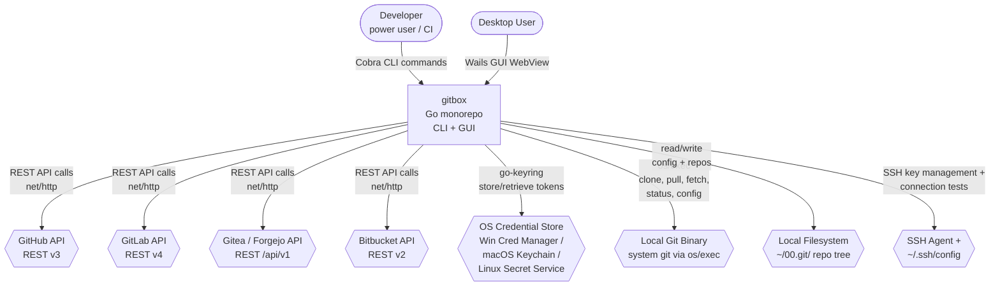
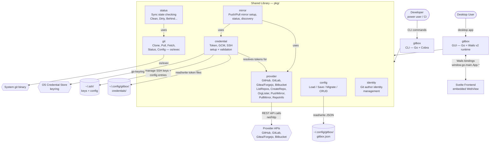

# Architecture — C4 Diagrams

C4 architecture diagrams for gitbox rendered in Mermaid flowchart syntax.

## Level 1 — System Context

How gitbox fits into the broader environment: actors, the system itself, and
every external dependency it touches.

## Level 2 — Container

Internal containers, the shared library packages, data stores, and how they
connect to external systems.

