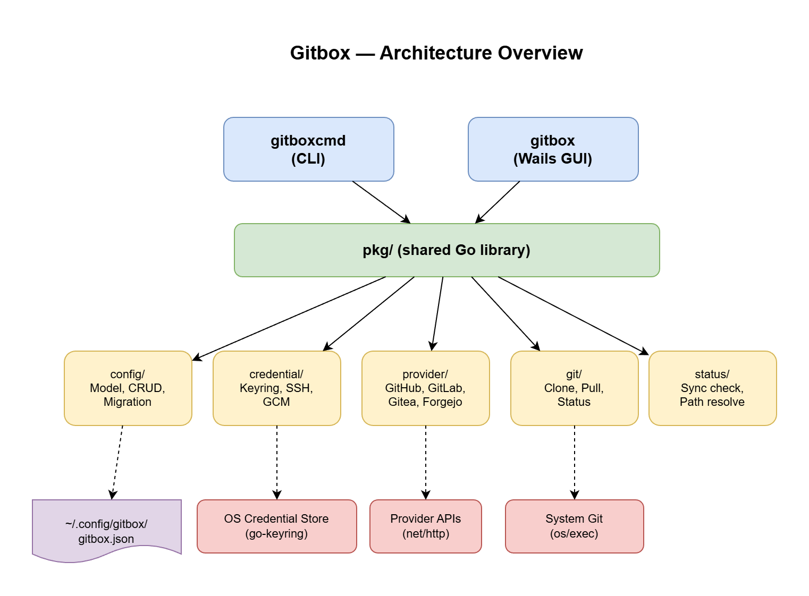
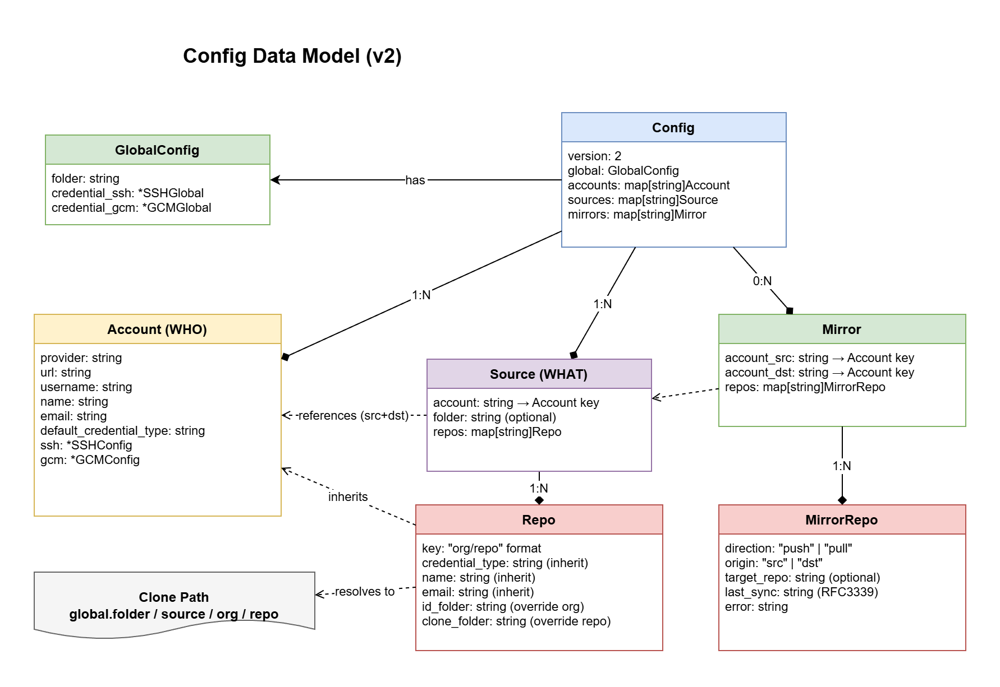
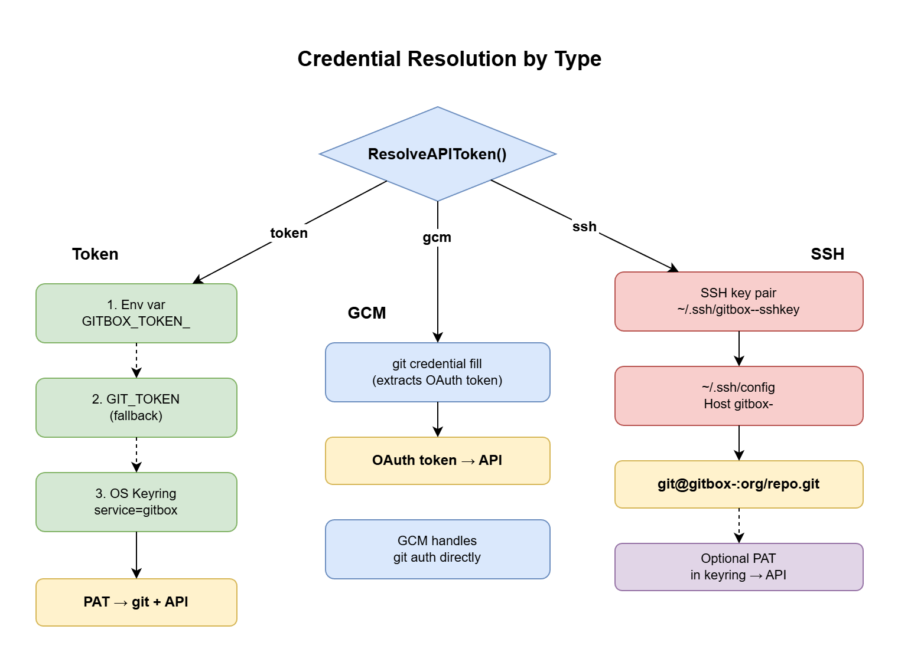

# Gitbox — Architecture & design

For the product overview (what gitbox does, who it's for, and why it exists), see the [README](../README.md).

---

## 1. Architecture overview

gitbox is a Go monorepo producing two binaries from a shared library, with three runtime modes:

<p align="center">
  
</p>

| Binary          | Mode | Purpose                                 | Technology                      | Auth            |
| --------------- | ---- | --------------------------------------- | ------------------------------- | --------------- |
| **`gitbox`**    | CLI  | Power users, headless servers, CI       | Go + Cobra                      | GCM, SSH, Token |
| **`gitbox`**    | TUI  | Interactive terminal (no args + tty)    | Go + Bubble Tea + Lip Gloss     | GCM, SSH, Token |
| **`GitboxApp`** | GUI  | Desktop users                           | Go + Wails v2 + Svelte          | GCM (guided)    |

The TUI launches automatically when `gitbox` runs with no arguments and stdin is a terminal. Otherwise, Cobra CLI commands execute. Both binaries share the exact same `pkg/` library — neither the TUI nor the GUI reimplements logic that the CLI already has.

## 2. Core concepts

### Accounts, Sources, and Repos

<p align="center">
  
</p>

**Why separate?** One account can have multiple sources (e.g., different GitHub orgs under the same login). Sources group repos logically. Repos use `org/repo` naming — the org part becomes the folder structure.

### Credential model

See [credentials.md](credentials.md) for user-facing setup details. This section covers the design.

Each credential type is **self-sufficient** for the account. Per-repo credential isolation ensures every clone has self-contained config in `.git/config` — an empty `credential.helper =` line cancels inherited (global/system) helpers, then the type-specific helper is set. This makes clones independent of `~/.gitconfig`.

**Design decisions:**

- **Token** uses dual storage: OS keyring (for gitbox API calls) + per-repo `credential-store` file (for git CLI). The file is derived from the keyring entry.
- **GCM** uses `helper = manager` with per-host config (`username`, `provider`, `credentialStore`) scoped per-repo.
- **SSH** only cancels helpers (auth is via `~/.ssh/config`). Discovery requires an optional PAT.

**Credential lifecycle:** Type switching cleans up old artifacts before configuring the new type. Existing clones are automatically reconfigured (remote URL + credential config). Account key renames migrate all artifacts: config keys, source folders, keyring entries, credential files, SSH keys, and SSH config aliases.

### Config as local database

The JSON config file (`~/.config/gitbox/gitbox.json`) is the **desired state** — a local database of what accounts, sources, and repos should exist.

**Discovery** is a northbound query — it asks the provider API "what repos exist?" and lets you add them to the config. Discovery is add-only on demand; it never auto-removes repos.

### Folder structure

Repos are cloned into a 3-level hierarchy:

```text
~/00.git/                          <- global.folder
  github-personal/                 <- source key (1st level)
    MyOrg/                         <- org from "MyOrg/project-a" (2nd level)
      project-a/                   <- repo name (3rd level)
      project-b/
    other-org/
      tools/
  forgejo-work/
    infra/
      homelab-ops/
```

Each level can be overridden:

- **1st level**: `source.folder` overrides the source key
- **2nd level**: `repo.id_folder` overrides the org part
- **3rd level**: `repo.clone_folder` overrides the repo name (if absolute path, replaces everything)

---

## 3. Component design

### pkg/config — Configuration Management

Handles the v2 configuration file. Core types: `Config`, `Account`, `Source`, `Repo`. See `pkg/config/config.go` for struct definitions.

**Key design decisions:**

- **JSON order preservation:** `SourceOrder` and `RepoOrder` ensure iteration follows the user's config file order
- **Credential inheritance:** Repos inherit `default_credential_type` from their account unless they override it
- **CRUD with referential integrity:** `DeleteAccount` fails if any source references it; `DeleteSource` cascades to its repos

### pkg/credential — Credential Management

Manages tokens, SSH keys, GCM integration, and per-repo credential isolation. See `pkg/credential/credential.go`, `pkg/credential/validate.go`, and `pkg/credential/repoconfig.go`.

**Token resolution chain:** Environment variable (`GITBOX_TOKEN_<KEY>`) -> `GIT_TOKEN` fallback -> credential file (`~/.config/gitbox/credentials/<key>`).

**API token dispatch:** Routes by credential type — `token` uses the credential file, `gcm` runs `git credential fill` (falls back to credential file), `ssh` tries the credential file (optional PAT for discovery).

**SSH key management:** Generates key pairs, writes `~/.ssh/config` entries, tests connections. Naming convention: host alias `gitbox-<account-key>`, key file `gitbox-<account-key>-sshkey`.

**Per-repo credential config** (`repoconfig.go`): `ConfigureRepoCredential()` sets each clone's `.git/config` to be self-contained. `WriteCredentialFile()` and `RemoveCredentialFile()` manage the git-credential-store files for token accounts. Both CLI and GUI call the same shared functions.

### pkg/provider — Repository Discovery

Abstraction layer for Git hosting provider APIs. Each provider implements `ListRepos()` returning `RemoteRepo` structs. See `pkg/provider/provider.go` for the interface.

| Provider      | API          | Auth                        | Notes                         |
| ------------- | ------------ | --------------------------- | ----------------------------- |
| GitHub        | REST v3      | Bearer token                | Supports GitHub Enterprise    |
| GitLab        | REST v4      | PRIVATE-TOKEN header        | Self-hosted compatible        |
| Gitea/Forgejo | REST /api/v1 | Token + Basic auth fallback | Same API, same implementation |
| Bitbucket     | REST v2      | HTTP Basic (app password)   | Cloud only                    |

Helpers include `TestAuth()` for credential validation and `TokenSetupGuide()` for per-provider PAT creation instructions.

**Additional interfaces** (optional, via type assertions):

- `RepoCreator` — create repos (under user or org namespace, with description) and check existence (all providers)
- `OrgLister` — list organizations/groups the user belongs to, for the "create repo" owner dropdown (all providers)
- `PushMirrorProvider` — server-side push mirrors (Gitea/Forgejo, GitLab)
- `PullMirrorProvider` — pull mirrors via migrate API (Gitea/Forgejo)
- `RepoInfoProvider` — fetch HEAD commit and visibility for sync comparison (GitHub, GitLab, Gitea/Forgejo)

### pkg/git — Git Operations

Thin wrapper around `os/exec` for all Git operations — no libgit2 dependency. Provides `Clone`, `CloneWithProgress`, `Pull`, `Status`, `Fetch`, `ConfigSet`, `ConfigAdd`, `ConfigUnsetAll`, and more. See `pkg/git/git.go`. Multi-value git config keys (like `credential.helper`) are managed with `ConfigUnsetAll` + `ConfigAdd`.

On macOS, `GitBin()` probes Homebrew paths (`/opt/homebrew/bin/git`, `/usr/local/bin/git`) before falling back to PATH, ensuring GUI apps find GCM-enabled git even with the minimal PATH that macOS GUI apps inherit.

### pkg/status — Sync Status Checking

Determines the sync state of local clones relative to their upstream. States: Clean, Dirty, Behind, Ahead, Diverged, Conflict, NotCloned, NoUpstream, Error. Priority: Conflicts > Dirty > Diverged > Behind > Ahead > NoUpstream > Clean. See `pkg/status/status.go`.

### pkg/identity — Git Identity Management

Manages per-repo git identity (`user.name`, `user.email`) with a resolution chain: repo-level overrides fall back to account-level values. See `pkg/identity/identity.go`.

`EnsureRepoIdentity()` checks each clone's local git config and fixes identity if it diverges from the expected values. `CheckGlobalIdentity()` and `RemoveGlobalIdentity()` handle global `~/.gitconfig` identity — gitbox encourages removing global identity so that per-repo identity (set during clone/reconfigure) is always authoritative.

Parallel to the identity check, `pkg/credential` exposes `IsGlobalGCMConfigNeeded()` + `CheckGlobalGCMConfig()` + `FixGlobalGCMConfig()` for the global GCM credential helper. When at least one account uses GCM, gitbox verifies `~/.gitconfig` has `credential.helper = manager` and `credential.credentialStore = <keychain|wincredman|secretservice>`; when missing or wrong, the GUI / TUI surface a fix button that writes both entries and backfills OS defaults into `gitbox.json`. Without this, `git credential fill` falls through to `/dev/tty` and fails with "Device not configured" in GUI contexts.

### pkg/update — Auto-update

Provides version checking and self-update via GitHub Releases. `CheckLatest()` queries the GitHub API (throttled to once per 24h). `DownloadRelease()` fetches the platform-specific artifact and verifies its SHA256 checksum. `Apply()` extracts the zip and replaces binaries in place — on Unix via atomic rename, on Windows by renaming the running binary to `.old` first (`CleanupOldBinary()` removes stale `.old` files on the next startup).

### pkg/mirror — Repository Mirroring

Handles push and pull mirror setup, status checking, and manual setup guides. Mirrors keep backup copies of repos on another provider without cloning locally.

**Mirror types:**

| Type | Direction | Use case |
| ---- | --------- | -------- |
| Push | Origin server pushes to backup | Source repo on Forgejo/GitLab; backup on GitHub |
| Pull | Backup server pulls from origin | Source repo on GitHub; backup on Forgejo |

**Provider automation:**

| Provider | Create repo | Push mirror | Pull mirror |
| -------- | ----------- | ----------- | ----------- |
| Gitea/Forgejo | Yes | Yes | Yes (via migrate API) |
| GitHub | Yes | No (guide only) | No |
| GitLab | Yes | Yes (remote mirrors API) | No |
| Bitbucket | Yes | No (guide only) | No |

**Key design decisions:**

- **Config model:** `mirrors` is an optional top-level section (`omitempty`), backward compatible with existing configs. Each mirror group pairs two accounts (`account_src`, `account_dst`) with per-repo direction and origin settings.
- **Mirror tokens:** Remote servers need portable PATs, not machine-local GCM OAuth tokens. `ResolveMirrorToken()` enforces this — GCM accounts must store a separate PAT via `credential setup --token`.
- **Immediate sync:** After creating a push mirror on Forgejo/Gitea, the code triggers `/push_mirrors-sync` so the first sync happens immediately instead of waiting for the configured interval.
- **Status comparison:** `CheckStatus()` queries HEAD commit SHAs on both origin and backup via provider APIs and compares them to determine sync state.
- **Visibility checks:** Status warns if backup repos are not private.

---

## 4. Config format (v2)

See the [JSON annotated example](../json/gitbox.jsonc) for a complete config with comments, and the [JSON Schema](../json/gitbox.schema.json) for editor validation and autocompletion.

**Credential type inheritance:** Repos inherit `default_credential_type` from their account unless they set their own `credential_type`.

**Folder resolution:** `globalFolder / sourceFolder / idFolder / cloneFolder`, with overrides possible at each level. If `clone_folder` is an absolute path, it replaces the entire hierarchy.

---

## 5. Credential architecture

<p align="center">
  
</p>

<p align="center">
  
</p>

### Token flow

User runs `credential setup` -> app shows the provider-specific PAT creation URL with required scopes -> user pastes the token -> app validates it via the provider API -> stores it in the credential file (`~/.config/gitbox/credentials/<key>`). On clone, the token is temporarily embedded in the URL for authentication, then sanitized from the remote URL. The per-repo `.git/config` is configured with `credential.helper = store --file <path>` pointing to the same gitbox-managed credential store file, so subsequent `git push/pull` from any terminal works without GCM.

### GCM flow

User runs `credential setup` -> app triggers `git credential fill` which opens browser OAuth -> app runs `git credential approve` to persist -> tests API access with the GCM token. Clone uses HTTPS with username. The per-repo `.git/config` is configured with `credential.helper = manager` plus per-host `username`, `provider`, and `credentialStore`, making each clone self-contained. API access extracts the OAuth token via `git credential fill`.

### SSH flow

User runs `credential setup` -> app creates `~/.ssh/config` entry and generates an ed25519 key pair -> displays the public key for the user to register at their provider -> tests the SSH connection. Clone uses `git@<host-alias>:repo.git` URLs routed through the SSH config. API access optionally uses a separately stored PAT for discovery. The per-repo `.git/config` sets an empty `credential.helper =` to defensively cancel any global credential helper.

### Credential type switching

When changing an account's credential type, gitbox:

1. **Cleans up old artifacts** based on the current type (keyring entries, credential store files, SSH keys, GCM cached credentials)
2. **Updates the account config** with the new type and credential sub-object
3. **Reconfigures all existing clones** — updates remote URLs and per-repo credential config

The cleanup matrix ensures no ghost credentials persist across type changes:

| From -> To   | Keyring `gitbox:<key>` | Credential store file | GCM `git:https://` | SSH keys + config |
| ------------ | ---------------------- | --------------------- | ------------------ | ----------------- |
| GCM -> Token | ---                    | ---                   | Deleted            | ---               |
| GCM -> SSH   | ---                    | ---                   | Deleted            | ---               |
| Token -> GCM | Deleted                | Deleted               | ---                | ---               |
| Token -> SSH | Deleted                | Deleted               | ---                | ---               |
| SSH -> Token | Deleted (discovery)    | ---                   | ---                | Deleted           |
| SSH -> GCM   | Deleted (discovery)    | ---                   | ---                | Deleted           |

---

## 6. CLI command structure

<p align="center">
  
</p>

### Command tree

```text
gitbox
|- init                              Initialize config file
|- global [--folder] [--periodic-sync]  Set global settings
|- account
|  |- list                           List all accounts
|  |- add <key> --provider ...       Add an account
|  |- update <key> --name ...        Update account fields
|  |- delete <key>                   Delete an account
|  |- show <key>                     Show account as JSON
|  |- orgs <key>                     List provider organizations
|  |- credential
|  |  |- setup <key>                 Set up credentials (idempotent)
|  |  |- verify <key>               Verify credentials work
|  |  +- del <key>                  Remove credentials
|  +- discover <key>                 Discover repos from provider API
|- source
|  |- list                           List all sources
|  |- add <key> --account ...        Add a source
|  |- update <key> --folder ...      Update source fields
|  |- delete <key>                   Delete source + its repos
|  +- show <key>                     Show source as JSON
|- repo
|  |- list [--source <key>]          List repos (optionally filtered)
|  |- add <source> <repo>            Add a repo to a source
|  |- update <source> <repo> ...     Update repo fields
|  |- delete <source> <repo>         Remove a repo
|  +- show <source> <repo>           Show repo as JSON
|- clone [--source] [--repo]         Clone configured repos
|- pull [--source] [--repo]          Pull repos that are behind
|- fetch [--source] [--repo]         Fetch without pulling
|- status [--source] [--repo]        Show sync status of all repos
|- mirror
|  |- list                           List all mirror groups
|  |- show <key>                     Show mirror details as JSON
|  |- add <key> --account-src/dst    Create a mirror group
|  |- delete <key>                   Delete a mirror group
|  |- add-repo <key> <repo> ...      Add a repo to a mirror
|  |- delete-repo <key> <repo>       Remove a repo from a mirror
|  |- setup [<key>] [--repo]         Run API setup for pending mirrors
|  |- status [<key>]                 Check live mirror sync status
|  +- discover [<key>]              Discover mirrorable repos across accounts
|- identity [--remove]               Check/remove global git identity
|- reconfigure [--account]           Update per-repo credential isolation
|- scan [--dir] [--pull]             Filesystem walk for repo status
|- completion <shell>                Generate shell completion
+- version                           Show version info
```

### Global flags

```text
--config <path>    Custom config file path
--json             JSON output format
--verbose          Show all items (including clean/skipped)
```

---

## 7. UX design principles

These apply to both CLI and GUI. The user should NOT need to know Git internals — commands are verbs that do what they say.

**Output:**

- One colored line per item, streamed as it happens (not batched)
- Long operations show progress bars, then snap to the final state
- Quiet by default — only errors, warnings, and actual changes. `--verbose` shows everything

**Color system** (true-color ANSI, respects `NO_COLOR`):

| Color | Symbol | Meaning |
| --- | --- | --- |
| Green | `+` | Success, clean, ok |
| Orange | `!` `~` | Warning, dirty, no upstream |
| Red | `!` `x` | Diverged, conflict, error |
| Purple | `<` `o` | Behind upstream, not cloned |
| Blue | `>` | Ahead of upstream |
| Cyan | | Info, skip, section header |

**Behavioral rules:** JSON order follows config file order. Commands are idempotent. Errors tell the user what to do, not just what went wrong. Tokens are never displayed.

---

## 8. GUI architecture

The GUI is a Wails v2 desktop app with a Svelte frontend. The Go backend (`cmd/gui/app.go`) exposes methods that the frontend calls via auto-generated TypeScript bindings. The frontend bridge is in `cmd/gui/frontend/src/lib/bridge.ts`.

Long-running operations (clone, status refresh, pull, mirror discovery) run in goroutines with progress pushed to the frontend via Wails events.

**Layout structure:**

- **Top bar** — logo, repo health ring, mirror health ring (when mirrors exist), action buttons (Pull All, Fetch All, Delete mode, Compact view)
- **Tab bar** — switches between Accounts and Mirrors views
- **Accounts tab** — account cards (with sync rings, credential badges, Find projects/Create repo buttons) + repo detail list
- **Mirrors tab** — mirror group cards (with sync rings, status dots) + mirror detail list with per-repo status, Discover and Check all action buttons
- **Summary footer** — aggregated counts for repos and mirrors
- **Compact view** — narrow sidebar mode with health ring, account pills, and mirror summary pill

**Additional features:**

- **Config auto-backup:** Meaningful saves create a dated backup (rolling window of the 10 most recent) before overwriting. Window-position-only saves skip the backup — cosmetic churn would otherwise rotate real pre-corruption copies out of the ring.
- **Window state persistence:** Position and size are saved per view mode (`window` and `compact_window` in config), restored on launch.
- **Autostart:** Platform-specific autostart registration (macOS launch agent, Windows registry). Configurable from the GUI.
- **Create repo:** Repos can be created directly on providers (under user namespace or org) from the Accounts tab, with owner dropdown populated via `OrgLister`.

See the [GUI Guide](gui-guide.md) for the user-facing walkthrough.

---

## 9. Security

- **Tokens are NEVER stored in the JSON config file.** PATs live in git-credential-store format files (`~/.config/gitbox/credentials/<key>`) with 0600 permissions. GCM OAuth tokens live in the OS credential store (Windows Credential Manager, macOS Keychain, Linux Secret Service) managed by Git Credential Manager.
- **The config file contains no secrets** — only URLs, usernames, folder paths, and preference flags.
- **Provider API calls use tokens from credential files or GCM** at runtime, never from config.
- **SSH private keys** are standard `~/.ssh/` files with appropriate permissions (600).
- **Clone URLs are sanitized** — token-authenticated clone URLs have the token stripped from the remote after cloning. Subsequent git operations authenticate via the per-repo credential helper, not the URL.
- **Per-repo credential isolation** — each clone's `.git/config` cancels global credential helpers and sets its own, preventing credential leakage between accounts and eliminating ghost credentials from GCM's OAuth refresh tokens.
- **Credential store files** (`~/.config/gitbox/credentials/<key>`) are plaintext with 0600 permissions — the same security model as `~/.git-credentials` and SSH private keys.
- **No secrets in output** — tokens are never displayed, even in verbose mode.
- **The repository is public** — no real hostnames, usernames, emails, or tokens in tracked files.

---

## 10. Diagrams

Architecture diagrams are available in `docs/diagrams/` as editable `.drawio` files:

- **architecture-overview.drawio** — High-level system component diagram
- **credential-flow.drawio** — Per-type credential resolution flow
- **credential-types.drawio** — Which secrets power Discovery, Git Operations, and Mirrors per credential type
- **config-model.drawio** — Accounts / Sources / Repos / Mirrors data model
- **cli-workflow.drawio** — User workflow from init to day-to-day

These can be opened and edited with [draw.io](https://app.diagrams.net/) or the VS Code drawio extension.
