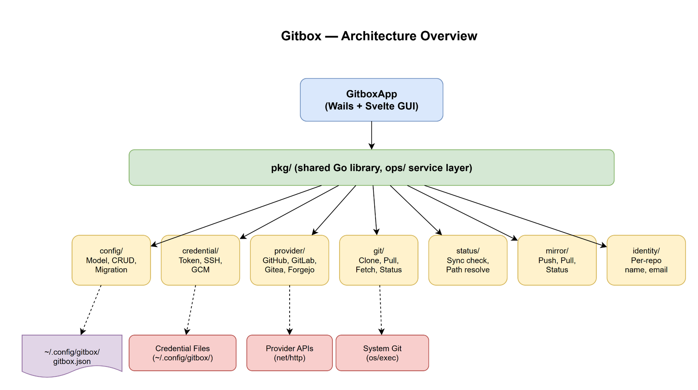
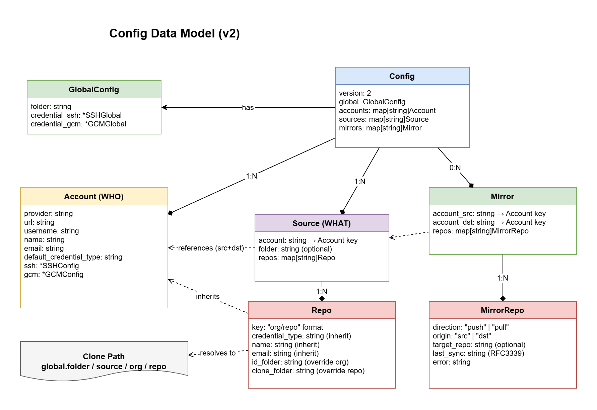
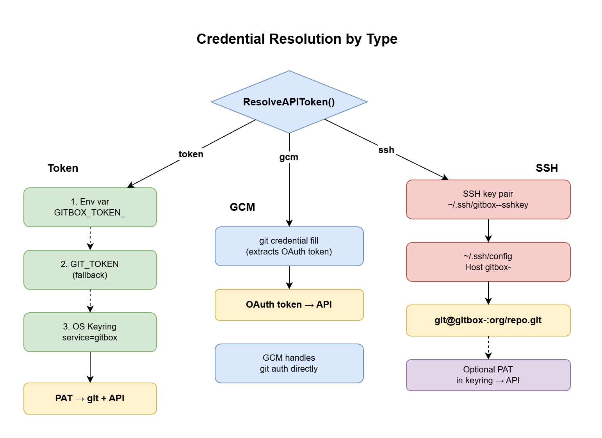
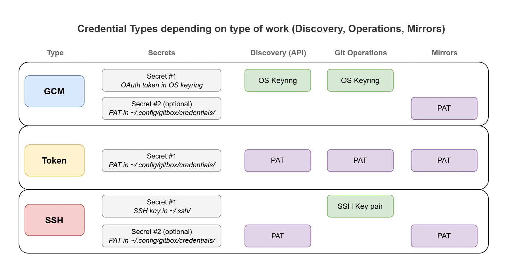

# Gitbox — architecture & design

For the product overview (what gitbox does, who it's for, and why it exists), see the [README](../readme.md).

---

## 1. Architecture overview

gitbox is a Go monorepo that produces one binary, the `GitboxApp` desktop app, on top of a shared library in `pkg/`:

<p align="center">
  
</p>

The GUI is a Wails v2 app with a Svelte frontend. The Go side lives in `cmd/gui/` and is a thin layer of Wails bindings, locking, and events. Application-level operations (account lifecycle, credential switching, clone planning, discovery) live in `pkg/ops`, and everything below that — config, credentials, providers, git, status, mirrors — lives in the other `pkg/` packages. The GUI supports GCM, SSH, and Token credentials.

The app needs no companion binary. It shells out only to tools already on the system: `git`, Git Credential Manager, `ssh` / `ssh-keygen` / `ssh-add`, `wsl` on Windows, and the user's terminals and editors.

Until v1.x, gitbox also shipped a `gitbox` CLI with an embedded TUI. v2 removed both; they live on in the v1 maintenance line on the `release/v1` branch.

## 2. Core concepts

### Accounts, sources, and repos

<p align="center">
  
</p>

**Why separate?** One account can have multiple sources (e.g., different GitHub orgs under the same login). Sources group repos logically. Repos use `org/repo` naming — the org part becomes the folder structure.

### Credential model

See [credentials.md](credentials.md) for user-facing setup details. This section covers the design.

Each credential type is **self-sufficient** for the account. Per-repo credential isolation ensures every clone has self-contained config in `.git/config` — an empty `credential.helper =` line cancels inherited (global/system) helpers, then the type-specific helper is set. This makes clones independent of `~/.gitconfig`.

**Design decisions:**

- **Token** uses dual storage: OS keyring (for gitbox API calls) + per-repo `credential-store` file (for git). The file is derived from the keyring entry.
- **GCM** uses `helper = manager` with per-host config (`username`, `provider`, `credentialStore`) scoped per-repo.
- **SSH** only cancels helpers (auth is via `~/.ssh/config`). Discovery requires an optional PAT.

**Credential lifecycle:** Type switching cleans up old artifacts before configuring the new type. Existing clones are automatically reconfigured (remote URL + credential config). Account key renames migrate all artifacts: config keys, source folders, keyring entries, credential files, SSH keys, and SSH config aliases.

### Config as local database

The JSON config file (`~/.config/gitbox/gitbox.json`) is the **desired state** — a local database of what accounts, sources, and repos should exist.

**Discovery** is a northbound query — it asks the provider API "what repos exist?" and lets you add them to the config. Discovery is add-only on demand; it never auto-removes repos.

### Folder structure

Repos are cloned into a 3-level hierarchy:

```text
~/00.git/                          <- global.folder
  github-personal/                 <- source key (1st level)
    MyOrg/                         <- org from "MyOrg/project-a" (2nd level)
      project-a/                   <- repo name (3rd level)
      project-b/
    other-org/
      tools/                       <- cross-org repo, same credentials
  forgejo-work/
    infra/
      homelab-ops/
    infra-prod/                    <- id_folder override
      homelab/
```

Each level can be overridden:

- **1st level**: `source.folder` overrides the source key
- **2nd level**: `repo.id_folder` overrides the org part
- **3rd level**: `repo.clone_folder` overrides the repo name (if absolute — `/`, `~`, or `../` — it replaces the entire path)

Clones outside this tree (extra scan folders, nested clones inside a multi-repo container) always carry an absolute `clone_folder`, so gitbox never moves them.

---

## 3. Component design

### cmd/gui — Wails bindings

`cmd/gui/app.go` exposes the methods the Svelte frontend calls through auto-generated TypeScript bindings. Each binding takes the config lock, calls into `pkg/ops` or another `pkg/` package, saves the config, and emits Wails events for progress. Neighbouring files hold GUI-only concerns: terminal profiles (`profiles.go`), workspaces (`workspaces.go`), multi-repo containers (`containers.go`), PR badges (`pr.go`), autostart, and per-OS process lifecycle. Every `exec.Command` in `cmd/gui/` goes through `git.HideWindow` so no console window flashes on Windows.

`main.go` handles two flags before Wails starts: `--version` prints the build version and exits, and `--test-mode` routes the config through a temp directory built from the `test-gitbox.json` fixture (see [testing.md](testing.md)).

### pkg/ops — Application operations

The service layer between the GUI bindings and the lower-level packages. It holds the operations that touch several packages at once: `AddAccount`, `RenameAccount`, `DeleteAccount`, `DeleteRepo`, `ChangeCredentialType`, `DeleteCredential`, `RemoveCredentialArtifacts`, `ReconfigureClones` (runs `heal.Repo` on each clone), `PlanClone` / `Clone`, `ListRemoteRepos`, `ListAccountOrgs`, `CreateRemoteRepo`, `AddDiscoveredRepos`, and `ProviderClient`.

Each operation works on a `*config.Config` plus the files it owns on disk (clones, SSH keys, credential stores). Operations never save the config and never lock — the caller serializes access and persists afterwards. Operations that touch every clone of an account (`ReconfigureClones`) are separate so the caller can run them after a successful save.

### pkg/config — Configuration management

Handles the v3 configuration file (v1 and v2 files are migrated transparently on load). Core types: `Config`, `Account`, `Source`, `Repo`. v3 adds multi-repo containers (`Repo.Container`), extra scan roots (`Global.ExtraFolders`), nested-clone discovery depth (`Global.NestedScanDepth`), absolute `clone_folder` overrides, and read-only discovered workspaces. See `pkg/config/config.go` for struct definitions.

**Key design decisions:**

- **JSON order preservation:** `SourceOrder` and `RepoOrder` ensure iteration follows the user's config file order
- **Credential inheritance:** Repos inherit `default_credential_type` from their account unless they override it
- **CRUD with referential integrity:** `DeleteAccount` fails if any source references it; `DeleteSource` cascades to its repos

### pkg/credential — Credential management

Manages tokens, SSH keys, GCM integration, and per-repo credential isolation. See `pkg/credential/credential.go`, `pkg/credential/validate.go`, and `pkg/credential/repoconfig.go`.

**Token resolution chain:** Environment variable (`GITBOX_TOKEN_<KEY>`) -> `GIT_TOKEN` fallback -> credential file (`~/.config/gitbox/credentials/<key>`).

**API token dispatch:** Routes by credential type — `token` uses the credential file, `gcm` runs `git credential fill` (falls back to credential file), `ssh` tries the credential file (optional PAT for discovery).

**SSH key management:** Generates key pairs, writes `~/.ssh/config` entries, tests connections. Naming convention: host alias `gitbox-<account-key>`, key file `gitbox-<account-key>-sshkey`.

**Per-repo credential config** (`repoconfig.go`): `ConfigureRepoCredential()` sets each clone's `.git/config` to be self-contained. `WriteCredentialFile()` and `DeleteToken()` manage the git-credential-store files for token accounts. `pkg/ops` and `pkg/heal` call the same shared functions.

### pkg/provider — Repository discovery

Abstraction layer for Git hosting provider APIs. Each provider implements `ListRepos()` returning `RemoteRepo` structs. See `pkg/provider/provider.go` for the interface.

| Provider      | API          | Auth                        | Notes                         |
| ------------- | ------------ | --------------------------- | ----------------------------- |
| GitHub        | REST v3      | Bearer token                | Supports GitHub Enterprise    |
| GitLab        | REST v4      | PRIVATE-TOKEN header        | Self-hosted compatible        |
| Gitea/Forgejo | REST /api/v1 | Token + Basic auth fallback | Same API, same implementation |
| Bitbucket     | REST v2      | HTTP Basic (app password)   | Cloud only                    |

Helpers include `TestAuth()` for credential validation and `TokenSetupGuide()` for per-provider PAT creation instructions.

**Additional interfaces** (optional, via type assertions):

- `RepoCreator` — create repos (under user or org namespace, with description) and check existence (all providers)
- `OrgLister` — list organizations/groups the user belongs to, for the "create repo" owner dropdown (all providers)
- `PushMirrorProvider` — server-side push mirrors (Gitea/Forgejo, GitLab)
- `PullMirrorProvider` — pull mirrors via migrate API (Gitea/Forgejo)
- `RepoInfoProvider` — fetch HEAD commit and visibility for sync comparison (GitHub, GitLab, Gitea/Forgejo)

### pkg/git — Git operations

Thin wrapper around `os/exec` for all Git operations — no libgit2 dependency. Provides `Clone`, `CloneWithProgress`, `Pull`, `Status`, `Fetch`, `ConfigSet`, `ConfigAdd`, `ConfigUnsetAll`, and more. See `pkg/git/git.go`. Multi-value git config keys (like `credential.helper`) are managed with `ConfigUnsetAll` + `ConfigAdd`.

On macOS, `GitBin()` probes Homebrew paths (`/opt/homebrew/bin/git`, `/usr/local/bin/git`) before falling back to PATH, ensuring the GUI finds GCM-enabled git even with the minimal PATH that macOS GUI apps inherit.

### pkg/status — Sync status checking

Determines the sync state of local clones relative to their upstream. States: Clean, Dirty, Behind, Ahead, Diverged, Conflict, NotCloned, NoUpstream, Error. Priority: Conflicts > Dirty > Diverged > Behind > Ahead > NoUpstream > Clean. `ComputeNesting` derives parent → child relationships between container clones and the clones nested inside them. See `pkg/status/status.go`.

### pkg/identity — Git identity management

Manages per-repo git identity (`user.name`, `user.email`) with a resolution chain: repo-level overrides fall back to account-level values. See `pkg/identity/identity.go`.

`EnsureRepoIdentity()` checks each clone's local git config and fixes identity if it diverges from the expected values. `CheckGlobalIdentity()` and `RemoveGlobalIdentity()` handle global `~/.gitconfig` identity — gitbox encourages removing global identity so that per-repo identity (set during clone/reconfigure) is always authoritative.

Parallel to the identity check, `pkg/credential` exposes `IsGlobalGCMConfigNeeded()` + `CheckGlobalGCMConfig()` + `FixGlobalGCMConfig()` for the global GCM credential helper. When at least one account uses GCM, gitbox verifies `~/.gitconfig` has `credential.helper = manager` and `credential.credentialStore = <keychain|wincredman|secretservice>`; when missing or wrong, the GUI surfaces a fix button that writes both entries and backfills OS defaults into `gitbox.json`. Without this, `git credential fill` falls through to `/dev/tty` and fails with "Device not configured" in GUI contexts.

### pkg/update — Auto-update

Provides version checking and self-update via GitHub Releases. `CheckLatest()` queries the GitHub API (throttled to once per 24h). `DownloadRelease()` first verifies that the release's `checksums.sha256.sig` is an `ssh-keygen -Y sign` signature, in the `gitbox-release` namespace, by the key embedded from `release-signing-key.pub`, over `gitbox <tag>` plus the checksums (a small sshsig verifier on `golang.org/x/crypto/ssh`); only then does it fetch the platform-specific artifact and verify its SHA256 checksum. It fails closed when the signature or `checksums.sha256` is missing, unreadable or invalid, or doesn't list the artifact. See [release-signing.md](release-signing.md). `ExtractUpdate()` and `InstallExtracted()` unpack the zip and replace what is already installed next to the running app — on macOS the whole `GitboxApp.app` bundle, on Unix via atomic rename, on Windows by renaming the running binary to `.old` first (`CleanupOldBinary()` removes stale `.old` files on the next startup). The GUI follows the release GitHub marks as latest; a `MaxMajor` option caps the major version, which the v1 CLI on `release/v1` uses to stay on 1.x.

### pkg/doctor — External-tool detection

Probes the host for every external binary gitbox may call — `git`, `git-credential-manager`, `ssh`, `ssh-keygen`, `ssh-add`, `wsl` (Windows only) — and reports path, version, and per-OS install hints for anything missing. `PrecheckForCredentialType()` powers the GUI setup flows so a missing tool surfaces as a yellow banner with the install command instead of a cryptic runtime error. The full report is available in the GUI under **Settings → System check**.

### pkg/heal — Repo .git/config self-heal

`heal.Repo(cfg, sourceKey, repoKey)` idempotently reconciles a clone's `.git/config` against the account spec: `user.name`, `user.email`, the canonical `origin` URL (credential-type specific, no embedded secrets), and the credential helper. Wired into every trigger point — clone, fetch, pull, `ops.ReconfigureClones`, and the GUI's periodic sync — so that clones drifting out of spec are silently repaired. Introduced alongside the GUI Windows-stdio fix in `pkg/git.run()` to stop GUI-side `.git/config` writes from silently failing.

### pkg/move — Cross-account / cross-provider repo move

Relocates a clone from one configured account to another, including across providers (GitHub → GitLab, Gitea → Forgejo). Orchestrates a phased flow — preflight (credential-readiness probe) → fetch → create destination → `git push --mirror` → rewire `origin` → update `gitbox.json` → optional source-remote delete → optional local-clone delete → auto-clone destination when the local was deleted. Phase callbacks stream progress to the GUI. Phases 1–6 are fatal on failure; optional deletes are best-effort and surface as warnings with `provider.InsufficientScopesError` humanised into remediation text (e.g. "add `delete_repo` scope to your GitHub PAT").

### pkg/gitignore — Global gitignore self-heal

Installs a curated managed block of OS-junk patterns (`.DS_Store`, `Thumbs.db`, `*~`, …) into `~/.gitignore_global` and points `core.excludesfile` at it. The block is wrapped in sentinel markers (`# >>> gitbox:global-gitignore >>>` / `# <<< gitbox:global-gitignore <<<`) so re-installs rewrite only the managed region; user-added entries and negation patterns (`!.DS_Store`) outside the sentinels are preserved, and duplicates of managed patterns outside the sentinels are sanitised away. Atomic tmp+rename write with a rolling 3-backup cap (`.bak-YYYYMMDD-HHMMSS`). Opt-out via `global.check_global_gitignore` in `gitbox.json` gates only the automatic startup check; explicit actions always run. Exposed in the GUI as a banner with an **Install** button.

### pkg/workspace — Read-only workspaces

Discovers existing VS Code `.code-workspace` files and exposes them read-only — gitbox never creates, edits, generates, or deletes workspace files. `Discover` walks `global.folder` and every `global.extra_folders` root for `*.code-workspace` files and resolves each file's folder references back to known clones (deepest-prefix match against resolved repo paths); it is pure and only reports what is on disk. `RefreshCache` mirrors the result into the `workspaces` section of `gitbox.json` and persists only when the set changed. `BuildOpenCommand()` launches an existing `.code-workspace` in the first editor in `global.editors`. Tmuxinator support and workspace generation were removed with config v3.

### pkg/adopt — Orphan repo discovery

Scans `global.folder`, every `global.extra_folders` root, and the working trees of container repos for clones that are not in `gitbox.json`, then scores each against every host-matching account. All signals are additive, and the highest score wins:

| Signal                                                                    | Score | Source                                                                |
| ------------------------------------------------------------------------- | ----- | --------------------------------------------------------------------- |
| Host match (required baseline)                                            | 1     | account URL hostname or SSH alias vs the parsed remote host           |
| Owner equals `account.username`                                           | +3    | owner segment of the remote URL path                                  |
| Repo lives under the account's source folder                              | +5    | first path component of the repo relative to the gitbox parent folder |
| HTTPS URL embeds `user@` where user equals `account.username`             | +10   | `url.User.Username()` of the origin remote                            |
| `.git/config` has `credential.<url>.username` equal to `account.username` | +10   | `git config --get-regexp '^credential\..*\.username$'` in the repo    |

If the top score is shared by two or more accounts (including a bare host-only tie) the match is marked ambiguous: no account is picked, no files are moved, and the GUI shows the candidate list. Adopted orphans get credential isolation, identity, and a remote URL rewritten to match the credential type. Orphans under the standard tree can optionally be relocated to their canonical path; clones outside it and nested clones are onboarded in place with an absolute `clone_folder`.

### pkg/mirror — Repository mirroring

Handles push and pull mirror setup, status checking, discovery, and manual setup guides. Mirrors keep backup copies of repos on another provider without cloning locally.

**Mirror types:**

| Type | Direction                       | Use case                                        |
| ---- | ------------------------------- | ----------------------------------------------- |
| Push | Origin server pushes to backup  | Source repo on Forgejo/GitLab; backup on GitHub |
| Pull | Backup server pulls from origin | Source repo on GitHub; backup on Forgejo        |

**Provider automation:**

| Provider      | Create repo | Push mirror              | Pull mirror           |
| ------------- | ----------- | ------------------------ | --------------------- |
| Gitea/Forgejo | Yes         | Yes                      | Yes (via migrate API) |
| GitHub        | Yes         | No (guide only)          | No                    |
| GitLab        | Yes         | Yes (remote mirrors API) | No                    |
| Bitbucket     | Yes         | No (guide only)          | No                    |

**Key design decisions:**

- **Config model:** `mirrors` is an optional top-level section (`omitempty`), backward compatible with existing configs. Each mirror group pairs two accounts (`account_src`, `account_dst`) with per-repo direction and origin settings.
- **Mirror tokens:** Remote servers need portable PATs, not machine-local GCM OAuth tokens. `ResolveMirrorToken()` enforces this — GCM accounts must store a separate PAT for mirrors.
- **Immediate sync:** After creating a push mirror on Forgejo/Gitea, the code triggers `/push_mirrors-sync` so the first sync happens immediately instead of waiting for the configured interval.
- **Status comparison:** `CheckStatus()` queries HEAD commit SHAs on both origin and backup via provider APIs and compares them to determine sync state.
- **Visibility checks:** Status warns if backup repos are not private.
- **Discovery:** Scans all account pairs for existing mirror relationships, with decreasing confidence: push mirror API (confirmed), pull mirror flag (likely), name match (possible).

### pkg/terminals, pkg/launch, pkg/harness — Open-in actions

`pkg/terminals` owns the compiled-in catalog of supported terminals and shells per OS, host detection, OS-aware Profile composition, and the merge logic that keeps `terminal_apps[]`, `shells[]`, and `terminal_profiles[]` in sync with what is installed. `pkg/launch.ResolveArgs` expands a Profile's argv template for a folder, outside the Wails runtime so the token rules are unit-tested. `pkg/harness` parses the embedded [`tools-directory.md`](../pkg/harness/tools-directory.md) table to decide which AI CLI harnesses the GUI auto-detects. See [Terminal profiles](#terminal-profiles) below for the user-visible rules.

### pkg/i18n — UI language

Resolves and normalizes the UI language, in order: the `GITBOX_LANG` environment variable, `global.language`, the OS locale, and English as the fallback. The string catalogs themselves ship in the Svelte frontend; this package only decides which one to use.

---

## 4. Config format (v3)

The config lives at `~/.config/gitbox/gitbox.json`. See the [JSON annotated example](../json/gitbox.jsonc) for a complete config with comments, and the [JSON Schema](../json/gitbox.schema.json) for editor validation and autocompletion.

**Versioning:** `config.CurrentVersion` is 3. gitbox loads v3 strictly and migrates v1 and v2 files transparently on load (in memory; persisted on the next save). The v2 → v3 migration drops the old `workspaces` section, which is now a regenerable cache. Any other version is an error. Additive changes never bump the version.

**Automatic backups:** Every meaningful save creates a dated backup in the same directory (e.g., `gitbox-20260401-143025.json`). The 10 most recent are kept — older ones are pruned automatically. The GUI's corruption-recovery screen can restore from any of them in one click. Window-position-only saves (moving or resizing the GUI) skip the backup step, so real pre-corruption copies are not rotated out by cosmetic churn.

**Credential type inheritance:** Repos inherit `default_credential_type` from their account unless they set their own `credential_type`.

**Folder resolution:** `globalFolder / sourceFolder / idFolder / cloneFolder`, with overrides possible at each level. If `clone_folder` is an absolute path, it replaces the entire hierarchy.

### Global

| Field                             | Type   | Required | Description                                                                                                                                                                                                                                                                                                                                                                     |
| --------------------------------- | ------ | -------- | ------------------------------------------------------------------------------------------------------------------------------------------------------------------------------------------------------------------------------------------------------------------------------------------------------------------------------------------------------------------------------- |
| `folder`                          | string | Yes      | Root directory for all clones. Supports `~`.                                                                                                                                                                                                                                                                                                                                    |
| `extra_folders`                   | array  | No       | Additional root directories scanned for clones and `.code-workspace` files, on top of `folder`.                                                                                                                                                                                                                                                                                 |
| `nested_scan_depth`               | int    | No       | Levels gitbox descends below a container repo to find nested clones. Default `1` (immediate children).                                                                                                                                                                                                                                                                          |
| `language`                        | string | No       | UI language. Empty means the OS locale (English as the fallback).                                                                                                                                                                                                                                                                                                               |
| `periodic_sync`                   | string | No       | Background fetch interval: off, `5m`, `15m`, or `30m`.                                                                                                                                                                                                                                                                                                                          |
| `view_mode`                       | string | No       | `"full"` or `"compact"`.                                                                                                                                                                                                                                                                                                                                                        |
| `window` / `compact_window`       | object | No       | Saved position and size (`x`, `y`, `width`, `height`) per view mode.                                                                                                                                                                                                                                                                                                            |
| `check_global_gitignore`          | bool   | No       | Run the automatic `~/.gitignore_global` check at startup. Default `true`.                                                                                                                                                                                                                                                                                                       |
| `pr_badges_enabled`               | bool   | No       | Fetch and show PR / review indicators on clone rows. Default `true`.                                                                                                                                                                                                                                                                                                            |
| `pr_include_drafts`               | bool   | No       | Count draft PRs in the "my PRs" badge. Default `true`.                                                                                                                                                                                                                                                                                                                          |
| `credential_ssh`                  | object | No       | SSH platform defaults. Presence indicates SSH is available.                                                                                                                                                                                                                                                                                                                     |
| `credential_ssh.ssh_folder`       | string | No       | SSH config directory. Default `~/.ssh`.                                                                                                                                                                                                                                                                                                                                         |
| `credential_gcm`                  | object | No       | GCM platform defaults. Presence indicates GCM is available.                                                                                                                                                                                                                                                                                                                     |
| `credential_gcm.helper`           | string | No       | Credential helper. Typically `"manager"`.                                                                                                                                                                                                                                                                                                                                       |
| `credential_gcm.credential_store` | string | No       | `"wincredman"`, `"keychain"`, or `"secretservice"`.                                                                                                                                                                                                                                                                                                                             |
| `credential_token`                | object | No       | Token/PAT platform defaults. Presence indicates token auth is available.                                                                                                                                                                                                                                                                                                        |
| `editors`                         | array  | No       | Code editors for the "Open in" menu. Auto-populated on first launch.                                                                                                                                                                                                                                                                                                            |
| `editors[].name`                  | string | Yes      | Display name (e.g. `"VS Code"`).                                                                                                                                                                                                                                                                                                                                                |
| `editors[].command`               | string | Yes      | Full path or command name (e.g. `"C:\\...\\code.cmd"`).                                                                                                                                                                                                                                                                                                                         |
| `terminals`                       | array  | No       | Legacy flat terminal list from before Terminal Profiles. Migrated into the three arrays below on first load.                                                                                                                                                                                                                                                                    |
| `terminals[].name`                | string | Yes      | Display name (e.g. `"Windows Terminal"`).                                                                                                                                                                                                                                                                                                                                       |
| `terminals[].command`             | string | Yes      | Full path or on-PATH launcher (e.g. `"wt.exe"`, `"gnome-terminal"`).                                                                                                                                                                                                                                                                                                            |
| `terminals[].args`                | array  | No       | Arguments passed before the path. Use `"{path}"` as the path placeholder; if absent, path is appended. Use `"{command}"` to mark where an AI harness argv is spliced (expands to zero items for terminal-only launches).                                                                                                                                                        |
| `terminal_apps`                   | array  | No       | Detected terminal emulators. Populated by the catalog probe in `pkg/terminals` (Windows: Windows Terminal, WezTerm, Alacritty, Tabby, ConEmu, Hyper, Mintty, ZOC. macOS: iTerm2, Terminal.app, Warp, Kitty, Ghostty, WezTerm, Alacritty. Linux: GNOME Terminal, Konsole, Terminator, Foot, Alacritty, Kitty, Tilda, Guake, xterm). The GUI's Terminals Manager probes directly. |
| `terminal_apps[].id`              | string | Yes      | Stable id (`"wt"`, `"wezterm"`, `"gnome-terminal"`, `"iterm"`, …). Used as the cross-reference target from `terminal_profiles[].terminal`.                                                                                                                                                                                                                                      |
| `terminal_apps[].name`            | string | Yes      | Display name shown in the Manager and the per-row launcher.                                                                                                                                                                                                                                                                                                                     |
| `terminal_apps[].command`         | string | Yes      | Resolved absolute path (filled in at detect time).                                                                                                                                                                                                                                                                                                                              |
| `terminal_apps[].args_template`   | array  | No       | Argv template with `{path}`, `{shell_command}`, `{shell_args}`, `{command}` tokens. The launcher expands these per Profile via `pkg/launch.ResolveArgs`. Same token rules as `terminals[].args` above, plus `{shell_command}` (the resolved shell binary) and `{shell_args}` (a splice point for the shell's default args).                                                     |
| `shells`                          | array  | No       | Detected shells. Catalog scope per OS — Windows: PowerShell 7, PowerShell 5, CMD, Git Bash, plus per-distro `wsl-<name>` rows when WSL is installed. macOS: Zsh, Bash, Fish, Dash. Linux: Bash, Zsh, Fish, Ksh, Dash.                                                                                                                                                           |
| `shells[].id`                     | string | Yes      | Stable id (`"cmd"`, `"pwsh"`, `"git-bash"`, `"wsl-ubuntu"`, …). Cross-referenced by `terminal_profiles[].shell`.                                                                                                                                                                                                                                                                |
| `shells[].name`                   | string | Yes      | Display name.                                                                                                                                                                                                                                                                                                                                                                   |
| `shells[].command`                | string | Yes      | Resolved absolute path.                                                                                                                                                                                                                                                                                                                                                         |
| `shells[].args`                   | array  | No       | Default args spliced where the terminal's `args_template` references `{shell_args}`.                                                                                                                                                                                                                                                                                            |
| `terminal_profiles`               | array  | No       | Launchable Profiles. The per-row launcher and the `Open in…` menu read this list when populated. **OS-aware composition** (issue #71): on Windows each auto-derived Profile pairs a Terminal × Shell; on macOS / Linux each is Terminal-only with the host's login shell as the implicit shell.                                                                                 |
| `terminal_profiles[].id`          | string | Yes      | Stable id (`"wt+pwsh"`, `"wezterm+launchmenu-mybash"`, `"user-1"`, …).                                                                                                                                                                                                                                                                                                          |
| `terminal_profiles[].name`        | string | Yes      | Display name (e.g. `"Windows Terminal — pwsh"`).                                                                                                                                                                                                                                                                                                                                |
| `terminal_profiles[].terminal`    | string | Yes      | `terminal_apps[].id` to launch. Empty only for the bare-shell fallback Profiles emitted on Windows when no modern Terminal is installed.                                                                                                                                                                                                                                        |
| `terminal_profiles[].shell`       | string | No       | `shells[].id` to run inside the terminal. Empty means "use the terminal's default" — on macOS / Linux that is the host's login shell, displayed in the Manager as a dim badge next to the Terminal name.                                                                                                                                                                        |
| `terminal_profiles[].args`        | array  | No       | Override argv. When empty the launcher uses `terminal_apps[].args_template`. WezTerm `launch_menu` rows store the full `start --cwd {path} -- <argv>` shape here.                                                                                                                                                                                                               |
| `terminal_profiles[].default`     | bool   | No       | Marks the Profile invoked by the per-row launcher's primary action. Mutually exclusive across the list.                                                                                                                                                                                                                                                                         |
| `terminal_profiles[].preferred`   | bool   | No       | Promotes the Profile to the kebab menu's quick list.                                                                                                                                                                                                                                                                                                                            |
| `terminal_profiles[].hidden`      | bool   | No       | Suppresses the Profile from menus without deleting it. The only way to suppress an auto-detected / WT-imported / WezTerm-imported / migrated Profile (those reappear on the next detect cycle if removed).                                                                                                                                                                      |
| `terminal_profiles[].source`      | string | No       | **Internal field** — never displayed in the Manager. Origin tag used by the engine to gate delete-vs-hide: only `"user"` Profiles are deletable; `"detected"` / `"wt-profile"` / `"wezterm-launchmenu"` / `"migrated"` rows can only be Hidden.                                                                                                                                 |
| `ai_harnesses`                    | array  | No       | AI CLI harnesses for the "Open in" menu. Detected in the background (shortly after launch, every 10 minutes, on window focus) from the embedded catalog plus `~/.local/bin`, Homebrew prefixes and per-tool well-known directories. Launched inside the default Terminal Profile's shell (see `terminal_profiles[].default`).                                                   |
| `ai_harnesses[].name`             | string | Yes      | Display name (e.g. `"Claude Code"`).                                                                                                                                                                                                                                                                                                                                            |
| `ai_harnesses[].command`          | string | Yes      | Absolute path or on-PATH binary (e.g. `"claude"`).                                                                                                                                                                                                                                                                                                                              |
| `ai_harnesses[].args`             | array  | No       | Optional extra args for the harness. Usually empty.                                                                                                                                                                                                                                                                                                                             |
| `ai_harnesses[].source`           | string | No       | **Internal field.** `"detected"` entries were added by the harness sync and may have their `command` re-resolved after a reinstall; `"user"` entries are never altered beyond `missing`. Empty on pre-existing entries until the first sync classifies them.                                                                                                                    |
| `ai_harnesses[].missing`          | bool   | No       | Set by the harness sync when the binary can no longer be found; the entry is hidden from menus but kept so a reinstall restores it with its `args` intact. Cleared automatically when the binary reappears.                                                                                                                                                                     |

### Account

| Field                     | Type    | Required    | Description                                                                 |
| ------------------------- | ------- | ----------- | --------------------------------------------------------------------------- |
| `provider`                | string  | Yes         | `"github"`, `"gitlab"`, `"gitea"`, `"forgejo"`, `"bitbucket"`, `"generic"`  |
| `url`                     | string  | Yes         | Server URL (scheme+host, no path).                                          |
| `username`                | string  | Yes         | Account username.                                                           |
| `name`                    | string  | Yes         | Default `git user.name`.                                                    |
| `email`                   | string  | Yes         | Default `git user.email`.                                                   |
| `default_credential_type` | string  | No          | Default auth: `"gcm"`, `"ssh"`, or `"token"`.                               |
| `ssh.host`                | string  | Conditional | SSH Host alias (e.g., `"gt-myuser"`). **Mandatory** when SSH is configured. |
| `ssh.hostname`            | string  | No          | Real SSH hostname. Auto-derived from URL if omitted.                        |
| `ssh.key_type`            | string  | Conditional | `"ed25519"` or `"rsa"`. **Mandatory** when SSH is configured.               |
| `gcm.provider`            | string  | No          | GCM provider hint.                                                          |
| `gcm.useHttpPath`         | boolean | No          | Scope credentials by HTTP path.                                             |

An account is unique by `(hostname, username)`. Deleting an account cascades through every source, mirror, and workspace that references it.

### Source

| Field     | Type   | Required | Description                                             |
| --------- | ------ | -------- | ------------------------------------------------------- |
| `account` | string | Yes      | References an account key.                              |
| `folder`  | string | No       | Override first-level clone folder. Default: source key. |
| `repos`   | object | Yes      | Repos keyed by `org/repo`.                              |

### Repo (within source.repos)

| Field             | Type   | Required | Description                                                               |
| ----------------- | ------ | -------- | ------------------------------------------------------------------------- |
| `credential_type` | string | No       | Override auth method. Inherits from account.                              |
| `name`            | string | No       | Override `git user.name`.                                                 |
| `email`           | string | No       | Override `git user.email`.                                                |
| `id_folder`       | string | No       | Override 2nd level dir (org folder).                                      |
| `clone_folder`    | string | No       | Override 3rd level dir. If absolute, replaces entire path.                |
| `container`       | bool   | No       | Mark as a multi-repo container; gitbox scans inside it for nested clones. |

### Mirrors

```json
{
  "mirrors": {
    "forgejo-github": {
      "account_src": "my-forgejo",
      "account_dst": "github-personal",
      "repos": {
        "infra/homelab": {
          "direction": "push",
          "origin": "src",
          "method": "api",
          "status": "active"
        },
        "MyUser/dotfiles": {
          "direction": "pull",
          "origin": "dst",
          "method": "api",
          "status": "active"
        }
      }
    }
  }
}
```

| Field                     | Type   | Required | Description                                               |
| ------------------------- | ------ | -------- | --------------------------------------------------------- |
| `account_src`             | string | Yes      | Source account key                                        |
| `account_dst`             | string | Yes      | Destination account key (must differ from src)            |
| `repos.<key>.direction`   | string | Yes      | `"push"` or `"pull"`                                      |
| `repos.<key>.origin`      | string | Yes      | `"src"` or `"dst"` — which account is the source of truth |
| `repos.<key>.target_repo` | string | No       | Override target repo name (default: same as key)          |
| `repos.<key>.method`      | string | No       | `"api"` or `"manual"`                                     |
| `repos.<key>.status`      | string | No       | `"active"`, `"pending"`, `"error"`, `"paused"`            |
| `repos.<key>.last_sync`   | string | No       | RFC3339 timestamp of last known sync                      |
| `repos.<key>.error`       | string | No       | Last error message                                        |

### Workspaces cache

The `workspaces` section is a regenerable cache — it can be deleted safely and rediscovered. Entries are always discovered VS Code workspaces (no `type`/`layout`).

```json
{
  "workspaces": {
    "sumwall": {
      "name": "sumwall",
      "file": "/home/me/00.git/.../sumwall.project/sumwall.code-workspace",
      "members": [
        { "source": "github-org", "repo": "Org/browser" },
        { "source": "github-org", "repo": "Org/services" }
      ],
      "discovered": true
    }
  }
}
```

| Field        | Type   | Description                                                        |
| ------------ | ------ | ------------------------------------------------------------------ |
| `name`       | string | Display name (the `.code-workspace` filename stem)                 |
| `file`       | string | Absolute path to the discovered `.code-workspace` file             |
| `members`    | array  | Member clones resolved from the file's folders (`source` + `repo`) |
| `discovered` | bool   | Always `true` — entries are discovered, never authored             |

### Terminal profiles

The `terminal_apps[]` + `shells[]` + `terminal_profiles[]` trio is owned by `pkg/terminals`. The package ships a compiled-in catalog of supported Terminals + Shells per OS — that's the vocabulary gitbox knows how to detect and launch. Adding a new terminal-emulator entry is a code change in `pkg/terminals/catalog.go`.

On every launch the catalog probes the host and reconciles the result with what's already in `gitbox.json`:

- Catalog entries the host has installed are added to `terminal_apps[]` / `shells[]` (only if missing — existing rows survive across re-detect).
- Hidden flags survive across re-detect — hiding Mintty in this session keeps it hidden after upgrades that grow the catalog.
- User-added Profiles (`source: "user"`) and migrated legacy Profiles (`source: "migrated"`) are preserved verbatim, even when not in the freshly-detected set.
- Catalog-but-not-installed entries are skipped silently — they reappear automatically once the user installs the binary.

#### OS-aware composition

The auto-derived Profile set follows different rules per platform:

- **Windows** — Each Profile pairs a Terminal × Shell. Bare-shell auto-Profiles (a row whose Terminal is itself the shell) are not emitted when at least one modern Terminal is installed. When no modern Terminal is installed, gitbox falls back to one bare-shell Profile per shell so the user isn't stranded — and surfaces a banner in the Manager: "Install Windows Terminal for the best experience."
- **macOS / Linux** — Each Profile is Terminal-only (`terminal_profiles[].shell == ""`). The host's login shell is implicit — `pkg/launch.ResolveArgs` collapses the empty shell tokens to zero items, and the Manager renders the login shell as a dim metadata badge next to the Terminal name. Power users can still pair a Terminal with a non-login Shell via the Manager's `+ Add profile` form; the resulting row is stamped `source: "user"`.

The Add-Profile form mirrors these rules: on macOS / Linux the shell selector includes a `(login shell)` virtual entry as the default; on Windows the shell pick is mandatory.

#### How launch matching works

When I click a `WezTerm — PowerShell 7` or `Windows Terminal — PowerShell 7` Profile, gitbox does NOT just run the generic per-Terminal template. It first consults my own terminal config for a matching entry, and only falls back to the generic template when none is found.

The lookup runs at every launch (with an mtime-invalidated in-process cache, so re-edits to `wezterm.lua` / `settings.json` are picked up without restart):

- **WezTerm** — gitbox parses `wezterm.lua` (`$WEZTERM_CONFIG_FILE`, then `$XDG_CONFIG_HOME/wezterm/wezterm.lua`, then `~/.config/wezterm/wezterm.lua`, then `~/.wezterm.lua`) and looks up an entry of `config.launch_menu` whose label matches the gitbox shell. On hit, gitbox launches `wezterm-gui.exe start --cwd <path> -- <entry args>` and splices the entry's `set_environment_variables` on top of the parent env. The parser binds specifically to the documented `config.launch_menu` table — if my config stores entries in a custom `local profiles = { … }` variable driving a custom keybinding picker, gitbox cannot discover them and falls back to the generic template. To make custom-picker entries visible to gitbox, alias them with `config.launch_menu = profiles` at the end of `wezterm.lua` (one line, no behavioural impact on the existing keybinding). What gitbox does NOT reproduce is any Lua picker callback wired in `wezterm.lua` (per-entry `color_scheme`, `mux.spawn_window` overrides, `window-focus-changed` handlers, etc.) — those only fire when an entry is picked from WezTerm's own launcher menu, never when a pane is spawned externally.
- **Windows Terminal** — gitbox parses `settings.json` (Store install, Preview install, then unpackaged install under `%LOCALAPPDATA%`) and looks up a profile in `profiles.list` whose `name` matches the gitbox shell. On hit, gitbox runs `wt.exe -w 0 nt --profile "<name>" -d <path>` — `wt.exe` itself reads the profile's `commandline`, font, colors, and starting flags from `settings.json`. The `-w 0 nt` prefix pins the new tab to the most-recent existing WT window (or creates one if none exists) so a `firstWindowPreference: persistedWindowLayout` setting in `settings.json` doesn't spawn a second window beside ours when WT was closed with saved tabs.
- **No match / no config / terminal not installed** — gitbox falls back to the generic argv template (`wezterm-gui.exe start --cwd <path> -- <shell> <args>`, `wt.exe -d <path> <shell> <args>`, etc.). That's the right behaviour for shells I haven't wired into my terminal config.

Bare-shell DIRECT Profiles (the four hidden-by-default `pwsh / powershell / cmd / wsl` shortcuts on Windows) skip the lookup — they have no terminal config to consult, so the generic "run the shell directly" template is correct.

The shell-name matcher is forgiving:

- Direct match — the entry's normalised name equals the gitbox shell's display name (`"PowerShell 7"` ≡ `"PowerShell 7"`, `"WSL — Ubuntu-24.04"` ≡ `"WSL — Ubuntu-24.04"`).
- Em-dash suffix — for gitbox names like `"WSL — Ubuntu-24.04"`, an entry labelled just `"Ubuntu-24.04"` matches too.
- Pattern fallback — `pwsh` matches entries containing `"powershell 7"`, `"powershell core"`, or `"pwsh"`; `powershell` matches `"powershell 5"` or `"windows powershell"`; `cmd` matches `"command prompt"` or `"cmd exe"`; `git-bash` matches `"git bash"`; `wsl-<distro>` matches the bare distro slug (`"ubuntu 24 04"`).

---

## 5. Credential architecture

<p align="center">
  
</p>

<p align="center">
  
</p>

### Token flow

The user picks Token in the account's credential settings -> app shows the provider-specific PAT creation URL with required scopes -> user pastes the token -> app validates it via the provider API -> stores it in the credential file (`~/.config/gitbox/credentials/<key>`). On clone, the token is temporarily embedded in the URL for authentication, then sanitized from the remote URL. The per-repo `.git/config` is configured with `credential.helper = store --file <path>` pointing to the same gitbox-managed credential store file, so subsequent `git push/pull` from any terminal works without GCM.

### GCM flow

The user picks GCM in the account's credential settings -> app triggers `git credential fill` which opens browser OAuth -> app runs `git credential approve` to persist -> tests API access with the GCM token. Clone uses HTTPS with username. The per-repo `.git/config` is configured with `credential.helper = manager` plus per-host `username`, `provider`, and `credentialStore`, making each clone self-contained. API access extracts the OAuth token via `git credential fill`.

### SSH flow

The user picks SSH in the account's credential settings -> app creates `~/.ssh/config` entry and generates an ed25519 key pair -> displays the public key for the user to register at their provider -> tests the SSH connection. Clone uses `git@<host-alias>:repo.git` URLs routed through the SSH config. API access optionally uses a separately stored PAT for discovery. The per-repo `.git/config` sets an empty `credential.helper =` to defensively cancel any global credential helper.

### Credential type switching

When changing an account's credential type, gitbox (`ops.ChangeCredentialType` + `ops.ReconfigureClones`):

1. **Cleans up old artifacts** based on the current type (keyring entries, credential store files, SSH keys, GCM cached credentials)
2. **Updates the account config** with the new type and credential sub-object
3. **Reconfigures all existing clones** — updates remote URLs and per-repo credential config

The cleanup matrix ensures no ghost credentials persist across type changes:

| From -> To   | Keyring `gitbox:<key>` | Credential store file | GCM `git:https://` | SSH keys + config |
| ------------ | ---------------------- | --------------------- | ------------------ | ----------------- |
| GCM -> Token | ---                    | ---                   | Deleted            | ---               |
| GCM -> SSH   | ---                    | ---                   | Deleted            | ---               |
| Token -> GCM | Deleted                | Deleted               | ---                | ---               |
| Token -> SSH | Deleted                | Deleted               | ---                | ---               |
| SSH -> Token | Deleted (discovery)    | ---                   | ---                | Deleted           |
| SSH -> GCM   | Deleted (discovery)    | ---                   | ---                | Deleted           |

---

## 6. GUI architecture

The GUI is a Wails v2 desktop app with a Svelte frontend. The Go backend (`cmd/gui/app.go`) exposes methods that the frontend calls via auto-generated TypeScript bindings. The frontend bridge is in `cmd/gui/frontend/src/lib/bridge.ts`.

Long-running operations (clone, status refresh, pull, mirror discovery, repo moves) run in goroutines with progress pushed to the frontend via Wails events.

**Layout structure:**

- **Top bar** — logo, repo health ring, mirror health ring (when mirrors exist), action buttons (Pull All, Fetch All, Delete mode, Compact view)
- **Tab bar** — switches between Accounts, Mirrors, and Workspaces views
- **Accounts tab** — account cards (with sync rings, credential badges, Find projects/Create repo buttons) + repo detail list
- **Mirrors tab** — mirror group cards (with sync rings, status dots) + mirror detail list with per-repo status, Discover and Check all action buttons
- **Workspaces tab** — discovered `.code-workspace` files with their resolved member clones
- **Summary footer** — aggregated counts for repos and mirrors, plus the update pill when a newer release exists
- **Compact view** — narrow sidebar mode with health ring, account pills, and mirror summary pill

**Additional features:**

- **Config auto-backup:** Meaningful saves create a dated backup (rolling window of the 10 most recent) before overwriting. Window-position-only saves skip the backup — cosmetic churn would otherwise rotate real pre-corruption copies out of the ring.
- **Window state persistence:** Position and size are saved per view mode (`window` and `compact_window` in config), restored on launch.
- **Autostart:** Platform-specific autostart registration (macOS launch agent, Windows registry). Configurable from the GUI.
- **Create repo:** Repos can be created directly on providers (under user namespace or org) from the Accounts tab, with owner dropdown populated via `OrgLister`.
- **External edits:** When `gitbox.json` changes on disk, the GUI reloads it when the window regains focus.

See the [GUI Guide](gui-guide.md) for the user-facing walkthrough.

---

## 7. UX design principles

The user should NOT need to know Git internals — actions are verbs that do what they say.

**Feedback:**

- Status updates per repo as it happens (not batched)
- Long operations show progress bars, then snap to the final state
- Quiet by default — the UI highlights errors, warnings, and repos that need attention; clean repos stay calm

**Status colors** are consistent across rings, badges, and rows. The [GUI Guide](gui-guide.md#automatic-checking) lists what each state and color means.

**Behavioral rules:** Lists follow config file order. Actions are idempotent. Errors tell the user what to do, not just what went wrong. Tokens are never displayed.

---

## 8. Security

- **Tokens are NEVER stored in the JSON config file.** PATs live in git-credential-store format files (`~/.config/gitbox/credentials/<key>`) with 0600 permissions. GCM OAuth tokens live in the OS credential store (Windows Credential Manager, macOS Keychain, Linux Secret Service) managed by Git Credential Manager.
- **The config file contains no secrets** — only URLs, usernames, folder paths, and preference flags.
- **Provider API calls use tokens from credential files or GCM** at runtime, never from config.
- **SSH private keys** are standard `~/.ssh/` files with appropriate permissions (600).
- **Clone URLs are sanitized** — token-authenticated clone URLs have the token stripped from the remote after cloning. Subsequent git operations authenticate via the per-repo credential helper, not the URL.
- **Per-repo credential isolation** — each clone's `.git/config` cancels global credential helpers and sets its own, preventing credential leakage between accounts and eliminating ghost credentials from GCM's OAuth refresh tokens.
- **Credential store files** (`~/.config/gitbox/credentials/<key>`) are plaintext with 0600 permissions — the same security model as `~/.git-credentials` and SSH private keys.
- **No secrets in output** — tokens are never displayed, not even in error messages.
- **The repository is public** — no real hostnames, usernames, emails, or tokens in tracked files.

---

## 9. Diagrams

Architecture diagrams are available in `docs/diagrams/` as editable `.drawio` files:

- **architecture-overview.drawio** — High-level system component diagram
- **credential-flow.drawio** — Per-type credential resolution flow
- **credential-types.drawio** — Which secrets power Discovery, Git Operations, and Mirrors per credential type
- **config-model.drawio** — Accounts / Sources / Repos / Mirrors data model

These can be opened and edited with [draw.io](https://app.diagrams.net/) or the VS Code drawio extension.
