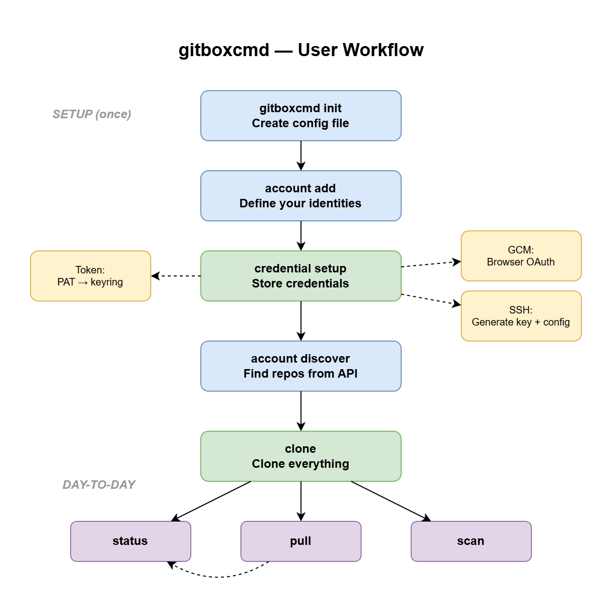

# Getting Started with gitbox CLI

This guide walks you through the complete workflow — from a fresh install to a fully managed multi-account Git environment.



## Prerequisites

- **Git** installed and on your PATH
- **gitboxcmd** binary ([download](https://github.com/LuisPalacios/gitbox/releases) or [build from source](developer-guide.md))
- For GCM accounts: [Git Credential Manager](https://github.com/git-ecosystem/git-credential-manager) installed

## Step 1: Initialize

Create your configuration file:

```bash
gitboxcmd init
```

This creates `~/.config/gitbox/gitbox.json` with sensible defaults for your platform. It auto-detects your credential store (Windows Credential Manager, macOS Keychain, etc.).

## Step 2: Add Accounts

An **account** defines WHO you are on a Git provider — your identity, not your repos.

### Forgejo / Gitea (self-hosted, GCM auth)

```bash
gitboxcmd account add my-forgejo \
  --provider forgejo \
  --url https://git.example.org \
  --username myuser \
  --name "My Name" \
  --email "me@example.com" \
  --default-credential-type gcm \
  --gcm-provider generic
```

### GitHub (GCM auth)

```bash
gitboxcmd account add github-personal \
  --provider github \
  --url https://github.com \
  --username MyGitHubUser \
  --name "My Name" \
  --email "me@example.com" \
  --default-credential-type gcm
```

### GitHub (SSH auth)

```bash
gitboxcmd account add github-ssh \
  --provider github \
  --url https://github.com \
  --username SSHUser \
  --name "SSH User" \
  --email "sshuser@example.com" \
  --default-credential-type ssh
```

### GitHub (Token auth)

```bash
gitboxcmd account add github-token \
  --provider github \
  --url https://github.com \
  --username TokenUser \
  --name "Token User" \
  --email "tokenuser@example.com" \
  --default-credential-type token
```

### Verify your accounts

```bash
gitboxcmd account list
```

## Step 3: Set Up Credentials

Run `credential setup` for each account. It detects the credential type and does the right thing:

```bash
gitboxcmd account credential setup my-forgejo
gitboxcmd account credential setup github-personal
gitboxcmd account credential setup github-ssh
```

What happens per credential type:

- **GCM**: Opens your browser for OAuth login, verifies API access
- **SSH**: Creates `~/.ssh/config` entry, generates a key pair, shows you the public key to register at your provider, tests the connection, and optionally stores a PAT for repo discovery
- **Token**: Shows the URL where you create a PAT, tells you exactly which scopes are needed, stores it securely in your OS keyring

The command is **idempotent** — run it again anytime to check or fix your setup. If a token has been revoked, it will detect that and offer a replacement.

### Verify credentials

```bash
gitboxcmd account credential verify my-forgejo
gitboxcmd account credential verify github-personal
gitboxcmd account credential verify github-ssh
```

## Step 4: Discover Repos

Discover fetches all repos visible to your account from the provider's API and lets you choose which ones to manage:

```bash
gitboxcmd account discover my-forgejo
```

You'll see a numbered list:

```text
Discovered 12 repos:

  #     REPO                                                STATUS
  1     personal/my-project                                 (new)
  2     infra/homelab                                       (new)
  -     training/old-course                                 (already in source "my-forgejo")

Enter repos to add (e.g. 1,3,5-10 or "all", empty to cancel):
```

Type `all` to add everything, or pick specific numbers.

### Discover options

```bash
gitboxcmd account discover my-forgejo --all            # Add all without prompting
gitboxcmd account discover my-forgejo --skip-forks     # Exclude forks
gitboxcmd account discover my-forgejo --skip-archived  # Exclude archived repos
gitboxcmd account discover my-forgejo --json           # JSON output (for scripting)
```

### Discover all accounts

```bash
gitboxcmd account discover github-personal
gitboxcmd account discover github-ssh
```

## Step 5: Clone Everything

```bash
gitboxcmd clone
```

You'll see colored, one-line-per-repo output with a progress bar for each clone:

```text
Cloning into ~/00.git
+ cloned    my-forgejo/personal/my-project
+ cloned    my-forgejo/infra/homelab
~ exists    github-personal/MyOrg/project-a
~ exists    github-personal/MyOrg/project-b

Cloned: 2, Skipped: 2, Errors: 0
```

### Clone options

```bash
gitboxcmd clone --source my-forgejo    # Clone from one source only
gitboxcmd clone --repo MyOrg/tools     # Clone a specific repo only
gitboxcmd clone --verbose              # Show all repos including skipped
```

## Step 6: Day-to-Day

### Check status

```bash
gitboxcmd status
```

Shows config info, account credential health, and per-repo sync state grouped by source.

### Pull updates

```bash
gitboxcmd pull
```

Pulls repos that are behind (fast-forward only). Dirty or conflicted repos are skipped with a warning.

```bash
gitboxcmd pull --verbose    # Show all repos including clean ones
gitboxcmd pull --source my-forgejo  # Pull from one source only
```

### Scan any directory

```bash
gitboxcmd scan
```

Walks the filesystem from the current directory, finds all git repos, and shows their sync status. Unlike `status`, this doesn't need a gitbox config — it works on any directory.

```bash
gitboxcmd scan --dir ~/projects    # Scan a specific directory
gitboxcmd scan --pull              # Also pull repos that are behind
```

## Quick Reference

| Command | What it does |
| --- | --- |
| `gitboxcmd init` | Create config file |
| `gitboxcmd account list` | List all accounts |
| `gitboxcmd account add <key> ...` | Add an account |
| `gitboxcmd account credential setup <key>` | Set up credentials |
| `gitboxcmd account credential verify <key>` | Verify credentials |
| `gitboxcmd account discover <key>` | Discover repos from provider |
| `gitboxcmd source list` | List all sources |
| `gitboxcmd repo list` | List all repos |
| `gitboxcmd clone` | Clone configured repos |
| `gitboxcmd status` | Show sync status |
| `gitboxcmd pull` | Pull repos that are behind |
| `gitboxcmd scan` | Scan filesystem for git repos |
| `gitboxcmd migrate --source ... --target ...` | Migrate v1 config to v2 |
| `gitboxcmd completion <shell>` | Generate shell completion |

## What's Next

- See the [Reference Guide](reference.md) for all commands, config format, and troubleshooting
- See [Credentials](credentials.md) for detailed PAT creation instructions per provider
- See the [Architecture](architecture.md) for technical design and component details
- See the [Migration Guide](migration.md) if coming from `git-config-repos.sh`
