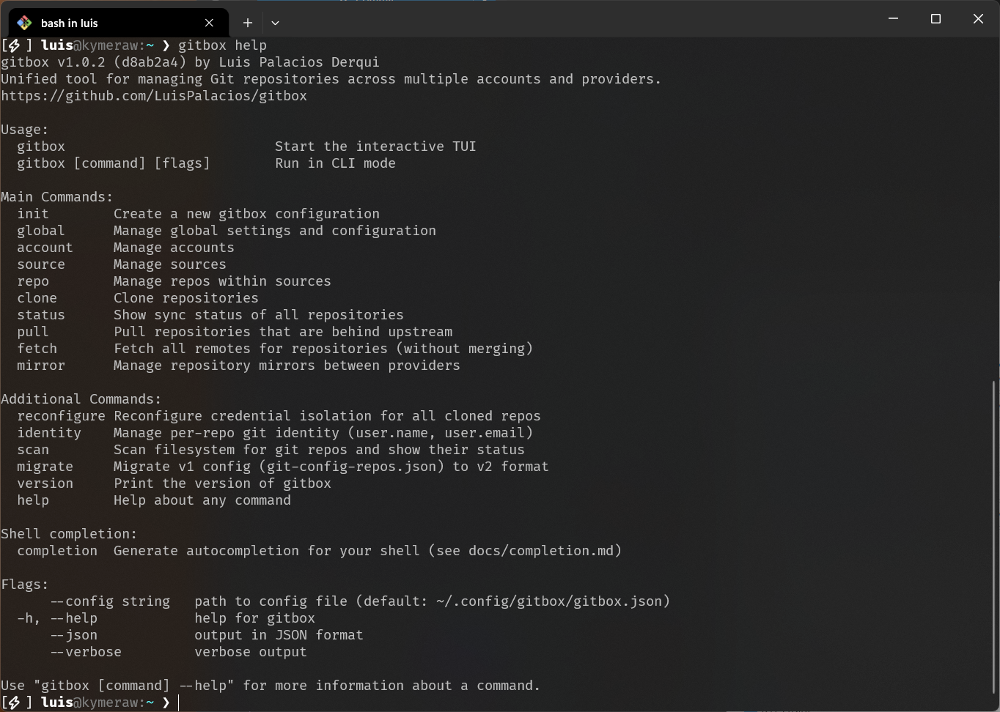
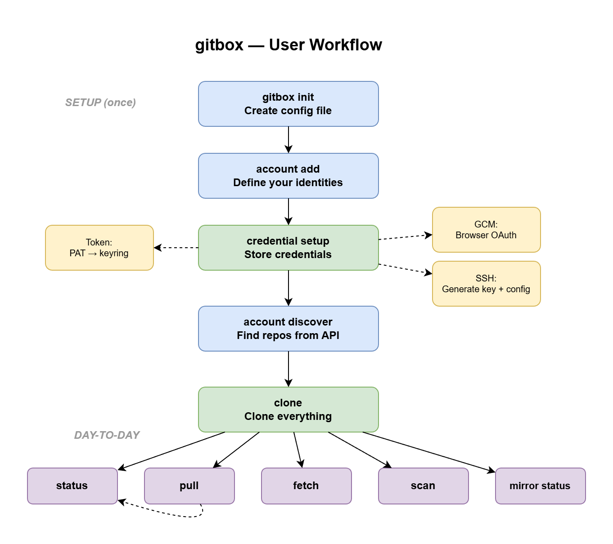

<p align="center">
  
</p>

# Getting started with gitbox CLI

This guide walks you through the complete workflow — from a fresh install to a fully managed multi-account Git environment.

<p align="center">
  
</p>

## Prerequisites

- **Git** installed and on your PATH
- **gitbox** binary — install with the one-liner or [download manually](https://github.com/LuisPalacios/gitbox/releases) or [build from source](developer-guide.md)
- For GCM accounts: [Git Credential Manager](https://github.com/git-ecosystem/git-credential-manager) installed. On Linux, GCM browser-based OAuth also needs a display server (X11 or Wayland) — see [credentials.md](credentials.md) for headless alternatives.

Run `gitbox doctor` at any time for a checklist of every external tool gitbox needs and install commands for the ones you're missing. It also powers the preflight check in the GUI add-account flow, so you learn about a missing dependency before it fails at auth time. Details in [reference.md](reference.md#system-check-doctor).

### Installing

Download the native installer for your platform from [Releases](https://github.com/LuisPalacios/gitbox/releases): `.exe` setup for Windows, `.dmg` for macOS, `.AppImage` for Linux. See the [README](../README.md) for details.

Alternatively, use the bootstrap script (macOS, Linux, Git Bash):

```bash
bash <(curl -fsSL https://raw.githubusercontent.com/LuisPalacios/gitbox/main/scripts/bootstrap.sh)
```

Use `--cli-only` to skip the GUI, `--version <tag>` for a specific release, or `--prefix <dir>` to change the install directory (default `~/bin`).

On Linux the bootstrap script also registers the GUI in the Activities menu so I can search for "Gitbox" or drag it to the dock. Skip with `--no-desktop`; run it later on its own with `bash <(curl -fsSL https://raw.githubusercontent.com/LuisPalacios/gitbox/main/scripts/register-gitbox.sh)`. Pass `--uninstall` to the same script to remove the menu entry. The `.desktop` file points at an absolute path, so `gitbox update` and subsequent bootstrap runs don't need a re-register.

## Step 1: Initialize

Create your configuration file:

```bash
gitbox init
```

This creates `~/.config/gitbox/gitbox.json` with sensible defaults for your platform. It auto-detects your credential store (Windows Credential Manager, macOS Keychain, etc.).

For tab-completion of commands and flags, see [Shell Completion](completion.md).

## Step 2: Add accounts

An **account** defines WHO you are on a Git provider — your identity, not your repos.

### Forgejo / Gitea (self-hosted, GCM auth)

```bash
gitbox account add my-forgejo \
  --provider forgejo \
  --url https://git.example.org \
  --username myuser \
  --name "My Name" \
  --email "me@example.com" \
  --default-credential-type gcm \
  --gcm-provider generic
```

### GitHub (GCM auth)

```bash
gitbox account add github-personal \
  --provider github \
  --url https://github.com \
  --username MyGitHubUser \
  --name "My Name" \
  --email "me@example.com" \
  --default-credential-type gcm
```

### GitHub (SSH auth)

```bash
gitbox account add github-ssh \
  --provider github \
  --url https://github.com \
  --username SSHUser \
  --name "SSH User" \
  --email "sshuser@example.com" \
  --default-credential-type ssh
```

### GitHub (Token auth)

```bash
gitbox account add github-token \
  --provider github \
  --url https://github.com \
  --username TokenUser \
  --name "Token User" \
  --email "tokenuser@example.com" \
  --default-credential-type token
```

### Verify your accounts

```bash
gitbox account list
```

## Step 3: Set up credentials

Run `credential setup` for each account. It detects the credential type and does the right thing:

```bash
gitbox account credential setup my-forgejo
gitbox account credential setup github-personal
gitbox account credential setup github-ssh
```

The command is **idempotent** — run it again anytime to check or fix your setup.

For GCM accounts, the setup opens your browser for OAuth authentication (GitHub, GitLab) or prompts for username/password (Gitea, Forgejo). On headless or SSH sessions where no browser is available, gitbox tells you and suggests running from a desktop terminal instead. See [credentials.md](credentials.md) for details on each credential type, browser detection, and what permissions to select.

### Verify credentials

```bash
gitbox account credential verify my-forgejo
gitbox account credential verify github-personal
gitbox account credential verify github-ssh
```

## Step 4: Discover repos

Discover fetches all repos visible to your account from the provider's API and lets you choose which ones to manage:

```bash
gitbox account discover my-forgejo
```

You'll see a numbered list:

```text
Discovered 12 repos:

  #     REPO                                                STATUS
  1     personal/my-project                                 (new)
  2     infra/homelab                                       (new)
  -     training/old-course                                 (already in source "my-forgejo")

Enter repos to add (e.g. 1,3,5-10 or "all", empty to cancel):
```

Type `all` to add everything, or pick specific numbers.

### Discover options

```bash
gitbox account discover my-forgejo --all            # Add all without prompting
gitbox account discover my-forgejo --skip-forks     # Exclude forks
gitbox account discover my-forgejo --skip-archived  # Exclude archived repos
gitbox account discover my-forgejo --json           # JSON output (for scripting)
```

### Discover all accounts

```bash
gitbox account discover github-personal
gitbox account discover github-ssh
```

## Step 5: Clone everything

```bash
gitbox clone
```

You'll see colored, one-line-per-repo output with a progress bar for each clone:

```text
Cloning into ~/00.git
+ cloned    my-forgejo/personal/my-project
+ cloned    my-forgejo/infra/homelab
~ exists    github-personal/MyOrg/project-a
~ exists    github-personal/MyOrg/project-b

Cloned: 2, Skipped: 2, Errors: 0
```

### Clone options

```bash
gitbox clone --source my-forgejo    # Clone from one source only
gitbox clone --repo MyOrg/tools     # Clone a specific repo only
gitbox clone --verbose              # Show all repos including skipped
```

## Step 6: Day-to-day

### Check status

```bash
gitbox status
```

Shows config info, account credential health, and per-repo sync state grouped by source. Repos on a non-default branch display a `[branch-name]` badge. Feature branches with no upstream show "local branch" instead of the generic "no upstream."

### Pull updates

```bash
gitbox pull
```

Pulls repos that are behind (fast-forward only). Dirty or conflicted repos are skipped with a warning. Repos on local branches with no upstream are skipped — use `--verbose` to see which repos were skipped and why.

```bash
gitbox pull --verbose    # Show all repos including clean ones
gitbox pull --source my-forgejo  # Pull from one source only
```

### Open in browser

```bash
gitbox browse --repo alice/hello-world
```

Opens the repository's remote web page in the default browser. Use `--source` to narrow the search if the same repo name appears in multiple sources.

### Sweep stale branches

```bash
gitbox sweep
```

Finds and deletes local branches that are no longer needed across all repos. Three types of stale branches are detected:

- **Gone** — remote tracking branch was deleted (e.g. PR merged and branch deleted on the server)
- **Merged** — branch is fully merged into the default branch locally
- **Squashed** — PR was squash-merged or rebase-merged on the server (different commits but same changes)

The current branch and default branch are never touched.

```bash
gitbox sweep --dry-run              # Preview without deleting
gitbox sweep --source my-github     # Sweep one source only
gitbox sweep --repo alice/my-repo   # Sweep a single repo
```

### Scan any directory

```bash
gitbox scan
```

Walks the filesystem from the current directory, finds all git repos, and shows their sync status. Unlike `status`, this doesn't need a gitbox config — it works on any directory.

```bash
gitbox scan --dir ~/projects    # Scan a specific directory
gitbox scan --pull              # Also pull repos that are behind
```

When a gitbox config exists and I scan inside the parent folder, each repo is annotated as `[tracked]` or `[ORPHAN]` with account-matching hints.

### Adopt orphan repos

If repos exist under the gitbox parent folder but aren't in `gitbox.json` (cloned manually, inherited from a previous setup), I adopt them:

```bash
gitbox adopt              # Interactive adoption of matched orphans
gitbox adopt --dry-run    # Preview what would happen
gitbox adopt --all        # Adopt all matched orphans without prompting
```

For each orphan with a matching account, `adopt` adds it to the config, sets up credential isolation, configures identity, and rewrites the remote URL. If the repo isn't in the standard folder, I'm asked whether to relocate it.

### Move a repository across accounts / providers

The TUI's repo detail screen exposes an `M` shortcut that opens a **Move repository** flow — pick a destination account and owner, optionally toggle _Delete source repo_ and _Delete local clone_, type the source repo key to confirm, then watch the phased progress (preflight → fetch → create destination → push --mirror → rewire origin → optional deletes → update config). The shortcut is inactive until the clone is clean and fully in sync with its upstream. Required token scopes per provider are listed in [Token scopes for destructive actions](credentials.md#token-scopes-for-destructive-actions). There is no dedicated `gitbox move` cobra command yet; everything happens through the TUI.

### Install a recommended global gitignore

```bash
gitbox gitignore check     # Status of ~/.gitignore_global and core.excludesfile
gitbox gitignore install   # Idempotent install / refresh, backed up to .bak-YYYYMMDD-HHMMSS
```

A curated block of OS-junk patterns (`.DS_Store`, `Thumbs.db`, `*~`, …) is wrapped in sentinel markers inside `~/.gitignore_global` so gitbox can update it without disturbing user-added entries. See [Global gitignore in reference.md](reference.md#global-gitignore) for the full flow, opt-out preference, and GUI/TUI hooks.

### Manage terminal profiles

The TUI's settings screen has a **Terminal profiles…** entry under the gitignore checkbox. Pressing **Enter** opens a dedicated full-screen editor with three sections: detected Terminal apps and Shells (read-only — populated by the GUI's host probe), and Profiles (the launchable Terminal × Shell pairs the kebab menu offers).

In the Profiles section: **d** marks the row as Default, **p** toggles Preferred, **h** toggles Hidden, **e** opens the inline edit form, **a** adds a new user Profile, **x** deletes a user-added Profile (auto-detected / WT-imported / WezTerm-imported / migrated rows can only be Hidden, not deleted — they would re-appear on the next detect cycle anyway). **ESC** returns to settings.

The TUI doesn't run the host probe itself yet — if the Terminals or Shells lists are empty, launch the GUI once on the same machine to populate them. The lists live in `gitbox.json` so both frontends see the same data after that.

## Step 7: Set up mirrors (optional)

Mirrors let you keep backup copies of repos on another provider — for example, pushing from a homelab Forgejo to GitHub, or pulling GitHub repos into Forgejo.

### Create a mirror group

A mirror group pairs two accounts:

```bash
gitbox mirror add forgejo-github \
  --account-src my-forgejo \
  --account-dst github-personal
```

### Add repos to mirror

Each repo specifies which account is the source of truth (`--origin`) and the direction (`--direction`):

```bash
# Push from Forgejo to GitHub (Forgejo is the source)
gitbox mirror add-repo forgejo-github infra/homelab \
  --origin src --direction push --setup

# Pull from GitHub into Forgejo (GitHub is the source)
gitbox mirror add-repo forgejo-github MyUser/dotfiles \
  --origin dst --direction pull --setup
```

The `--setup` flag immediately creates the target repo and configures the mirror via API.

### Discover existing mirrors

If you already have mirror relationships set up on your servers, gitbox can detect them:

```bash
# Show discovered mirrors
gitbox mirror discover

# Discover and apply to config
gitbox mirror discover --apply
```

Detection uses three methods with decreasing confidence: push mirror API queries (confirmed), pull mirror flags (likely), and repo name matching (possible).

### Check mirror status

```bash
gitbox mirror status
```

Shows sync state (comparing HEAD commits on both sides) and warns if backup repos are not private.

### Mirror credentials

If your account uses GCM, mirrors need a separate PAT (GCM OAuth tokens are machine-local). Store one with:

```bash
gitbox account credential setup github-personal --token
```

Token and SSH accounts already have a portable PAT — no extra setup needed. See [credentials.md](credentials.md) for details.

## Step 8: Workspaces (read-only)

Workspaces are **read-only** in gitbox. It discovers existing VS Code `.code-workspace` files under my configured folders, lists them, and opens one in my editor. It never creates, edits, generates, or deletes them — I own those files (I write them by hand, or a tool writes them).

```bash
gitbox workspace discover         # rescan disk and refresh the cache
gitbox workspace list             # discovered workspaces
gitbox workspace show <key>       # file path + resolved members
gitbox workspace open <key>       # open the .code-workspace in the first global.editors entry
```

`discover` walks `global.folder` and every `global.extra_folders` root for `*.code-workspace` files, resolves each file's folders back to known clones, and refreshes the cache in `gitbox.json` (only writing when something changed). The GUI runs it in the background at startup; the TUI runs it on launch and on each periodic-sync tick.

## Step 9: Non-standard clone locations & multi-repo containers (optional)

The standard layout is `global.folder / <account> / <org|user> / repo`. Two features support working outside it.

### Extra scan folders

Point gitbox at additional roots; clones found there are onboarded **in place** with an absolute `clone_folder` (never moved):

```bash
gitbox global update --add-folder ~/work/clients
gitbox adopt --path ~/some/other/tree     # one-off scan of an arbitrary folder
```

### Multi-repo containers

I work with a **main repo** (e.g. `sumwall.project`) into which my own script clones a dynamic set of sibling repos, inside its working tree. I flag the main repo as a container and gitbox discovers and onboards those nested clones:

```bash
gitbox container github-sumwall "Sumwall/sumwall.project"   # flag as container
gitbox global update --nested-depth 2                        # descend deeper if clones nest below direct children
gitbox adopt                                                  # discover + onboard the nested clones
```

Each nested clone is onboarded under its **real** account/org (matched by its remote URL), with an absolute `clone_folder` pointing inside the container — they are never relocated. `nested_scan_depth` defaults to `1` (the container's immediate children).

### Cloning into a custom folder

```bash
gitbox clone --source github-personal --repo "MyUser/special" --clone-folder ~/elsewhere/special
```

## Updating gitbox

Gitbox checks for updates automatically (once per day in the GUI). From the CLI:

```bash
gitbox update --check   # just check, no install
gitbox update           # check and install interactively
```

The updater downloads the release from GitHub, verifies the SHA256 checksum, and replaces the binaries in place. On Windows, a restart is needed after the update.

## What's next

- See the [Reference Guide](reference.md) for all commands, config format, and troubleshooting
- See [Credentials](credentials.md) for detailed PAT creation instructions per provider
- See the [Architecture](architecture.md) for technical design and component details
