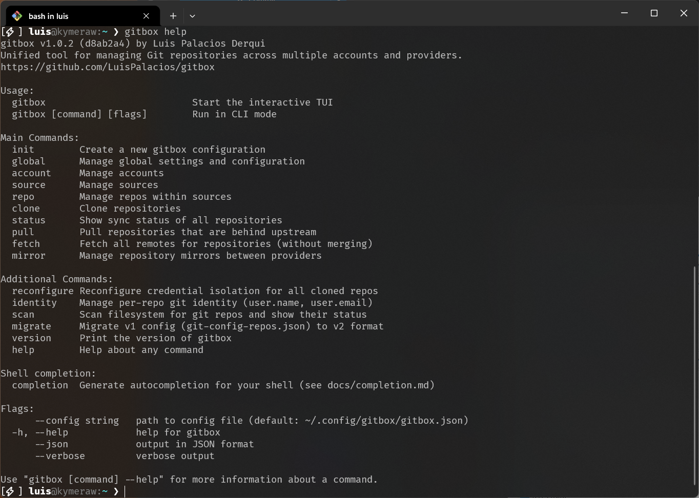

<p align="center">
  
</p>

# Primeros pasos con la CLI de gitbox

Esta guía recorre el flujo completo: desde una instalación limpia hasta un entorno Git multi-cuenta completamente gestionado.

<p align="center">
  
</p>

## Requisitos previos

- **Git** instalado y en tu PATH
- Binario **gitbox** — instala con el one-liner, [descarga manualmente](https://github.com/LuisPalacios/gitbox/releases) o [compila desde el código fuente](developer-guide.md)
- Para cuentas GCM: [Git Credential Manager](https://github.com/git-ecosystem/git-credential-manager) instalado. En Linux, el OAuth basado en navegador de GCM también necesita un servidor de pantalla (X11 o Wayland). Consulta [credentials.md](credentials.md) para alternativas headless.

Ejecuta `gitbox doctor` en cualquier momento para ver una checklist de cada herramienta externa que gitbox necesita y comandos de instalación para las que falten. También alimenta la comprobación previa del flujo de añadir cuenta en la GUI, para que sepas que falta una dependencia antes de fallar durante la autenticación. Detalles en [reference.md](reference.md#comprobación-del-sistema-doctor).

### Instalación

Descarga el instalador nativo para tu plataforma desde [Releases](https://github.com/LuisPalacios/gitbox/releases): setup `.exe` para Windows, `.dmg` para macOS, `.AppImage` para Linux. Consulta el [README](../../README.md) para más detalles.

También puedes usar el script bootstrap (macOS, Linux, Git Bash):

```bash
bash <(curl -fsSL https://raw.githubusercontent.com/LuisPalacios/gitbox/main/scripts/bootstrap.sh)
```

Usa `--cli-only` para omitir la GUI, `--version <tag>` para instalar una release concreta, o `--prefix <dir>` para cambiar el directorio de instalación (por defecto `~/bin`).

En Linux, el script bootstrap también registra la GUI en el menú Activities para que pueda buscar "Gitbox" o arrastrarlo al dock. Omítelo con `--no-desktop`; ejecútalo más tarde por separado con `bash <(curl -fsSL https://raw.githubusercontent.com/LuisPalacios/gitbox/main/scripts/register-gitbox.sh)`. Pasa `--uninstall` al mismo script para quitar la entrada del menú. El archivo `.desktop` apunta a una ruta absoluta, así que `gitbox update` y las siguientes ejecuciones de bootstrap no necesitan registrar de nuevo.

## Paso 1: inicializar

Crea tu archivo de configuración:

```bash
gitbox init
```

Esto crea `~/.config/gitbox/gitbox.json` con valores por defecto razonables para tu plataforma. Detecta automáticamente tu almacén de credenciales (Windows Credential Manager, macOS Keychain, etc.).

Para autocompletado de comandos y flags, consulta [Completado de shell](completion.md).

## Paso 2: añadir cuentas

Una **cuenta** define QUIÉN eres en un proveedor Git: tu identidad, no tus repos.

### Forgejo / Gitea (self-hosted, autenticación GCM)

```bash
gitbox account add my-forgejo \
  --provider forgejo \
  --url https://git.example.org \
  --username myuser \
  --name "My Name" \
  --email "me@example.com" \
  --default-credential-type gcm \
  --gcm-provider generic
```

### GitHub (autenticación GCM)

```bash
gitbox account add github-personal \
  --provider github \
  --url https://github.com \
  --username MyGitHubUser \
  --name "My Name" \
  --email "me@example.com" \
  --default-credential-type gcm
```

### GitHub (autenticación SSH)

```bash
gitbox account add github-ssh \
  --provider github \
  --url https://github.com \
  --username SSHUser \
  --name "SSH User" \
  --email "sshuser@example.com" \
  --default-credential-type ssh
```

### GitHub (autenticación Token)

```bash
gitbox account add github-token \
  --provider github \
  --url https://github.com \
  --username TokenUser \
  --name "Token User" \
  --email "tokenuser@example.com" \
  --default-credential-type token
```

### Verificar tus cuentas

```bash
gitbox account list
```

## Paso 3: configurar credenciales

Ejecuta `credential setup` para cada cuenta. Detecta el tipo de credencial y hace lo correcto:

```bash
gitbox account credential setup my-forgejo
gitbox account credential setup github-personal
gitbox account credential setup github-ssh
```

El comando es **idempotente**: ejecútalo de nuevo cuando quieras comprobar o corregir tu configuración.

Para cuentas GCM, el setup abre tu navegador para autenticación OAuth (GitHub, GitLab) o pide usuario/contraseña (Gitea, Forgejo). En sesiones headless o por SSH donde no hay navegador disponible, gitbox te lo indica y sugiere ejecutar desde una terminal de escritorio. Consulta [credentials.md](credentials.md) para detalles de cada tipo de credencial, detección de navegador y permisos que debes seleccionar.

### Verificar credenciales

```bash
gitbox account credential verify my-forgejo
gitbox account credential verify github-personal
gitbox account credential verify github-ssh
```

## Paso 4: descubrir repos

Discover obtiene todos los repos visibles para tu cuenta desde la API del proveedor y te permite elegir cuáles gestionar:

```bash
gitbox account discover my-forgejo
```

Verás una lista numerada:

```text
Discovered 12 repos:

  #     REPO                                                STATUS
  1     personal/my-project                                 (new)
  2     infra/homelab                                       (new)
  -     training/old-course                                 (already in source "my-forgejo")

Enter repos to add (e.g. 1,3,5-10 or "all", empty to cancel):
```

Escribe `all` para añadir todo o elige números concretos.

### Opciones de discover

```bash
gitbox account discover my-forgejo --all            # Añadir todo sin preguntar
gitbox account discover my-forgejo --skip-forks     # Excluir forks
gitbox account discover my-forgejo --skip-archived  # Excluir repos archivados
gitbox account discover my-forgejo --json           # Salida JSON (para scripting)
```

### Descubrir todas las cuentas

```bash
gitbox account discover github-personal
gitbox account discover github-ssh
```

## Paso 5: clonar todo

```bash
gitbox clone
```

Verás salida coloreada, una línea por repo, con una barra de progreso para cada clon:

```text
Cloning into ~/00.git
+ cloned    my-forgejo/personal/my-project
+ cloned    my-forgejo/infra/homelab
~ exists    github-personal/MyOrg/project-a
~ exists    github-personal/MyOrg/project-b

Cloned: 2, Skipped: 2, Errors: 0
```

### Opciones de clone

```bash
gitbox clone --source my-forgejo    # Clonar solo desde una source
gitbox clone --repo MyOrg/tools     # Clonar solo un repo concreto
gitbox clone --verbose              # Mostrar todos los repos, incluidos los omitidos
```

## Paso 6: día a día

### Comprobar estado

```bash
gitbox status
```

Muestra información de config, salud de credenciales de cuenta y estado de sync por repo agrupado por source. Los repos en una rama no predeterminada muestran una insignia `[branch-name]`. Las ramas feature sin upstream muestran "local branch" en lugar del genérico "no upstream".

### Traer actualizaciones

```bash
gitbox pull
```

Hace pull de repos que están behind (solo fast-forward). Los repos dirty o con conflictos se omiten con un aviso. Los repos en ramas locales sin upstream se omiten: usa `--verbose` para ver qué repos se omitieron y por qué.

```bash
gitbox pull --verbose    # Mostrar todos los repos, incluidos los limpios
gitbox pull --source my-forgejo  # Pull desde una sola source
```

### Abrir en navegador

```bash
gitbox browse --repo alice/hello-world
```

Abre la página web remota del repositorio en el navegador predeterminado. Usa `--source` para acotar la búsqueda si el mismo nombre de repo aparece en varias sources.

### Limpiar ramas obsoletas

```bash
gitbox sweep
```

Encuentra y elimina ramas locales que ya no hacen falta en todos los repos. Detecta tres tipos de ramas obsoletas:

- **Gone** — la rama remota de seguimiento fue eliminada (por ejemplo, PR fusionado y rama eliminada en el servidor)
- **Merged** — la rama está completamente fusionada en la rama predeterminada localmente
- **Squashed** — el PR fue squash-merged o rebase-merged en el servidor (commits distintos pero los mismos cambios)

La rama actual y la rama predeterminada nunca se tocan.

```bash
gitbox sweep --dry-run              # Vista previa sin eliminar
gitbox sweep --source my-github     # Limpiar una sola source
gitbox sweep --repo alice/my-repo   # Limpiar un solo repo
```

### Escanear cualquier directorio

```bash
gitbox scan
```

Recorre el sistema de archivos desde el directorio actual, encuentra todos los repos Git y muestra su estado de sync. A diferencia de `status`, no necesita una config de gitbox: funciona en cualquier directorio.

```bash
gitbox scan --dir ~/projects    # Escanear un directorio concreto
gitbox scan --pull              # También hacer pull de repos behind
```

Cuando existe una config de gitbox y escaneo dentro de la carpeta padre, cada repo se anota como `[tracked]` u `[ORPHAN]` con pistas de coincidencia de cuenta.

### Adoptar repos huérfanos

Si hay repos bajo la carpeta padre de gitbox que no están en `gitbox.json` (clonados manualmente, heredados de una configuración previa), los adopto:

```bash
gitbox adopt              # Adopción interactiva de huérfanos coincidentes
gitbox adopt --dry-run    # Vista previa de lo que ocurriría
gitbox adopt --all        # Adoptar todos los huérfanos coincidentes sin preguntar
```

Por cada huérfano con una cuenta coincidente, `adopt` lo añade a la config, configura aislamiento de credenciales, configura identidad y reescribe la URL remota. Si el repo no está en la carpeta estándar, se me pregunta si quiero reubicarlo.

### Mover un repositorio entre cuentas / proveedores

La pantalla de detalle de repo de la TUI expone el atajo `M`, que abre un flujo **Move repository**: elige una cuenta y owner de destino, opcionalmente activa _Delete source repo_ y _Delete local clone_, escribe la clave del repo origen para confirmar y observa el progreso por fases (preflight → fetch → create destination → push --mirror → rewire origin → optional deletes → update config). El atajo está inactivo hasta que el clon esté limpio y completamente sincronizado con su upstream. Los scopes de token requeridos por proveedor están en [Token scopes for destructive actions](credentials.md#scopes-de-token-por-capacidad). Todavía no existe un comando cobra dedicado `gitbox move`; todo ocurre mediante la TUI.

### Instalar un gitignore global recomendado

```bash
gitbox gitignore check     # Estado de ~/.gitignore_global y core.excludesfile
gitbox gitignore install   # Instalar / refrescar de forma idempotente, backup en .bak-YYYYMMDD-HHMMSS
```

Un bloque curado de patrones de basura del sistema operativo (`.DS_Store`, `Thumbs.db`, `*~`, …) se envuelve con marcadores sentinel dentro de `~/.gitignore_global` para que gitbox pueda actualizarlo sin tocar entradas añadidas por el usuario. Consulta [Gitignore global en reference.md](reference.md#gitignore-global) para el flujo completo, preferencia de opt-out y hooks de GUI/TUI.

## Paso 7: configurar mirrors (opcional)

Los mirrors permiten mantener copias de backup de repos en otro proveedor: por ejemplo, push desde un Forgejo de homelab a GitHub, o pull de repos de GitHub hacia Forgejo.

### Crear un grupo mirror

Un grupo mirror empareja dos cuentas:

```bash
gitbox mirror add forgejo-github \
  --account-src my-forgejo \
  --account-dst github-personal
```

### Añadir repos al mirror

Cada repo especifica qué cuenta es la fuente de verdad (`--origin`) y la dirección (`--direction`):

```bash
# Push desde Forgejo a GitHub (Forgejo es la fuente)
gitbox mirror add-repo forgejo-github infra/homelab \
  --origin src --direction push --setup

# Pull desde GitHub hacia Forgejo (GitHub es la fuente)
gitbox mirror add-repo forgejo-github MyUser/dotfiles \
  --origin dst --direction pull --setup
```

El flag `--setup` crea inmediatamente el repo destino y configura el mirror mediante API.

### Descubrir mirrors existentes

Si ya tienes relaciones de mirror configuradas en tus servidores, gitbox puede detectarlas:

```bash
# Mostrar mirrors descubiertos
gitbox mirror discover

# Descubrir y aplicar a la config
gitbox mirror discover --apply
```

La detección usa tres métodos con confianza decreciente: consultas API de push mirror (confirmed), flags de pull mirror (likely) y coincidencia por nombre de repo (possible).

### Comprobar estado de mirror

```bash
gitbox mirror status
```

Muestra estado de sync (comparando commits HEAD en ambos lados) y avisa si los repos de backup no son privados.

### Credenciales de mirror

Si tu cuenta usa GCM, los mirrors necesitan un PAT separado (los tokens OAuth de GCM son locales de la máquina). Guarda uno con:

```bash
gitbox account credential setup github-personal --token
```

Las cuentas Token y SSH ya tienen un PAT portable: no necesitan setup adicional. Consulta [credentials.md](credentials.md) para más detalles.

## Paso 8: workspaces dinámicos (opcional)

Un **workspace** agrupa varios clones que abro juntos para una tarea: por ejemplo, un repo frontend y su backend en una sesión multi-root de VS Code, o un layout de tmuxinator con cada repo en su propio panel.

Los workspaces son ciudadanos de primera clase en gitbox: se guardan en `gitbox.json`, se gestionan con `gitbox workspace …` y se generan a disco bajo demanda como archivos JSON `.code-workspace` o perfiles YAML de tmuxinator.

### Crear un workspace multi-root de VS Code

```bash
gitbox workspace add feat-x \
  --type codeWorkspace \
  --name "Feature X" \
  --member github-personal/myorg/frontend \
  --member gitea-work/team/backend

gitbox workspace generate feat-x
```

`generate` elige automáticamente la ruta del archivo (el ancestro común más cercano de las carpetas miembro, por ejemplo `~/00.git/feat-x.code-workspace`) salvo que pase `--file`. Escribe un `.code-workspace` con una entrada `folders[]` por miembro y un bloque pequeño `settings` que permite a VS Code detectar repos anidados bajo la raíz compartida.

### Abrir un workspace

```bash
gitbox workspace open feat-x
```

Esto regenera el archivo y lanza el primer editor en `global.editors` (para `codeWorkspace`) o la primera terminal ejecutando `tmuxinator start <key>` (para `tmuxinator`).

### Workspaces tmuxinator (macOS / Linux)

```bash
gitbox workspace add pair-session \
  --type tmuxinator \
  --layout windowsPerRepo \
  --member github-personal/myorg/frontend \
  --member github-personal/myorg/backend

gitbox workspace generate pair-session   # escribe ~/.tmuxinator/pair-session.yml
gitbox workspace open pair-session
```

Layouts:

- `windowsPerRepo` (por defecto) — una ventana tmuxinator por miembro, cada una enraizada en la carpeta del clon miembro
- `splitPanes` — una sola ventana con un panel por miembro, en mosaico

### Tmuxinator en Windows (mediante WSL)

Cuando WSL está instalado, gitbox escribe el YAML en el lado WSL `~/.tmuxinator/<key>.yml` (alcanzado mediante su ruta UNC `\\wsl.localhost\<distro>\…`) y reescribe las rutas `root:` por ventana y `cd` por panel a sus equivalentes del lado Linux (`/mnt/c/…` para rutas en la unidad Windows). `gitbox workspace open <key>` ejecuta la terminal configurada con `wsl.exe -- tmuxinator start <key>` como comando hijo, así tmuxinator se ejecuta dentro de WSL independientemente del perfil de terminal que haya elegido. Si `wsl.exe --status` no tiene éxito, los workspaces tmuxinator siguen fallando limpiamente con el mensaje de plataforma no soportada.

### Descubrir workspaces dejados en disco

Los archivos de workspace que creo a mano, o que llevo conmigo desde otra máquina, se detectan automáticamente. En cualquier invocación de la CLI también puedo ejecutar:

```bash
gitbox workspace discover           # solo vista previa, tres grupos (adoptable, ambiguous, skipped)
gitbox workspace discover --apply   # adoptar cada entrada adoptable en gitbox.json
```

El scanner recorre `global.folder` en busca de archivos `*.code-workspace` y `~/.tmuxinator/*.yml` (más el `~/.tmuxinator/` del lado WSL en Windows). Cada ruta de carpeta parseada se asocia de vuelta a un clon conocido mediante la coincidencia de prefijo de ruta más profunda contra las rutas resueltas de repos. Un workspace se auto-adopta cuando cada miembro resuelve exactamente a un clon; coincidencias ambiguas (una ruta que empata entre dos clones) se muestran como un grupo separado y nunca se adoptan automáticamente.

La GUI ejecuta el mismo discovery automáticamente al arrancar; la TUI lo ejecuta al lanzarse y en cada tick de periodic-sync. Las entradas adoptadas se etiquetan con `discovered: true` en `gitbox.json` para que la UI pueda mostrar de dónde vienen.

### Día a día

```bash
gitbox workspace list
gitbox workspace show feat-x
gitbox workspace add-member feat-x gitea-work/team/ops
gitbox workspace delete-member feat-x gitea-work/team/backend
gitbox workspace delete feat-x
gitbox workspace discover --apply
```

`delete` elimina el workspace de `gitbox.json`, pero NO elimina el archivo generado en disco: lo quito a mano si quiero.

## Actualizar gitbox

Gitbox comprueba actualizaciones automáticamente (una vez al día en la GUI). Desde la CLI:

```bash
gitbox update --check   # solo comprobar, sin instalar
gitbox update           # comprobar e instalar interactivamente
```

El updater descarga la release desde GitHub, verifica el checksum SHA256 y reemplaza los binarios in-place. En Windows, hace falta reiniciar después de la actualización.

## Qué sigue

- Consulta la [Guía de referencia](reference.md) para todos los comandos, formato de configuración y troubleshooting
- Consulta [Credenciales](credentials.md) para instrucciones detalladas de creación de PAT por proveedor
- Consulta [Arquitectura](architecture.md) para diseño técnico y detalles de componentes
