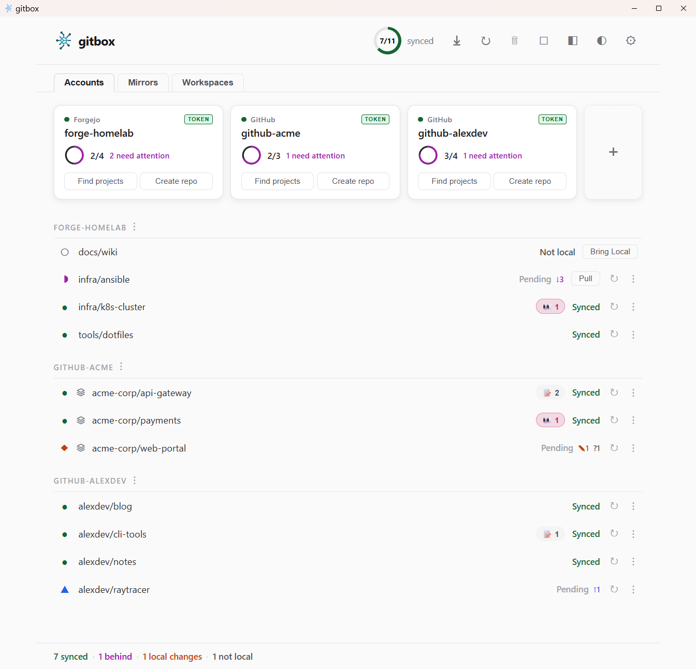

<p align="center">
  
</p>

# Gitbox desktop — guía de usuario

Gitbox es una app de escritorio que te ayuda a mantener todos tus proyectos Git organizados y actualizados, incluso cuando trabajas con varias cuentas en GitHub, GitLab, Forgejo y otros proveedores.

Esta guía recorre todo, desde el primer arranque hasta el uso diario.

## Requisitos previos

Descarga el instalador para tu plataforma desde la página de [Releases](https://github.com/LuisPalacios/gitbox/releases):

- **Windows** — `gitbox-win-amd64-setup.exe` (instala `GitboxApp.exe` en Program Files con accesos del menú Start)
- **macOS** — `gitbox-macos-arm64.dmg` o `gitbox-macos-amd64.dmg` (macOS 13 Ventura o posterior; abre el DMG, ejecuta el script de instalación desde Terminal)
- **Linux** — `gitbox-x86_64.AppImage` (autocontenido, solo descarga y ejecuta)

También puedes descargar los archivos ZIP (`gitbox-<platform>-<arch>.zip`) y extraerlos manualmente. Cada uno contiene solo la app: `GitboxApp.exe`, `GitboxApp.app` o `GitboxApp`.

> **Nota macOS:** La app no está firmada por Apple. El DMG incluye un script "Install Gitbox" que copia `GitboxApp.app` a `/Applications/` y elimina automáticamente los flags de cuarentena. Ejecuta `bash "/Volumes/gitbox/Install Gitbox.command"` desde Terminal. Para instalación manual, usa `xattr -cr /path/to/GitboxApp.app`.

Gitbox llama a herramientas que ya están en el sistema: **Git** en tu PATH y [Git Credential Manager](https://github.com/git-ecosystem/git-credential-manager) para las cuentas GCM. **Settings → System check** lista lo que falte con el comando de instalación para tu SO: consulta [Panel de ajustes](#panel-de-ajustes).

### Script de bootstrap

En macOS, Linux o Windows (Git Bash), el script de bootstrap descarga la última release e instala la app:

```bash
bash <(curl -fsSL https://raw.githubusercontent.com/LuisPalacios/gitbox/main/scripts/bootstrap.sh)
```

Usa `--version <tag>` para una release concreta o `--prefix <dir>` para cambiar el directorio de instalación (por defecto `~/bin`; macOS instala `GitboxApp.app` en `/Applications/`).

En Linux el script de bootstrap también registra la app en el menú Activities para que pueda buscar "Gitbox" o arrastrarla al dock. Omítelo con `--no-desktop`; ejecútalo más tarde por separado con `bash <(curl -fsSL https://raw.githubusercontent.com/LuisPalacios/gitbox/main/scripts/register-gitbox.sh)`. Pasa `--uninstall` al mismo script para eliminar la entrada del menú. El archivo `.desktop` apunta a una ruta absoluta, así que las actualizaciones desde la app y las ejecuciones posteriores del bootstrap no necesitan volver a registrarla.

Los hosts headless no pueden ejecutar la app. Ahí, `--cli-only` instala la última CLI `gitbox` 1.x de la línea de mantenimiento v1, y el script la elige automáticamente en Linux cuando no está definida ni `DISPLAY` ni `WAYLAND_DISPLAY`.

### Linux AppImage

Descarga la AppImage, dale permiso de ejecución y ejecútala:

```bash
chmod +x gitbox-x86_64.AppImage
./gitbox-x86_64.AppImage
```

La GUI requiere un entorno de escritorio con servidor de pantalla (X11 o Wayland).

## Paso 1: primer arranque

La primera vez que abres Gitbox, te pide elegir una **root folder**: ahí vivirán todos tus proyectos en disco. Algo como `~/00.git` o `C:\repos` funciona bien.

Haz clic en **Get started** y ya estás dentro.

## Paso 2: añadir cuentas

Una cuenta le dice a Gitbox quién eres en un servidor concreto. Por ejemplo, tu cuenta de GitHub o el GitLab de tu empresa.

Haz clic en la tarjeta **+** para añadir una. Rellenarás:

1. **Account key** — un nombre corto que eliges (por ejemplo, `github-personal`). También se convierte en el nombre de carpeta en disco.
2. **Provider** — elige tu servicio (GitHub, GitLab, Gitea, Forgejo o Bitbucket).
3. **URL** — la dirección del servidor. Para GitHub es `https://github.com`.
4. **Username** — tu nombre de cuenta en ese servicio.
5. **Name and Email** — la identidad usada en tus commits Git.
6. **Credential type** — cómo autenticará Gitbox (ver más abajo).

### Configurar credenciales

Después de crear la cuenta, Gitbox necesita una forma de iniciar sesión en tu proveedor. Hay tres opciones:

- **GCM (Git Credential Manager)** — La opción más sencilla. Gitbox abre tu navegador para que inicies sesión. Mejor para GitHub y GitLab.
- **Token (Personal Access Token)** — Creas un token en el sitio web de tu proveedor y lo pegas en Gitbox. La app te dice exactamente qué URL visitar y qué permisos seleccionar.
- **SSH** — Gitbox genera un par de claves por ti. Copias la clave pública y la añades a los ajustes de tu proveedor. La app te da el enlace directo.

Cuando las credenciales están configuradas, la tarjeta de cuenta muestra una **insignia verde** con el tipo de credencial: todo listo. Para más detalles sobre cada tipo y qué permisos seleccionar, consulta [credentials.md](credentials.md).

## Paso 3: encontrar y añadir proyectos

Haz clic en **Find projects** en una tarjeta de cuenta. Gitbox contacta con tu proveedor y lista todos los repositorios visibles para tu cuenta.

La ventana de discovery incluye:

- **Search field** — escribe para filtrar la lista cuando tienes muchos repos
- **Alphabetical sorting** — los repos se listan de la A a la Z para navegar fácilmente
- **Select all** — marca la casilla para seleccionar todo lo visible (respeta el filtro)
- **Already added** — los repos ya añadidos aparecen atenuados y no se pueden seleccionar de nuevo

Elige los que quieras y haz clic en **Add & Pull**. Gitbox los guarda en tu config y empieza a clonarlos en tu carpeta.

Discovery es **solo de adición**: añade repos a tu config pero nunca los elimina.

## Paso 4: día a día

Cierro cualquier diálogo con **Escape** o haciendo clic fuera de él. Los diálogos ocupados o que necesitan una decisión explícita (un clon en curso, una confirmación en marcha) siguen abiertos hasta que terminan. Los nombres de cuenta, las filas de repo y las insignias de organización también responden a **Enter** y **Espacio** cuando tienen el foco con **Tab**.

### Entender las tarjetas de cuenta

Cada cuenta aparece como una tarjeta en la pestaña **Accounts**. Esto significa cada elemento:

- **Credential badge** (arriba a la derecha) — muestra tu tipo de credencial con un fondo de color:
  - **Green** — todo funciona
  - **Orange** — hay un problema menor (por ejemplo, permisos limitados)
  - **Red** — la credencial está rota o caducada
  - **Blue "config"** — todavía no hay credencial configurada; haz clic para empezar
- **Sync ring** — un círculo pequeño que muestra cuántos proyectos están sincronizados
- **Find projects** — descubre repos de tu cuenta (deshabilitado si las credenciales no funcionan)
- **Create repo** — crea un repositorio nuevo en el proveedor (deshabilitado si las credenciales no funcionan)

Si falta una credencial o está rota, toda la tarjeta se vuelve **rojo claro** para que lo notes de inmediato.

### Mantener proyectos sincronizados

#### Comprobación automática

Gitbox vigila tus proyectos y muestra su estado:

- **Synced** (verde) — actualizado con el remoto
- **Behind** (magenta) — el remoto tiene commits nuevos que puedes traer
- **Local changes** (naranja) — tienes trabajo sin commitear
- **Ahead** (azul) — tienes commits que no has pusheado
- **Not local** (gris) — el repo todavía no se ha clonado
- **Local branch** (verde) — en una feature branch sin upstream tracking (normal)
- **No upstream** (gris) — la rama predeterminada no tiene upstream tracking (requiere atención)

Cuando un repo está checked out en una rama no predeterminada, aparece una pequeña insignia de rama junto al nombre del repo (por ejemplo, `feature-xyz`). Los repos en la rama predeterminada no muestran insignia. El estado detached HEAD muestra una insignia roja `detached`.

#### Pull All

Haz clic en el botón **Pull All** (icono de flecha hacia abajo) en la barra superior para actualizar todo con un clic. Clona repos ausentes y hace pull de repos que están safely behind (omite cualquier cosa con cambios locales).

#### Fetch All

Haz clic en el botón **Fetch All** (icono ↻) para consultar todos los remotos por commits nuevos sin hacer pull. Esto actualiza los indicadores de estado para que veas qué cambió antes de decidir si quieres hacer pull.

#### Fetch periódico

En Settings puedes activar fetch automático cada 5, 15 o 30 minutos. Gitbox comprueba todos los remotos y re-verifica salud de credenciales en segundo plano.

#### Ver detalles

Haz clic en un repo que muestre cambios locales, conflictos u otros problemas. Aparece un panel expansible que muestra:

- La rama actual y cuántos commits estás ahead o behind
- Una lista de cada archivo modificado con iconos que muestran qué ocurrió (added, deleted, renamed, modified)
- Cualquier archivo untracked

Esta vista de detalle **se actualiza automáticamente** cuando Gitbox detecta cambios nuevos: no necesitas cerrarla y volver a abrirla.

### Adoptar repos huérfanos

El modal de orphans lista clones bajo tu carpeta padre que todavía no están en `gitbox.json`, agrupados por cómo Gitbox puede gestionarlos:

- **Ready to adopt** — Gitbox emparejó el clon con una cuenta usando su URL remota, el `credential.<url>.username` del repo o la carpeta donde vive. Marca la casilla y haz clic en **Adopt** para registrarlo (y opcionalmente reubicarlo a la ruta canónica).
- **Unknown account** — ninguna cuenta configurada coincide con el host remoto. Añade una cuenta primero y vuelve a abrir el modal.
- **Unknown account, `ambiguous: a | b`** — dos o más cuentas en el mismo host empatan en cada señal de identidad que Gitbox mira. La casilla está deshabilitada para que no se muevan archivos. Para desambiguar: mueve el clon bajo el subtree de source correcto, edita `gitbox.json` para reflejar la cuenta deseada, o establece `credential.<url>.username` en el clon; luego vuelve a abrir el modal.
- **Local only** — sin remoto `origin`, no adoptable.

Para cada clon adoptado, Gitbox lo añade a `gitbox.json` bajo la source emparejada, configura el aislamiento de credenciales por repo, fija `user.name` y `user.email` a partir de la cuenta y reescribe la URL remota para que coincida con el tipo de credencial. Las reglas de puntuación detrás del emparejamiento de cuenta están en [Arquitectura › pkg/adopt](architecture.md#pkgadopt--discovery-de-repos-huérfanos).

### Crear repositorios

Haz clic en **Create repo** en una tarjeta de cuenta para crear un repositorio nuevo directamente en el proveedor sin salir de Gitbox.

El modal pide:

- **Owner** — un dropdown que lista tu usuario personal y cualquier organización a la que pertenezcas. La API del proveedor determina qué organizaciones están disponibles.
- **Name** — el nombre del repositorio. Los caracteres inválidos se eliminan automáticamente (solo se permite `a-z`, `A-Z`, `0-9`, `.`, `_`, `-`). Los espacios se convierten en guiones mientras escribes.
- **Description** — un resumen opcional de una línea.
- **Private** — marcado por defecto. Desmarca para crear un repo público.
- **Clone after creating** — marcado por defecto. Cuando está activo, Gitbox añade el repo a tu config y lo clona inmediatamente.

El texto del botón cambia según la casilla de clone: **Create & Clone** o **Create**.

La creación de repos está soportada en todos los proveedores (GitHub, GitLab, Gitea, Forgejo y Bitbucket) y funciona con todos los tipos de credencial. Se usa para creación el mismo token API que para discovery.

### Editar una cuenta

Haz clic en el nombre de la cuenta en cualquier tarjeta para abrir la pantalla de edición. Puedes cambiar:

- **Account key** — si lo renombras, Gitbox se encarga de todo: renombra la carpeta en disco, actualiza tus claves SSH y config, migra tokens guardados y corrige todas las referencias internas.
- **Provider** — por si elegiste el equivocado originalmente.
- **All other fields** — URL, username, name, email, default branch.

### Gestionar credenciales

Haz clic en la insignia de credencial de una tarjeta para abrir la pantalla de gestión de credenciales. Para detalles de cada tipo y permisos necesarios, consulta [credentials.md](credentials.md).

#### Cambiar tipo de credencial

Usa el dropdown para cambiar entre GCM, Token y SSH. Haz clic en **Setup** para aplicar el cambio. gitbox elimina la credencial antigua y sus artefactos, configura la nueva y reconfigura automáticamente todos los clones existentes.

#### Eliminar una credencial

Cuando ves el tipo de credencial actual, haz clic en el botón rojo **Delete** para eliminar todos los datos de autenticación guardados. Esto es útil cuando necesitas empezar limpio: por ejemplo, si un token caducó o quieres comenzar de nuevo.

Después de eliminar, la tarjeta se vuelve roja y la insignia muestra "config". Haz clic para configurar una credencial nueva.

## Paso 5: mirrors (opcional)

Los mirrors mantienen copias de backup de repos en otro proveedor: por ejemplo, push desde un Forgejo de homelab a GitHub. Los repos se mirrorizan server-side mediante APIs de proveedor, no se clonan localmente.

### Pestañas Accounts y Mirrors

La pantalla principal usa dos pestañas sobre la sección de tarjetas:

- **Accounts** (por defecto) — muestra tarjetas de cuenta y debajo la lista de repos. Aquí gestionas cuentas, descubres proyectos y creas repos.
- **Mirrors** — muestra tarjetas de grupos mirror y debajo la lista de detalle de mirrors. Cada grupo mirror aparece como una tarjeta con un sync ring que muestra la proporción active/total.

Cambia de pestaña haciendo clic en los botones de pestaña. El **summary footer** de abajo siempre muestra conteos de repos y mirrors independientemente de la pestaña activa.

### Tarjetas de mirror

Cada tarjeta de grupo mirror muestra:

- **Status dot** — verde si todos los repos están activos, rojo si hay errores, ámbar en caso contrario
- Etiqueta **MIRROR** y par de cuentas (por ejemplo, `forgejo ↔ github`)
- **Sync ring** — proporción de mirrors activos frente al total del grupo
- Botón **Check status** — verifica estado de sync comparando commits HEAD en ambos lados
- Una tarjeta **+** siempre visible en la pestaña Mirrors para crear un grupo mirror nuevo

### Anillo de salud de mirror

Cuando hay mirrors configurados, aparece un segundo **health ring** en la barra superior junto al sync ring de repos. Muestra `active/total` mirrors y se vuelve rojo si algún mirror tiene errores.

### Acciones de mirror

La pestaña Mirrors ofrece dos botones de sección:

- **Discover** — escanea todos los pares de cuentas para detectar relaciones de mirror existentes, con confianza decreciente: API de push mirror (confirmed), flag de pull mirror (likely) y coincidencia de nombre (possible). Durante el escaneo, una barra de progreso muestra avance por cuenta (indeterminado durante el listado de repos, determinado durante el análisis). Cuando aparecen resultados, los repos ya presentes en tu config se marcan como **"configured"** y aparecen atenuados. Cada resultado no configurado tiene un botón individual **+ Add** para añadirlo a tu config uno a uno, o puedes usar **Apply to config** para añadir todos a la vez.
- **Check all** — comprueba el estado de sync de cada grupo mirror.

### Lista de detalle de mirror

Bajo las tarjetas de mirror, cada grupo se expande en una lista de detalle con repos mirrorizados individuales:

- Etiqueta de dirección (por ejemplo, `origin → backup (mirror)`)
- Estado de sync (Synced OK, Backup is behind origin, etc.)
- Icono de aviso si el repo de backup es público
- Botón **Setup** para repos pendientes que todavía no se han configurado mediante API
- Botón **+ Repo** para añadir repos nuevos al grupo

## Paso 6: workspaces (solo lectura)

La pestaña **Workspaces**, junto a Accounts y Mirrors, lista los archivos `.code-workspace` de VS Code descubiertos. Los workspaces son de solo lectura: la GUI descubre los archivos existentes, los lista con sus clones miembro resueltos y abre uno en mi editor. Nunca los crea, edita, genera ni borra: los archivos son míos. Cada entrada tiene un botón **Open** que abre el `.code-workspace` en el primer editor de `global.editors`; el botón **Discover** de la pestaña reescanea bajo demanda.

### Auto-descubrimiento al arrancar

Cuando dejo un archivo `*.code-workspace` bajo la carpeta gestionada por gitbox (o una carpeta extra configurada), o traigo uno desde otra máquina, la GUI lo recoge: la lista en caché aparece al instante al arrancar y luego una pasada en segundo plano la refresca, actualizando la pestaña si algo cambió. Discovery recorre `global.folder` y cada raíz de `global.extra_folders` en busca de archivos `*.code-workspace`. Las carpetas de cada archivo se resuelven de vuelta a clones conocidos por coincidencia deepest-prefix, y la caché de `gitbox.json` solo se reescribe cuando algo cambió.

### Clones no estándar y contenedores multi-repo

Un **contenedor multi-repo** es un clon gestionado que mantiene otros clones anidados en su árbol de trabajo (por ejemplo, un repo de proyecto cuyo `.code-workspace` agrupa varios clones hermanos). Cuando un clon parece serlo — tiene un `.code-workspace` en su raíz pero aún no está marcado — su fila muestra un aviso inline **onboard nested clones**. Al hacer clic, marca el clon como contenedor, escanea su árbol de trabajo y abre el modal de adopción con los clones anidados que encuentra; tú confirmas cuáles incorporar. Los clones anidados se adoptan en el lugar bajo su cuenta/org real (se guardan con una `clone_folder` absoluta dentro del contenedor, nunca se reubican), y el aviso se reemplaza por un badge **container**.

También puedes gestionarlo desde el menú kebab (⋮) de la fila del repo — **Mark as multi-repo container**, **Unmark as multi-repo container** y **Re-scan for nested clones** (visible una vez que el clon es contenedor) — o con la casilla **Multi-repo container** del panel de detalle del repo. El diálogo **Change root folder** gestiona las **carpetas de escaneo extra** (raíces adicionales escaneadas en busca de clones y archivos `.code-workspace`) y la **profundidad de escaneo anidado** (cuántos niveles desciende Gitbox por debajo de un contenedor, por defecto 1: los hijos inmediatos del contenedor; súbela para alcanzar clones anidados más profundos).

El layout estándar es `global.folder / <account> / <org|user> / repo`. Los clones encontrados en una carpeta de escaneo extra aparecen en el modal de orphans y se incorporan **en el lugar** con una `clone_folder` absoluta: Gitbox nunca los mueve.

## Vistas del dashboard

### Vista completa

El dashboard completo muestra la barra superior con health rings, la barra de pestañas (Accounts/Mirrors), tarjetas, listas de detalle de repos o mirrors, y el summary footer. Los botones de acción en la barra superior incluyen Pull All, Fetch All, Delete mode y Compact view.

### Vista compacta

Haz clic en el botón **◧** en la barra superior para cambiar a modo compacto: una tira estrecha de estado (~220px de ancho) que muestra:

- **Global health ring** — porcentaje y conteo global de sync
- **Account pills** — una por cuenta con un mini ring y conteo de problemas. Haz clic para expandir y ver repos individuales debajo
- **Mirror pill** — cuando hay mirrors configurados, muestra el conteo active/total con un punto de color
- **Theme toggle** y un botón **Full view** abajo

Esto es útil cuando quieres tener gitbox visible como sidebar mientras trabajas en otras apps. Haz clic en **◧ Full view** para volver al dashboard completo.

## Ajustes y mantenimiento

### Panel de ajustes

Haz clic en el **icono de engranaje** para abrir el panel de ajustes:

- **Config** — muestra la ruta a tu archivo de config con un botón "Open in Editor"
- **Root folder** — dónde se guardan los proyectos, con un botón "Change"
- **Theme** — cambia entre System, Light y Dark
- **Fetch periódico** — intervalo de fetch automático (off, 5m, 15m, 30m)
- **Run at startup** — lanzar Gitbox automáticamente al iniciar sesión (dependiente de plataforma)
- **System check** — **Run** abre un informe de cada herramienta externa que usa gitbox (`git`, `git-credential-manager`, `ssh`, `ssh-keygen`, `ssh-add` y `wsl` en Windows), dónde está instalada, su versión y, para cualquier cosa ausente que tu config necesite, un comando de instalación. Cada herramienta se marca como ok, missing (requerida por tu config) u optional.
- **Terminals** — **Manager** abre el editor de Perfiles de terminal en su propia ventana del SO. Tres secciones: aplicaciones de terminal detectadas (solo lectura), shells detectados (solo lectura) y Perfiles (las parejas Terminal × Shell que el menú kebab puede lanzar). Alterna Default / Preferred / Hidden por fila, edita el nombre + Terminal + Shell de un Perfil, añade Perfiles definidos por el usuario o elimina los que tú añadiste. Re-detect vuelve a sondear el host para captar nuevos shells, entradas frescas de `launch_menu` de WezTerm o terminales recién instaladas sin reiniciar la GUI. La ventana es propiedad de la app principal — al cerrar la ventana principal también se cierra el Manager.

  Cuando hago clic en un Perfil `WezTerm + <Shell>` o `Windows Terminal + <Shell>`, gitbox primero busca una entrada coincidente en mi propia configuración del terminal (`launch_menu` de `wezterm.lua` para WezTerm, `profiles.list` de `settings.json` para Windows Terminal). Si encuentra una, gitbox la lanza — para WezTerm construye `wezterm-gui.exe start --cwd <path> -- <argv de la entrada>` y empalma el `set_environment_variables` de la entrada sobre el entorno padre; para Windows Terminal ejecuta `wt.exe -w 0 nt --profile "<name>" -d <path>` para que WT aplique el font, los colors y el `commandline` de mi perfil sin spawnear una segunda ventana cuando está activo `firstWindowPreference: persistedWindowLayout`. Sin coincidencia (o sin config / terminal no instalado), gitbox cae en su plantilla genérica de argv. Nota: la lógica de picker-callback de WezTerm en `wezterm.lua` (`color_scheme` por entrada, hooks personalizados de `mux.spawn_window`, etc.) solo se dispara cuando la entrada se elige desde el propio launcher menu de WezTerm — gitbox spawneando el pane externamente salta esos callbacks. Ver [Arquitectura › Cómo funciona el emparejamiento de lanzamiento](architecture.md#cómo-funciona-el-emparejamiento-de-lanzamiento) para las reglas del comparador (sufijo tras em-dash, patrón de respaldo para `pwsh` / `cmd` / distros WSL, etc.).

- **Versión** — versión actual de la app
- **Author** — autor del proyecto y enlace al repositorio de GitHub

Los flujos add-account y change-credential ejecutan la misma comprobación automáticamente: si eliges el tipo de credencial `gcm` en una máquina sin Git Credential Manager instalado, recibes un banner amarillo con el comando de instalación en lugar de un fallo críptico de autenticación más tarde.

### Acciones de clones

Cada fila de repo clonado tiene un **menú kebab (⋮)** en el lado derecho. El menú se divide en tres secciones para que los elementos que más usas no queden enterrados detrás de scroll:

1. **Siempre visible** — `🌐 Open in browser` y `📁 Open folder`. La entrada de navegador abre `<account url>/<owner>/<name>`, resuelto en el lado Go a partir de la config guardada, y muestra un diálogo de error si la fila no se encuentra ahí. Toda entrada basada en ruta (carpeta, editor, terminal, profile, AI harness) muestra un diálogo de "clona primero" en lugar de no hacer nada cuando el clon no ha terminado o su estado todavía no se ha cargado.
2. **Defaults** — una entrada por categoría: `>_ <default profile>` (el Terminal Profile marcado como Default, mostrado por su nombre), `✎ Open with <editors[0]>` y `🤖 Open with <ai_harnesses[0]>`. Una entrada se oculta cuando esa categoría no tiene nada configurado.
3. **Submenús** — `Profiles ▸`, `Editors ▸`, `AI Harnesses ▸`. `Profiles ▸` lista los profiles marcados como Preferred, aparte del default, y aparece cuando hay al menos uno. `Editors ▸` y `AI Harnesses ▸` solo aparecen cuando la categoría tiene **dos o más** entradas: con una sola, el default ya la cubre. Haz clic en el submenú para expandirlo (no hover), haz clic en otro submenú para cambiar, haz clic fuera o elige un elemento para cerrarlo todo.

Bajo los submenús:

- **🧹 Sweep branches** — encuentra y elimina ramas locales obsoletas. Muestra un diálogo de confirmación con la lista de ramas antes de eliminar nada. La rama actual y la rama predeterminada nunca se tocan. Detecta tres tipos de rama obsoleta:
  - **Gone** — la rama de remote tracking se eliminó (por ejemplo, se mergeó una PR y su rama se borró en el servidor); se elimina con `git branch -D`.
  - **Merged** — totalmente mergeada en la rama predeterminada; se elimina con `git branch -d`.
  - **Squashed** — squash-merged o rebase-merged en el servidor (commits distintos, mismos cambios); se elimina con `git branch -D`.

Para cambiar qué editor o AI harness aparece como default de nivel superior, reordena el array en `gitbox.json`: la primera entrada siempre es el default. El default de terminal es el profile marcado como Default en **Settings → Terminals → Manager**.

La detección de terminales cubre Windows Terminal, WezTerm, Alacritty, Tabby, ConEmu, Hyper, Mintty y ZOC en Windows; iTerm2, Terminal, Warp, Kitty, Ghostty, WezTerm y Alacritty en macOS; GNOME Terminal, Konsole, Terminator, Foot, Alacritty, Kitty, Tilda, Guake y xterm en Linux. La detección de shells cubre PowerShell 7/5, Command Prompt, Git Bash y WSL en Windows; Zsh, Bash, Fish y Dash en macOS; Bash, Zsh, Fish, Ksh y Dash en Linux. Los editores cubren VS Code, Cursor, Zed y cualquier otro detectable en `PATH`. Los AI harnesses (Claude Code, Codex, Antigravity, Aider, Cursor Agent, OpenCode) se ejecutan dentro del shell del Terminal Profile por defecto: consulta [AI harness actions](#acciones-de-ai-harness) más abajo.

### Acciones de cuenta

Cada grupo de source en la lista de repos tiene un **menú kebab (⋮)** en el lado derecho de su cabecera (el título de cuenta sobre la lista de clones). El kebab de cuenta usa la **misma estructura e iconos** que el kebab de fila de repo: defaults de nivel superior, submenús por categoría, mismas reglas de ocultación, pero aplicado a la carpeta padre de la cuenta (`<global.folder>/<account-key>`) en lugar de a un clon concreto:

- **🌐 Open in browser** — abre la página de perfil/org del proveedor para la cuenta (por ejemplo, `https://github.com/<username>`, la página de grupo de GitLab, la página de usuario de Gitea/Forgejo).
- **📁 Open folder** — abre la carpeta padre de la cuenta en el gestor de archivos del SO. La carpeta es la raíz natural de workspace para greps multi-repo, ediciones multi-repo o loops de shell. Si la carpeta todavía no existe (nada clonado bajo esa cuenta), la acción falla silenciosamente: clona al menos un repo primero.
- **>\_ Open in \<terminal\>**, **✎ Open in \<editor\>**, **🤖 Open in \<AI harness\>** — las mismas entradas default-first que el kebab de repo, más submenús de categoría cuando tienes varias opciones configuradas. Sweep branches no aparece aquí: solo tiene sentido en un clon concreto.

Los editores se auto-detectan al arrancar escaneando PATH. Gitbox escribe los editores detectados en `global.editors` en tu archivo de config con sus rutas completas. Puedes reordenar entradas o añadir editores custom editando la config: el menú siempre refleja el orden de la config.

Las terminales usan profiles en su lugar. Al arrancar, gitbox detecta las apps de terminal y los shells instalados, los escribe en `global.terminal_apps` y `global.shells`, y los combina en entradas lanzables en `global.terminal_profiles`. En Windows un profile empareja una terminal con un shell, por ejemplo Windows Terminal + PowerShell 7. En macOS y Linux un profile es solo la terminal y ejecuta tu login shell. Los gestiono en **Settings → Terminals → Manager**: marco un profile como Default (la entrada de terminal de nivel superior del kebab), marco otros como Preferred (el submenú `Profiles ▸`), oculto los que nunca uso o añado los míos. La re-detección conserva mis flags, renombrados, args editados a mano y los profiles que añadí.

En Windows, los profiles de shell desnudo que abren un shell sin app de terminal (`pwsh.exe`, `powershell.exe`, `cmd.exe`, `wsl.exe`) están ocultos por defecto, y solo aparecen por sí mismos cuando no hay ninguna terminal moderna instalada. Muestra uno en el Manager para tener un acceso directo. El launcher los envuelve en `cmd.exe /C start "" /D <path>`, lo que da a cada shell una consola nueva y fija el directorio inicial.

#### Perfiles de Windows Terminal y WezTerm

Cuando un profile usa Windows Terminal, gitbox busca un perfil WT que coincida en `settings.json` en el momento del lanzamiento. `Windows Terminal + PowerShell 7` coincide con el perfil WT llamado `PowerShell 7`, y un shell WSL por distro coincide con el perfil WT de esa distro. Si hay coincidencia, gitbox ejecuta `wt.exe -w 0 nt --profile "<name>" -d <path>`, así que el shell se abre como pestaña nueva en tu ventana WT más reciente con la fuente, los colores y los ajustes de arranque que configuraste en WT. Los perfiles ocultos y los perfiles cuyo `source` aparece en el `disabledProfileSources` de nivel superior de WT nunca coinciden. Sin coincidencia, gitbox usa los argumentos genéricos de Windows Terminal.

Ubicaciones comprobadas, en orden: `%LOCALAPPDATA%\Packages\Microsoft.WindowsTerminal_8wekyb3d8bbwe\LocalState\settings.json` (Store), `…\Microsoft.WindowsTerminalPreview_8wekyb3d8bbwe\…` (Preview), `%LOCALAPPDATA%\Microsoft\Windows Terminal\settings.json` (sin empaquetar). Gitbox vuelve a leer el archivo cada vez que cambia, así que renombrar o añadir un perfil WT se aplica en el siguiente lanzamiento.

WezTerm funciona en todos los OS: cuando `wezterm.lua` define un `config.launch_menu`, cada sync añade un profile por entrada, y al lanzarlo se ejecutan los `args` propios de esa entrada.

Para renombrar un profile o cambiar su terminal o shell, edítalo en el Manager. Para pasar flags extra, edita sus `args` en `gitbox.json`: la re-detección conserva los args editados a mano.

#### Lanzar gitbox desde Git Bash (nota de desarrollo)

Si lanzas `GitboxApp.exe` desde una shell Git Bash / MSYS2, las variables de entorno Windows heredadas por la GUI llegan en forma posix (por ejemplo, `LOCALAPPDATA=/c/Users/you/AppData/Local`). Esos valores se propagan a terminales abiertas desde gitbox mediante la ruta default `cmd.exe /C start …`, y herramientas que las leen como rutas Windows — `oh-my-posh`, algunos helpers de `$PROFILE` — pueden atragantarse (`& '/c/Users/...' — not recognized as a cmdlet`). Gitbox sanea el bloque env que entrega a la terminal lanzada, pero cuando Windows Terminal es el host de consola predeterminado, la ruta de delegación de WT puede saltarse ese bloque.

Dos arreglos igual de limpios:

- **Lanza `GitboxApp.exe` desde Explorer, el menú Start o un acceso anclado**: cualquier lugar donde Windows origine un env limpio. Los usuarios finales nunca ven esto, así que el comportamiento de producción no se afecta.
- **Usa un perfil de Windows Terminal** que coincida con el shell, como se describe arriba. Gitbox lanza entonces mediante `wt.exe --profile`, y WT inicia el shell desde su propio contexto de perfil, que tiene env Windows limpio independientemente de cómo se haya lanzado la GUI.

El **modo compacto** solo muestra el estado. Cambia a vista completa para acceder a las acciones de clone y de cuenta.

### Acciones de AI harness

Los AI CLI harnesses (Claude Code, Codex, Antigravity, Aider, Cursor Agent, OpenCode, …) son procesos shell interactivos: necesitan una terminal para ejecutarse. Gitbox añade una entrada **Open in \<harness\>** por harness configurado tanto al kebab de repo como al kebab de cabecera de source (cuenta). Hacer clic abre el **Terminal Profile por defecto** en la carpeta objetivo y ejecuta el harness dentro del shell de ese profile, así la misma terminal y shell que obtienes con `>_ <profile>` aloja el harness.

Elijo el host escogiendo el profile por defecto en **Settings → Terminals → Manager** (el mismo default que usa el launcher). Para cambiar de host, marca otro profile como default.

El harness se ejecuta a través del shell del profile en lugar de como comando desnudo de la terminal. Así los ficheros rc de tu shell siguen aplicando (el PATH de `nvm`/`npm` en macOS y Linux, el PATH de Git Bash en Windows), que es donde viven la mayoría de los CLIs de harness, y te deja en un prompt interactivo cuando el harness termina. PowerShell recibe `-NoExit -EncodedCommand`, `cmd` recibe `/K`, `fish` recibe `-C`, cualquier otro shell POSIX recibe `-i -c '<harness>; exec <shell>'`. En Windows, Git Bash recibe los shims `.cmd` de npm por nombre desnudo (`claude`, resuelto en su propio PATH) y los binarios nativos por su ruta con barras normales; WSL siempre recibe el nombre desnudo. Los profiles sin shell explícito (macOS, Linux) usan `$SHELL`.

Los perfiles de Windows Terminal emparejados desde `settings.json` reciben el shell envuelto como commandline final de WT, así la fuente y los colores del perfil WT siguen aplicando. Las entradas `launch_menu` de WezTerm se envuelven igual usando el shell de los propios `args` de la entrada. Terminal.app e iTerm en macOS no aceptan un comando en su línea de lanzamiento `open -a`, así que gitbox los controla mediante AppleScript (`cd <carpeta> && <harness>`); la primera ejecución puede pedir permiso de Automation. Warp, Kitty, Ghostty y Alacritty en macOS no pueden alojar un comando: con uno de ellos como profile por defecto, hacer clic en una entrada AI harness muestra un error accionable con el nombre del profile; marca iTerm, Terminal o WezTerm como default en su lugar.

Los harnesses se detectan en segundo plano, no en la ruta de arranque: una primera pasada corre unos dos segundos después de abrirse la ventana, luego cada diez minutos, y de nuevo cada vez que la ventana recupera el foco (limitado a una vez por minuto). El menú se refresca solo cuando la lista cambia: sin reiniciar, sin recargar config. El sondeo nunca toca el PATH del proceso, así que es seguro mientras hay fetches y clones en marcha. Además de PATH, gitbox sondea `~/.local/bin` en todos los sistemas (los instaladores nativos de Claude Code, Antigravity, Codex, Goose y los gestionados por uv dejan ahí sus binarios, y una GUI lanzada desde el Dock, un menú de escritorio o el menú Inicio no hereda el PATH del shell), los prefijos de Homebrew en macOS, y cualquier directorio conocido específico de la herramienta que liste el catálogo (por ejemplo `%LOCALAPPDATA%\agy\bin` para Antigravity en Windows). Gitbox escribe las entradas detectadas en `global.ai_harnesses` con la ruta resuelta del binario y `source: "detected"`. Cada entrada tiene `name` (display en el menú), `command` (ruta de binario o nombre en PATH) y un array opcional `args` para flags específicos del harness (por ejemplo `["--model", "sonnet-4.6"]`). La mayoría no necesita flags: `args` suele estar vacío.

Cuando un harness detectado se desinstala, la siguiente pasada marca su entrada con `missing: true` y la oculta del menú. La entrada se queda en la config a propósito: reinstalar la herramienta (incluso en otro sitio del disco) limpia el flag, actualiza `command` a la nueva ubicación y devuelve la entrada al menú con tus `args` intactos. Las entradas que escribiste a mano (`source: "user"`) se marcan y ocultan igual cuando su `command` deja de resolverse, pero gitbox nunca reescribe su `command` ni sus `args`. Las entradas anteriores a este comportamiento no tienen `source`; la primera pasada las clasifica, tratando como detectada una ruta guardada cuyo nombre de archivo coincide con un binario del catálogo y como escrita por el usuario cualquier otra.

El conjunto de harnesses que gitbox intenta auto-detectar se mantiene como una tabla markdown embebida en el binario. La lista autoritativa vive en [`pkg/harness/tools-directory.md`](../../pkg/harness/tools-directory.md): para añadir o quitar un harness detectado, edita ese archivo. Una fila se auto-detecta cuando su `Category` es `Agentic CLI`, `AI Harness`, `Headless Harness`, `Agentic IDE` o `Agentic IDE / CLI`, y su celda `Executable / CLI Command` contiene uno o más identificadores entre backticks (por ejemplo `` `claude` ``, `` `aider` ``, `` `cursor` ``). Una celda con varios nombres, como "`` `agent` `` or `` `cursor-agent` ``" para la Cursor CLI renombrada, los sondea en orden para que cualquiera de las dos instalaciones resuelva. La columna final `Well-known locations` lista directorios de instalación por herramienta fuera de PATH, cada uno como su propio token entre backticks, con `~`, `$VAR` y `%VAR%` expandidos en el momento del sondeo. Las filas de framework, orchestrator y cloud-platform se documentan como referencia pero el detector las omite: no se lanzan desde una terminal en una carpeta. Las filas cuya `Category` es `Retired CLI` (Gemini CLI, retirado en favor de Antigravity CLI) también se omiten, y cualquier entrada de `global.ai_harnesses` con un nombre retirado se elimina en el siguiente sync para que un binario muerto deje de aparecer en el menú. Los Agentic IDEs (Cursor, Devin Desktop) se tratan como herramientas AI, no como editores: por tanto, la entrada "Open in Cursor" aparecerá en la sección AI harness del menú, no en la sección editor.

En el kebab de cuenta, las mismas entradas aparecen con orden idéntico: la única diferencia en runtime es que el directorio de trabajo es `<global.folder>/<account-key>` (la carpeta padre de la cuenta) en lugar de un clon concreto. Si la carpeta padre no existe todavía (nada clonado bajo esa cuenta), la acción falla con "account folder does not exist": clona al menos un repo primero.

### Notificación de actualización

Gitbox comprueba actualizaciones una vez al día en segundo plano. Cuando hay una versión más nueva, aparece una píldora ámbar en el lado derecho de la barra de estado del footer mostrando la nueva versión. Haz clic para descargar y aplicar la actualización in-place. Gitbox verifica el checksum SHA256 de la release, y rechaza la actualización si la release no tiene checksum para ella o no se pueden descargar los checksums; después reemplaza solo lo que ya está instalado junto a la app: en macOS, el bundle `GitboxApp.app` completo. Cuando termina, haz clic en **Quit** y reinicia la app para usar la nueva versión.

El AppImage de Linux solo avisa: al hacer clic en la píldora se abre la página de la release, y descargo el nuevo AppImage y sustituyo el archivo antiguo yo mismo. Gitbox nunca reescribe el AppImage, y no incrusta información de actualización para actualizadores externos de AppImage.

El actualizador sigue la release que GitHub marca como latest, así que una GUI v1 pasa a v2 de la misma forma.

### Eliminar repos y cuentas

Haz clic en el **icono de papelera** de la barra superior para entrar en modo delete. Aparecen botones X rojos en tarjetas de cuenta, tarjetas de grupo mirror y filas de repo. Haz clic en uno para eliminarlo. El borrado de cuenta también elimina su source y carpetas de clones locales.

Sal del modo delete haciendo clic de nuevo en el icono de papelera.

### Mover un repositorio entre cuentas / proveedores

Abre el kebab (⋮) en cualquier fila de repo y elige **Move repository…**. La entrada está deshabilitada cuando el clon no está limpio y sincronizado; el tooltip explica por qué. El modal:

1. **Form** — elige la cuenta + owner de destino (personal u org, cargado asincrónicamente), confirma el nuevo nombre de repo, define visibilidad y opcionalmente acepta eliminar el repo origen y/o el clon local después de un movimiento exitoso. Ambos toggles de delete están desmarcados por defecto.
2. **Confirm** — un resumen con borde rojo que lista cada efecto destructivo. Escribe la clave del repo origen (por ejemplo, `acme/widget`) para desbloquear el botón **Move**.
3. **Progress** — cada fase (preflight → fetch → create destination → push mirror → rewire origin → optional deletes → update config) aparece como una línea propia con estado en vivo.

El move preserva cada ref y tag mediante `git push --mirror`, reconfigura `origin` en el clon local hacia la URL nueva y actualiza la config de gitbox para que el repo viva ahora bajo la source de la cuenta destino. Un fallo de source-delete o local-clone-delete (fases 6–7) se captura como warning: el move ya está completo en ese punto.

Los scopes de token requeridos en ambos lados están listados en [Scopes de token por capacidad](credentials.md#scopes-de-token-por-capacidad).

### Aviso de identidad global

Si tu `~/.gitconfig` tiene un `user.name` o `user.email` global, Gitbox muestra un **banner naranja de aviso** arriba del dashboard. Una identidad global puede sobrescribir las identidades por repo que gitbox configura para cada cuenta.

Haz clic en **Remove** para limpiar las entradas de identidad global, o descarta el banner con el botón **✕**.

### Aviso de credential helper global

Cuando al menos una cuenta usa **GCM** (Git Credential Manager), Gitbox verifica que tu `~/.gitconfig` global tiene un `credential.helper` que resuelve a Git Credential Manager — el nombre corto `manager`, el heredado `manager-core`, o una ruta absoluta al binario `git-credential-manager` (la forma que escribe `git-credential-manager configure` en macOS) — y `credential.credentialStore` fijado al valor apropiado del SO (`keychain` en macOS, `wincredman` en Windows, `secretservice` en Linux). Si ningún helper resuelve a GCM o el store está mal, aparece un segundo banner naranja.

Sin un helper GCM configurado, GCM cae a un prompt TTY durante la autenticación y falla con `fatal: could not read Password ... Device not configured` en la GUI: mira el texto del banner para el problema concreto (sin helper GCM, o el credential store incorrecto).

Haz clic en **Configure** para corregir ambas entradas en un paso. Gitbox también rellena los mismos defaults en tu `gitbox.json` para que la comprobación pase permanentemente, incluso si `~/.gitconfig` se edita después. Descarta el banner con el botón **✕** si prefieres gestionarlo manualmente.

### Aviso de gitignore global

Gitbox detecta cuando falta `~/.gitignore_global`, cuando tiene un bloque recomendado desactualizado, cuando hay patrones gestionados duplicados fuera de los marcadores sentinel o cuando `core.excludesfile` no está configurado. En cualquiera de esos estados aparece un banner con un botón **Install** que hace todo esto: escribe un bloque curado de patrones de basura del SO (`.DS_Store`, `Thumbs.db`, `*~`, …), apunta `core.excludesfile` a él y guarda un backup con timestamp `.bak-YYYYMMDD-HHMMSS` de cualquier archivo existente. Solo se conservan los últimos 3 backups.

La comprobación automática al arrancar se puede cambiar mediante **Settings → Global gitignore → On/Off**, guardada como `global.check_global_gitignore`. Las acciones explícitas siempre se ejecutan: el toggle del engranaje y el botón Install nunca se silencian por la preferencia. El bloque gestionado va entre marcadores sentinel, así que los patrones y comentarios que añado fuera de ellos sobreviven a cada reinstalación. Consulta [Arquitectura › pkg/gitignore](architecture.md#pkggitignore--autorreparación-del-gitignore-global) para el formato del bloque gestionado.

## Consejos

- **Window position** — Gitbox recuerda tamaño y posición de ventana. Si desconectas un monitor secundario y la ventana se abriría fuera de pantalla, se centra automáticamente en tu pantalla principal.
- **External edits** — si editas `gitbox.json` a mano, la GUI recoge los cambios automáticamente cuando la ventana recupera foco.
- **Same config as v1** — la app lee `~/.config/gitbox/gitbox.json`, el mismo archivo que usaba v1. El formato sigue en la versión 3, así que actualizar desde v1 no necesita migración.
- **Automatic backups** — cada vez que se guarda un cambio significativo, Gitbox crea un backup fechado (por ejemplo, `gitbox-20260401-143025.json`) en el mismo directorio. Los 10 backups más recientes se conservan automáticamente; los más antiguos se podan. La pantalla de recuperación de corrupción de la GUI puede restaurar cualquiera de ellos con un clic. Los guardados solo de posición de ventana (mover o redimensionar la app) no crean backup: son churn cosmético y rotarían copias reales pre-corrupción fuera del anillo.

## Ver también

- [Credenciales](credentials.md) — tipos de credencial, permisos y resolución de problemas
- [Referencia del archivo de config](architecture.md#4-formato-de-config-v3) — cada clave de `gitbox.json`
- [Arquitectura](architecture.md) — diseño técnico
