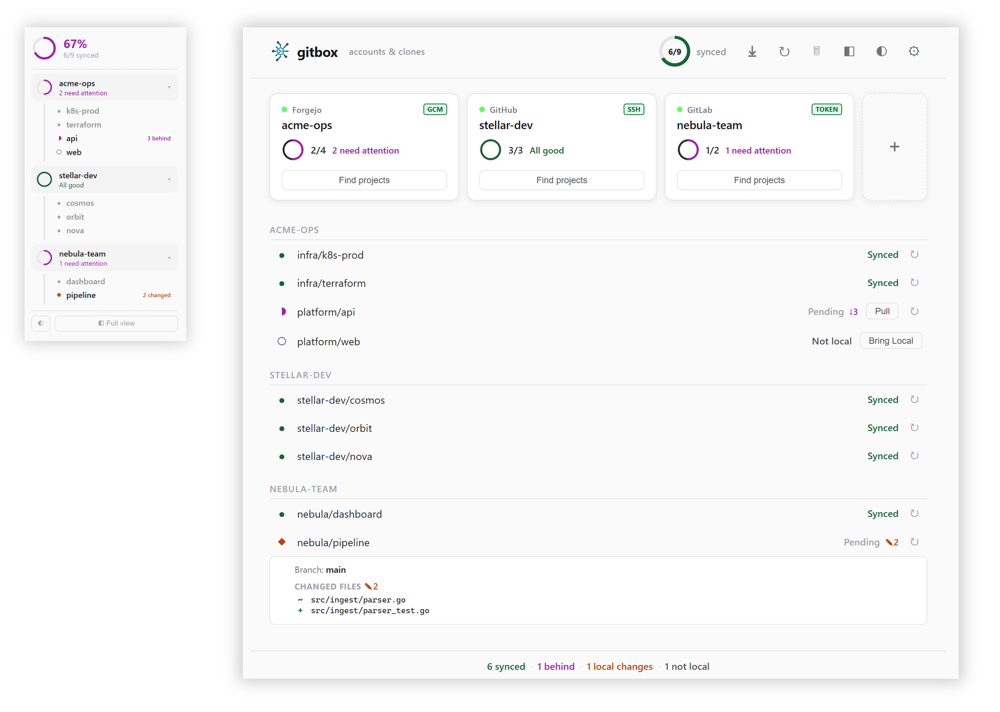

<p align="center">
  
</p>

# Gitbox Desktop — User Guide

Gitbox is a desktop app that helps you keep all your Git projects organized and up to date, even when you work with multiple accounts on GitHub, GitLab, Forgejo, and other providers.

This guide walks you through everything from first launch to day-to-day use.

## Prerequisites

Download the installer for your platform from the [Releases](https://github.com/LuisPalacios/gitbox/releases) page:

- **Windows** — `gitbox-win-amd64-setup.exe` (installer with PATH setup and Start Menu shortcuts)
- **macOS** — `gitbox-macos-arm64.dmg` or `gitbox-macos-amd64.dmg` (right-click "Install Gitbox" → Open inside the DMG)
- **Linux** — `gitbox-linux-amd64.AppImage` (self-contained, just download and run)

Alternatively, download the ZIP archives (`gitbox-<platform>-<arch>.zip`) and extract manually.

> **macOS note:** The app is not signed by Apple. The DMG includes an "Install Gitbox" script that copies the binaries and removes quarantine flags automatically. Right-click the script and select "Open" to bypass Gatekeeper, or run `bash "/Volumes/gitbox/Install Gitbox.command"` from Terminal. For manual install, use `xattr -cr /path/to/GitboxApp.app` and `xattr -cr /path/to/gitbox`.

### Linux AppImage

Download the AppImage, make it executable, and run:

```bash
chmod +x gitbox-linux-amd64.AppImage
./gitbox-linux-amd64.AppImage
```

The GUI requires a desktop environment with a display server (X11 or Wayland).

## Step 1: First launch

The first time you open Gitbox, it asks you to pick a **clone folder** — this is where all your projects will live on disk. Something like `~/00.git` or `C:\repos` works well.

Click **Get started** and you're in.

## Step 2: Add accounts

An account tells Gitbox who you are on a particular server. For example, your GitHub account, or your company's GitLab.

Click the **+** card to add one. You'll fill in:

1. **Account key** — a short name you choose (e.g., `github-personal`). This also becomes the folder name on disk.
2. **Provider** — pick your service (GitHub, GitLab, Gitea, Forgejo, or Bitbucket).
3. **URL** — the server address. For GitHub this is `https://github.com`.
4. **Username** — your account name on that service.
5. **Name and Email** — the identity used in your Git commits.
6. **Credential type** — how Gitbox will authenticate (see below).

### Setting up credentials

After creating your account, Gitbox needs a way to log in to your provider. There are three options:

- **GCM (Git Credential Manager)** — The easiest option. Gitbox opens your browser so you can log in. Best for GitHub and GitLab.
- **Token (Personal Access Token)** — You create a token on your provider's website and paste it into Gitbox. The app tells you exactly which URL to visit and what permissions to select.
- **SSH** — Gitbox generates a key pair for you. You copy the public key and add it to your provider's settings. The app gives you the direct link.

Once credentials are set up, the account card shows a **green badge** with the credential type — you're good to go. For more details on each type and what permissions to select, see [credentials.md](credentials.md).

## Step 3: Find and add projects

Click **Find projects** on an account card. Gitbox contacts your provider and lists all the repositories visible to your account.

The discovery window features:

- **Search field** — type to filter the list when you have many repos
- **Alphabetical sorting** — repos are listed A to Z for easy browsing
- **Select all** — check the box to select everything visible (respects your filter)
- **Already added** — repos you've already added appear dimmed and can't be selected again

Pick the ones you want, then click **Add & Pull**. Gitbox saves them to your config and starts cloning them into your folder.

## Step 4: Day-to-day

### Understanding account cards

Each account appears as a card on the **Accounts** tab. Here's what the elements mean:

- **Credential badge** (top right) — shows your credential type with a colored background:
  - **Green** — everything is working
  - **Orange** — there's a minor issue (e.g., limited permissions)
  - **Red** — the credential is broken or expired
  - **Blue "config"** — no credential set up yet; click it to get started
- **Sync ring** — a small circle showing how many of your projects are in sync
- **Find projects** — discovers repos from your account (disabled if credentials aren't working)
- **Create repo** — creates a new repository on the provider (disabled if credentials aren't working)

If a credential is missing or broken, the entire card turns **light red** so you notice right away.

### Keeping projects in sync

#### Automatic Checking

Gitbox watches your projects and shows their status:

- **Synced** (green) — up to date with the remote
- **Behind** (magenta) — the remote has new commits you can pull
- **Local changes** (orange) — you have uncommitted work
- **Ahead** (blue) — you have commits that haven't been pushed
- **Not local** (grey) — the repo hasn't been cloned yet

#### Pull All

Click the **Pull All** button (down-arrow icon) in the top bar to bring everything up to date in one click. It clones missing repos and pulls repos that are safely behind (skipping anything with local changes).

#### Fetch All

Click the **Fetch All** button (↻ icon) to check all remotes for new commits without pulling. This updates the status indicators so you can see what's changed before deciding to pull.

#### Periodic Fetch

In Settings, you can enable automatic fetch every 5, 15, or 30 minutes. Gitbox checks all remotes and re-checks credential health in the background.

#### Viewing Details

Click a repo that shows local changes, conflicts, or other issues. An expandable panel appears showing:

- The current branch and how many commits you're ahead or behind
- A list of every changed file with icons showing what happened (added, deleted, renamed, modified)
- Any untracked files

This detail view **updates automatically** when Gitbox detects new changes — you don't need to close and reopen it.

### Creating repositories

Click **Create repo** on an account card to create a new repository directly on the provider without leaving Gitbox.

The modal asks for:

- **Owner** — a dropdown listing your personal username plus any organizations you belong to. The provider API determines which organizations are available.
- **Name** — the repository name. Invalid characters are stripped automatically (only `a-z`, `A-Z`, `0-9`, `.`, `_`, `-` allowed). Spaces are converted to hyphens as you type.
- **Description** — an optional one-line summary.
- **Private** — checked by default. Uncheck to create a public repo.
- **Clone after creating** — checked by default. When enabled, Gitbox adds the repo to your config and clones it immediately.

The button text changes based on the clone checkbox: **Create & Clone** or **Create**.

Repo creation is supported on all providers (GitHub, GitLab, Gitea, Forgejo, and Bitbucket) and works with all credential types. The same API token used for discovery is used for creation.

### Editing an account

Click the account name on any card to open the edit screen. You can change:

- **Account key** — if you rename it, Gitbox takes care of everything: it renames the folder on disk, updates your SSH keys and config, migrates stored tokens, and fixes all internal references.
- **Provider** — in case you picked the wrong one originally.
- **All other fields** — URL, username, name, email, default branch.

### Managing credentials

Click the credential badge on a card to open the credential management screen. For details on each credential type and what permissions they need, see [credentials.md](credentials.md).

#### Changing Credential Type

Use the dropdown to switch between GCM, Token, and SSH. Click **Setup** to apply the change. gitbox removes the old credential and its artifacts, sets up the new one, and reconfigures all existing clones automatically.

#### Deleting a Credential

When viewing the current credential type, click the red **Delete** button to remove all stored authentication data. This is useful when you need a clean start — for example, if a token expired or you want to start fresh.

After deleting, the card turns red and the badge shows "config". Click it to set up a fresh credential.

## Step 5: Mirrors (optional)

Mirrors keep backup copies of repos on another provider — for example, pushing from a homelab Forgejo to GitHub. Repos are mirrored server-side via provider APIs, not cloned locally.

### Accounts and mirrors tabs

The main screen uses two tabs above the cards section:

- **Accounts** (default) — shows account cards and the repo list underneath. This is where you manage accounts, discover projects, and create repos.
- **Mirrors** — shows mirror group cards and the mirror detail list underneath. Each mirror group appears as a card with a sync ring showing the active/total ratio.

Switch tabs by clicking the tab buttons. The **summary footer** at the bottom always shows both repo and mirror counts regardless of which tab is active.

### Mirror cards

Each mirror group card shows:

- **Status dot** — green if all repos are active, red if errors exist, amber otherwise
- **MIRROR label** and account pair (e.g., `forgejo ↔ github`)
- **Sync ring** — ratio of active mirrors to total mirrors in the group
- **Check status** button — verifies sync state by comparing HEAD commits on both sides
- A **+** card is always visible on the Mirrors tab to create a new mirror group

### Mirror health ring

When mirrors are configured, a second **health ring** appears in the top bar next to the repo sync ring. It shows `active/total` mirrors and turns red if any mirrors have errors.

### Mirror actions

The Mirrors tab provides two section-level buttons:

- **Discover** — scans all account pairs to detect existing mirror relationships. During scanning, a progress bar shows per-account progress (indeterminate during repo listing, determinate during analysis). When results appear, repos already in your config are marked as **"configured"** and dimmed. Each unconfigured result has an individual **+ Add** button to add it to your config one by one, or use **Apply to config** to add all at once.
- **Check all** — checks sync status for every mirror group.

### Mirror detail list

Below the mirror cards, each group expands into a detail list showing individual mirrored repos with:

- Direction label (e.g., `origin → backup (mirror)`)
- Sync status (Synced OK, Backup is behind origin, etc.)
- Warning icon if the backup repo is public
- **Setup** button for pending repos that haven't been configured yet via API
- **+ Repo** button to add new repos to the group

## Dashboard views

### Full view

The full dashboard shows the top bar with health rings, the tab bar (Accounts/Mirrors), cards, repo or mirror detail lists, and the summary footer. Action buttons in the top bar include Pull All, Fetch All, Delete mode, and Compact view.

### Compact view

Click the **◧** button in the top bar to switch to compact mode — a narrow status strip (~220px wide) that shows:

- **Global health ring** — overall sync percentage and count
- **Account pills** — one per account with a mini ring and issue count. Click to expand and see individual repos underneath
- **Mirror pill** — when mirrors are configured, shows active/total count with a colored dot
- **Theme toggle** and a **Full view** button at the bottom

This is useful when you want gitbox visible as a sidebar while working in other apps. Click **◧ Full view** to return to the full dashboard.

## Settings and maintenance

### Settings panel

Click the **gear icon** to open the settings panel:

- **Config** — shows the path to your config file with an "Open in Editor" button
- **Clone folder** — where projects are stored, with a "Change" button
- **Theme** — switch between System, Light, and Dark
- **Periodic fetch** — automatic fetch interval (off, 5m, 15m, 30m)
- **Run at startup** — launch Gitbox automatically when you log in (platform dependent)
- **Version** — current app version
- **Author** — project author and link to the GitHub repository

### Clone actions

Each cloned repo row has a **kebab menu (⋮)** on the right side. Click it to see:

- **Open in browser** — opens the repository's remote web page (GitHub, GitLab, etc.) in the default browser
- **Open folder** — opens the clone directory in the OS file manager (Explorer, Finder, or your Linux file manager)
- **Open in \<editor\>** — opens the clone folder in a detected code editor (VS Code, Cursor, Zed, etc.)

Editors are auto-detected on startup by scanning PATH. Gitbox writes the detected editors to `global.editors` in your config file with their full paths. You can reorder entries or add custom editors by editing the config — the menu always reflects the config order.

In **compact mode**, the clone actions appear as small icon buttons (browser, folder, and editor) that show on hover over each repo row. Only the first configured editor is shown — switch to full view for the complete list.

### Update banner

Gitbox checks for updates once per day in the background. When a newer version is available, a green banner appears below the header bar showing the new version. Click **Update** to download and apply it in place. After the update completes, restart the app to use the new version.

### Deleting repos and accounts

Click the **trash icon** in the top bar to enter delete mode. Red X buttons appear on account cards, mirror group cards, and repo rows. Click one to remove it. Account deletion also removes its source and local clone folders.

Exit delete mode by clicking the trash icon again.

### Global identity warning

If your `~/.gitconfig` has a global `user.name` or `user.email`, Gitbox shows an **orange warning banner** at the top of the dashboard. A global identity can override the per-repo identities that gitbox sets up for each account.

Click **Remove** to clear the global identity entries, or dismiss the banner with the **✕** button.

## Tips

- **Window position** — Gitbox remembers your window size and position. If you disconnect a secondary monitor and the window would open off-screen, it automatically centers on your main display.
- **External edits** — if you edit `gitbox.json` by hand (or via the CLI), the GUI picks up changes automatically when the window regains focus.
- **Same config** — the desktop app and the CLI tool (`gitbox`) share the same config file. Changes in one are visible in the other.
- **Automatic backups** — every time the config is saved, Gitbox creates a dated backup (e.g., `gitbox-2026-04-01.json`) in the same directory. A rolling 5-day history is kept automatically.

## See also

- [CLI Quick Start](cli-guide.md) — for terminal users
- [Configuration Reference](reference.md) — detailed config format and commands
- [Architecture](architecture.md) — technical design
