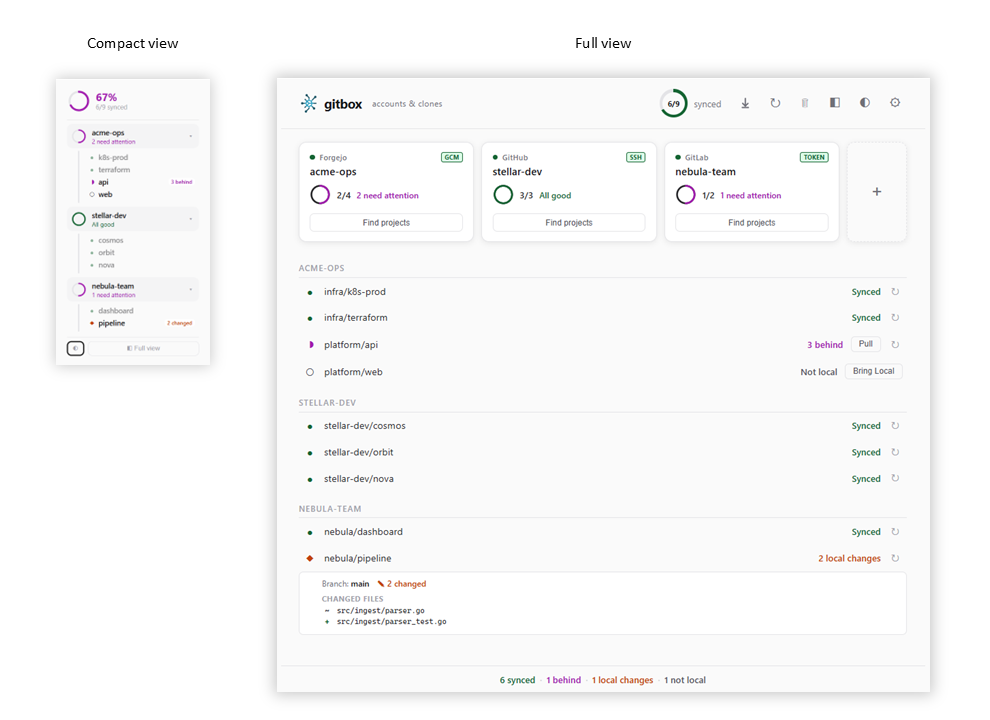

  

<h1 align="center">Git Box</h1>

  

  <strong>Accounts & clones — nothing else.</strong> 
  Discover, clone, and organise Git repositories across multiple accounts, providers, and devices. 
  <em>gitbox never adds, commits, pushes, or modifies your working trees.</em>

---

If you manage dozens of repos across multiple accounts (personal, corporate, home server), different credential types (GCM, SSH, tokens), and different machines (desktops, headless servers) — gitbox keeps it all in one config and one workflow. It handles **account setup, repo discovery, and cloning** — that's it. Your working trees are yours; gitbox won't touch them.

 

  

Supports GitHub, GitLab, Forgejo, etc. — on Windows, macOS, and Linux.

## Download

Grab the latest binaries from the [Releases](https://github.com/LuisPalacios/gitbox/releases) page.

| Platform | Arch | CLI | GUI | Download |
| --- | --- | --- | --- | --- |
| Windows | amd64 | `gitboxcmd.exe` | `Gitbox.exe` | `gitbox-win-amd64.zip` |
| macOS | arm64 | `gitboxcmd` | `Gitbox.app` | `gitbox-macos-arm64.zip` |
| Linux | amd64 | `gitboxcmd` | `Gitbox` | `gitbox-linux-amd64.zip` |

### The app is not signed

This only happens once per download

- **macOS:** After extracting, move it to *Applications*. Run `xattr -cr /Applications/Gitbox.app` and `xattr -cr /path/to/gitboxcmd` from Terminal, before you launch it.

- **Windows SmartScreen:** After extracting, move executable to any folder and launch it. Will show "Windows protected your PC" dialog. Click **More info** → **Run anyway**.

## Documentation

See the full [documentation index](docs/README.md) for all guides, reference, and technical docs.

## License

[MIT](LICENSE)
