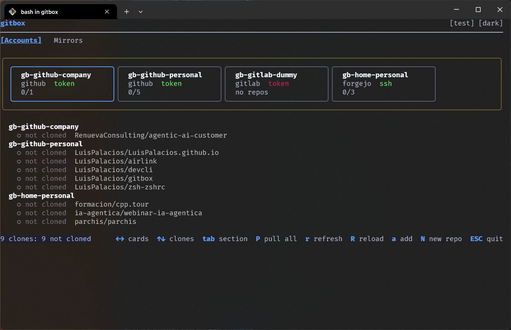
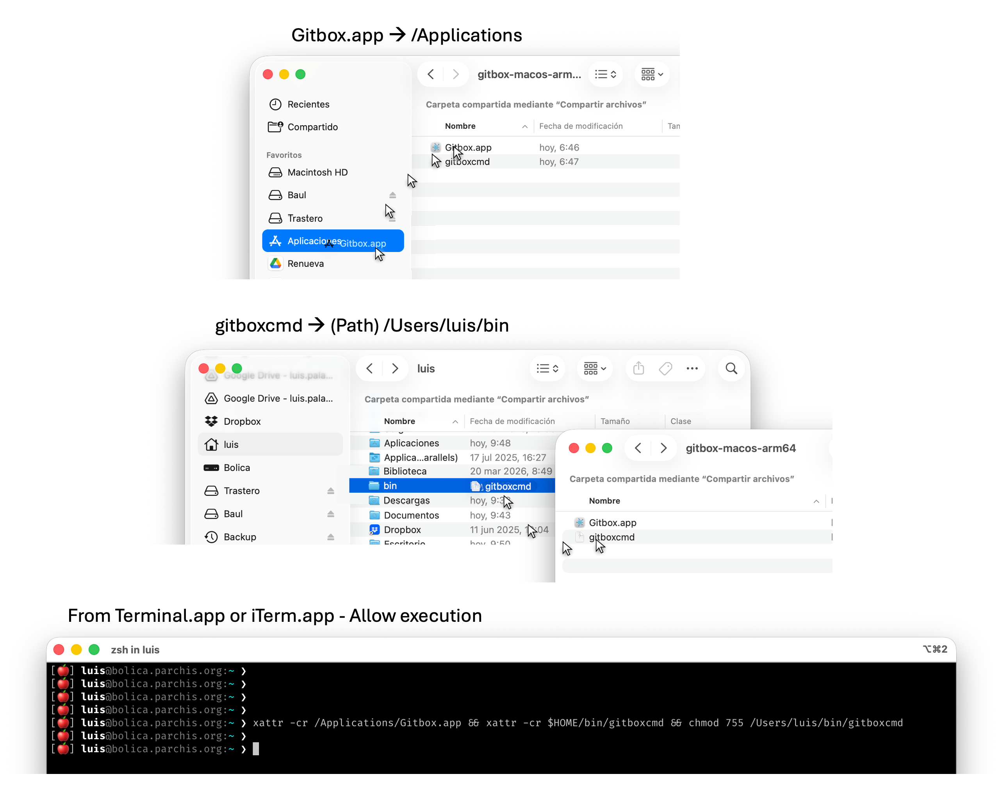

<p align="center">
  
</p>

<h1 align="center">Gitbox</h1>

<p align="center">
  <a href="https://github.com/LuisPalacios/gitbox/actions/workflows/ci.yml">
    
  </a>
</p>

<p align="center">
  <strong>Accounts & clones — nothing else.</strong><br>
  <em>gitbox never adds, commits, pushes, or modifies your working trees.</em>
</p>

---

## Why gitbox?

I juggle multiple Git accounts — personal, corporate, open-source, self-hosted — across GitHub, GitLab, Gitea, Forgejo, and Bitbucket. The pain is always the same: credentials get tangled, clones end up with the wrong identity, and every new machine means starting from scratch.

I built gitbox to fix this. One tool to set up my accounts, discover my repos, clone them with the right credentials, and keep everything in sync. It runs on Windows, macOS, and Linux.

Gitbox does not implement any Git protocol or plumbing logic. It acts as an orchestration layer that shells out to tools already on the system: **git** for clone, fetch, pull, status, and credential-manager operations; **ssh** and **ssh-keygen** for SSH key validation and generation; and the **OS native file opener** to manage files, folders and launching local applications.

## What it does

- **Multi-account management** — define identities per provider with isolated credentials (GCM, SSH, or Token)
- **Automatic discovery** — find all my repos via provider APIs instead of listing them by hand
- **Smart cloning** — each repo gets cloned with the correct identity and folder structure, self-contained in its own `.git/config`
- **Sync status** — see which repos are clean, behind, dirty, diverged, or whose remote has been deleted, at a glance
- **Safe pulling** — fast-forward-only pulls; dirty or conflicted repos are never touched
- **Cross-provider mirroring** — push or pull mirrors between providers for backups (e.g., Forgejo → GitHub)
- **Move a repository** — relocate a clone from one account to another — including cross-provider (GitHub ↔ GitLab ↔ Forgejo) — with a guided preflight, credential-scope check, mirror push, origin rewire, optional source-remote delete, and optional local-clone delete. The local folder ends up pointing at the new account with no further steps
- **Credential switching** — change auth types (GCM ↔ SSH ↔ Token) with automatic cleanup
- **Self-healing host setup** — gitbox watches the pieces of your global git setup that tend to cause cryptic failures and offers a one-click fix from CLI, TUI, or GUI: a lingering global `user.name` / `user.email`, a missing GCM credential helper in `~/.gitconfig`, and a missing `~/.gitignore_global` with a curated block of OS-junk patterns (`.DS_Store`, `Thumbs.db`, `*~`, …)
- **System check (doctor)** — `gitbox doctor` (and the GUI/TUI equivalent) probes the host for every external tool gitbox relies on (git, Git Credential Manager, ssh, tmux, wsl) and prints the OS-specific install command for anything missing — so you learn about a broken dependency before it fails at auth time
- **Safe account deletion + recovery** — deleting an account cascades through every mirror and workspace that references it so nothing is left dangling; every meaningful save keeps a rolling window of 10 dated backups, and the GUI's corruption-recovery screen can restore any of them in one click
- **One-click actions** — every clone row (and every account header) has a kebab menu to open the clone in a browser, file manager, terminal, editor, or AI CLI harness (Claude Code, Codex, Gemini, …)
- **PR & review indicators** — each clone row surfaces its open pull requests and pending review requests, pulled from the provider API
- **Task-based workspaces** — bundle clones from different accounts into a VS Code multi-root workspace or a tmuxinator layout; launch from a clone's kebab or from a dedicated Workspaces tab (GUI + TUI + CLI). Auto-discovery adopts `.code-workspace` and `.tmuxinator` files dropped on disk, and full WSL-backed tmuxinator support lights up automatically on Windows.

Five providers are supported — GitHub, GitLab, Gitea, Forgejo, and Bitbucket — and all of them work for discovery, cloning, and repo creation. Cross-provider mirroring is fully automated on Gitea, Forgejo, and GitLab; for GitHub and Bitbucket gitbox prints the manual setup steps instead of driving the UI. Read the docs for details.

## Three interfaces

Gitbox ships as two binaries built from the same Go library (`pkg/`).

The CLI and TUI live in a single binary — if you run `gitbox` with no arguments in a terminal, the TUI launches; if you pass any command, the CLI executes. I use them on Linux headless hosts mainly.

The GUI is a separate binary built with **[Wails](https://wails.io/)** + Svelte.

| Platform | CLI / TUI | GUI |
| --- | --- | --- |
| Windows | `gitbox.exe` | `GitboxApp.exe` |
| macOS | `gitbox` | `GitboxApp.app` |
| Linux | `gitbox` | `GitboxApp` |

**Desktop (GUI)**:

<p align="center">
  
</p>

**Terminal (TUI)**:

<p align="center">
  
</p>

**Terminal (CLI)**:

<p align="center">
  
</p>

<!-- TUI demo GIF recorded with VHS (https://github.com/charmbracelet/vhs) goes here -->

## Getting started

### Install with bootstrap script

For macOS, Linux, or Windows (Git Bash) — a single command that downloads, extracts, and sets up PATH:

```bash
bash <(curl -fsSL https://raw.githubusercontent.com/LuisPalacios/gitbox/main/scripts/bootstrap.sh)
```

This installs to `~/bin/` (macOS GUI goes to `/Applications/`). Run with `--help` for options. Useful for headless servers or CI environments where the native installer is not practical.

> [!WARNING]
> **Gitbox is not signed or notarized.** The binaries are not code-signed, so macOS Gatekeeper, Windows SmartScreen, and similar OS protections will flag them. The bootstrap installer removes these flags automatically (`xattr -cr` on macOS, `Unblock-File` on Windows) so the binaries can run. **You are explicitly trusting unsigned code when you do this.** I recommend you audit the [source code](https://github.com/LuisPalacios/gitbox) and the [bootstrap script](scripts/bootstrap.sh) before running anything. This project is MIT-licensed open source — inspect it, build it yourself, or don't use it at all.

### Install with native installer

Notice that this installation method complains about apps not signed nor notarized. Download the installer for your platform from the [Releases](https://github.com/LuisPalacios/gitbox/releases) page:

| Platform | Installer | What it does |
| --- | --- | --- |
| Windows | `gitbox-win-amd64-setup.exe` | Installs to Program Files, adds to PATH, creates Start Menu shortcuts |
| macOS | `gitbox-macos-arm64.dmg` / `gitbox-macos-amd64.dmg` | Open DMG, run `bash "/Volumes/gitbox/Install Gitbox.command"` from Terminal — installs GUI + CLI, clears quarantine flags |
| Linux | `gitbox-linux-amd64.AppImage` | Self-contained, runs directly — no installation needed |

Each release also includes a `checksums.sha256` file for verifying downloads.

Once installed, gitbox checks for updates automatically (once per day). Run `gitbox update` from the CLI or click "Update" in the GUI banner when a new version is available.

### Manual install (zip)

Notice that this installation method complains about apps not signed nor notarized. The [Releases](https://github.com/LuisPalacios/gitbox/releases) page also has platform zips (`gitbox-<platform>-<arch>.zip`) containing the raw binaries. Extract and place them wherever you like. The app is not signed, so the OS will complain the first time.

On macOS: `xattr -cr GitboxApp.app && xattr -cr gitbox && chmod +x gitbox`. On Windows: SmartScreen shows "Windows protected your PC" — click **More info** → **Run anyway**. On Linux: `chmod +x gitbox GitboxApp`.

<p align="center">
  
</p>

## Documentation

The [documentation index](docs/README.md) has everything — user guides (GUI, CLI, credentials), developer guides (building, testing, architecture), and reference material (commands, config format, JSON schema).

## Contributing

To build from source, run tests, and test across platforms, start with the [Developer Guide](docs/developer-guide.md). The [docs index](docs/README.md) has a suggested reading order for first-time contributors.

## Disclaimer

This software is provided **"as is"**, without warranty of any kind. I am not responsible for any damage, data loss, or security issues arising from the use of gitbox or its installer. The binaries are unsigned — the bootstrap script and manual instructions remove OS security flags so they can execute. By installing and running gitbox you accept this risk. The entire source code is available in this repository under the MIT license; audit it before use.

## License

[MIT](LICENSE)
