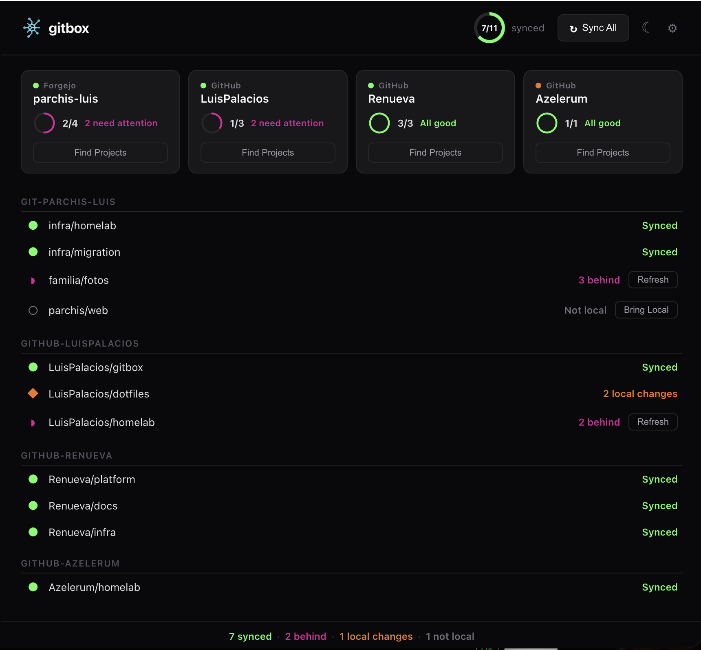

  

<h1 align="center">Git Box</h1>

  

  <strong>Accounts & clones — nothing else.</strong> 
  Discover, clone, and organise Git repositories across multiple accounts, providers, and devices. 
  <em>gitbox never adds, commits, pushes, or modifies your working trees.</em>

---

If you manage dozens of repos across multiple accounts (personal, corporate, home server), different credential types (GCM, SSH, tokens), and different machines (desktops, headless servers) — gitbox keeps it all in one config and one workflow. It handles **account setup, repo discovery, and cloning** — that's it. Your working trees are yours; gitbox won't touch them.

 

  

Supports GitHub, GitLab, Forgejo, etc. — on Windows, macOS, and Linux.

## Two binaries, one config

| Binary          | For                                     | Auth                |
|-----------------|-----------------------------------------|---------------------|
| **`gitboxcmd`** | CLI — power users, headless servers, CI | GCM, SSH, Token     |
| **`gitbox`**    | GUI — desktop users (Wails + Svelte)    | GCM (guided setup)  |

- Configuration: **`~/.config/gitbox/gitbox.json`**.
- See the [CLI Quick Start Guide](docs/cli-guide.md) for a full walkthrough with 5 accounts.

## Documentation

| Doc                                          | What's in it                                               |
|----------------------------------------------|------------------------------------------------------------|
| [CLI Quick Start](docs/cli-guide.md)         | Step-by-step: init, accounts, credentials, discover, clone |
| [GUI Guide](docs/gui-guide.md)               | Desktop app walkthrough                                    |
| [Reference](docs/reference.md)               | All commands, config format, folder structure              |
| [Credentials](docs/credentials.md)           | Token, GCM, and SSH setup in detail                        |
| [Architecture](docs/architecture.md)         | Technical design, component diagram                        |
| [Developer Guide](docs/developer-guide.md)   | Building from source, contributing                         |
| [Shell Completion](docs/completion.md)       | Tab-completion setup for Bash, Zsh, Fish, PowerShell       |
| [Legacy scripts](legacy/README.md)           | Original `git-config-repos.sh` and `git-status-pull.sh`    |
| [Legacy migration](docs/migration.md)        | Migrating from `git-config-repos.sh` (v1)                  |

See the [JSON annotated example](gitbox.jsonc) or the [JSON Schema](gitbox.schema.json).

## Building

See the [Developer Guide](docs/developer-guide.md) for cross-compilation and release builds.

## License

[MIT](LICENSE)
