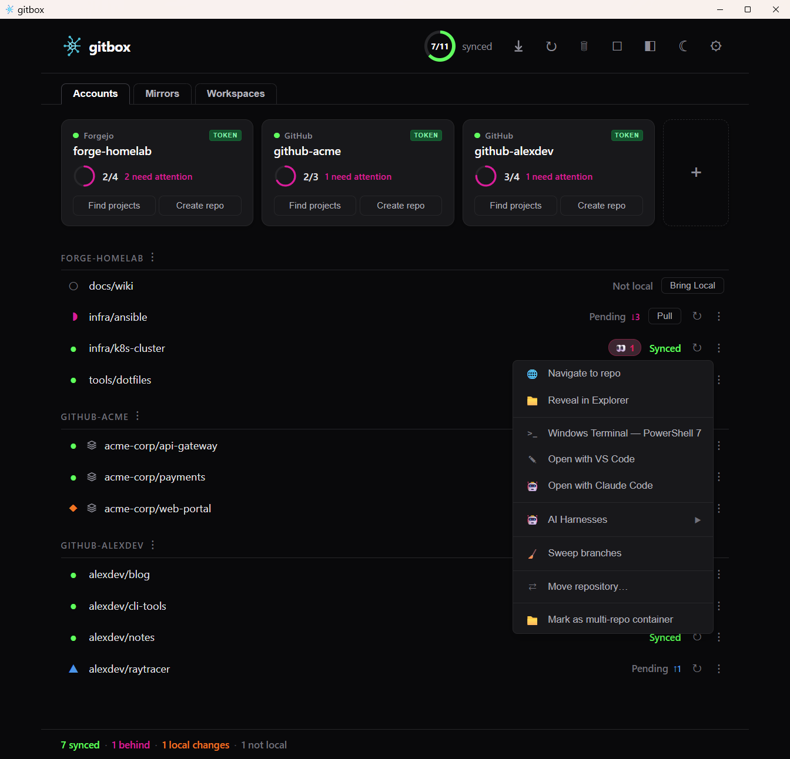
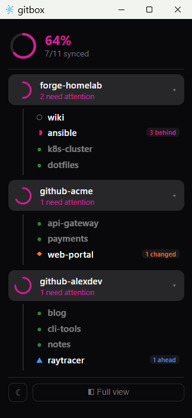

<p align="center">
  
</p>

<h1 align="center">Gitbox</h1>

<p align="center">
  <strong>One desktop app for every Git account you own.</strong><br>
  <em>Accounts and clones, nothing else. Gitbox never commits, pushes, or touches your working trees.</em>
</p>

<p align="center">
  <a href="https://github.com/LuisPalacios/gitbox/actions/workflows/ci.yml"></a>
  <a href="https://github.com/LuisPalacios/gitbox/releases/latest"></a>
  <a href="LICENSE"></a>
</p>

<p align="center">
  <picture>
    <source media="(prefers-color-scheme: dark)" srcset="assets/screenshot-dark.png">
    
  </picture>
</p>

## What it is

I juggle a personal GitHub, a corporate GitHub, and a self-hosted Forgejo, and every machine I set up used to end the same way: tangled credentials, clones committing under the wrong identity, and an afternoon of re-cloning by hand.

Gitbox fixes that. I add each account once, with its own credential (GCM, SSH, or token). Gitbox discovers my repos through the provider APIs, clones each one with the right identity into a predictable folder tree, and shows the health of the whole fleet at a glance. It runs on Windows, macOS, and Linux, and works with GitHub, GitLab, Gitea, Forgejo, and Bitbucket.

It's for anyone who works across more than one Git account or provider and wants every clone set up correctly without thinking about it. Gitbox doesn't reimplement Git: it drives the `git`, `ssh`, and Git Credential Manager already on your system.

## Install

Download the installer for your platform from the [latest release](https://github.com/LuisPalacios/gitbox/releases/latest):

| Platform | Download                                            | How to install                                                                                        |
| -------- | --------------------------------------------------- | ----------------------------------------------------------------------------------------------------- |
| Windows  | `gitbox-win-amd64-setup.exe`                        | Run it. Installs `GitboxApp.exe` to Program Files with Start Menu shortcuts                           |
| macOS    | `gitbox-macos-arm64.dmg` / `gitbox-macos-amd64.dmg` | macOS 13 or later. Open the DMG and run `bash "/Volumes/gitbox/Install Gitbox.command"` from Terminal |
| Linux    | `gitbox-x86_64.AppImage`                            | `chmod +x` and run it. Self-contained, bundles GTK 3 and WebKitGTK                                    |

Prefer the terminal? The bootstrap script downloads the latest release and installs it in one go on macOS, Linux, or Windows (Git Bash). On Linux it also adds gitbox to the applications menu:

```bash
bash <(curl -fsSL https://raw.githubusercontent.com/LuisPalacios/gitbox/main/scripts/bootstrap.sh)
```

Run it with `--help` for options. If you'd rather place the app yourself, each release also ships plain zips (`gitbox-<platform>-<arch>.zip`) and a `checksums.sha256` file.

> [!WARNING]
> **The binaries are not signed or notarized**, so macOS Gatekeeper and Windows SmartScreen will flag them. The DMG installer and the bootstrap script clear those flags for you (`xattr -cr` on macOS, `Unblock-File` on Windows). From a zip, run `xattr -cr GitboxApp.app` on macOS, or pick **More info → Run anyway** in SmartScreen. Either way you're trusting unsigned code, so audit the [source](https://github.com/LuisPalacios/gitbox) and the [bootstrap script](scripts/bootstrap.sh) first, or build it yourself.

## Features

- **Accounts and credentials.** Isolated identities per account with GCM, SSH, or token auth, and a one-click switch between them.
- **Discover and clone.** Find every repo through the provider API and clone it with the right identity, configured in its own `.git/config`.
- **Fleet health.** See which clones are synced, behind, ahead, dirty, or diverged, plus their open pull requests and pending reviews.
- **Safe sync.** Fetch everything and pull fast-forward only. Dirty or conflicted clones are never touched.
- **Mirrors and moves.** Set up push or pull mirrors between providers for backups, and move a repo to another account or provider with a guided flow.
- **Workspaces and launchers.** Open any clone in your terminal, editor, file manager, or AI harness (Claude Code, Codex, …), and open existing VS Code workspaces.
- **Clones anywhere.** Adopt clones that live outside the standard folder tree, including repos nested inside a multi-repo container.
- **Self-healing setup.** A system check for the tools gitbox needs, one-click fixes for global git settings that cause cryptic failures, and dated config backups you can restore.

Discovery, cloning, and repo creation work on all five providers. Mirroring is fully automated on Gitea, Forgejo, and GitLab; for GitHub and Bitbucket gitbox shows the manual steps.

<p align="center">
  
  &nbsp;
  
</p>

## Updating

Gitbox checks for a new release once a day. When one is out, an update pill appears in the app's footer: click it to download, verify, and install the new version, then restart.

## Upgrading from v1

v2 is a desktop app only: the `gitbox` CLI and its TUI are gone.

- **Your config keeps working.** v2 reads the same `~/.config/gitbox/gitbox.json` without migrating anything.
- **The app updates itself.** The v1 desktop app offers v2 like any other update, and the Windows installer removes the old CLI and its PATH entry.
- **The CLI lives on in v1.** The [`release/v1`](https://github.com/LuisPalacios/gitbox/tree/release/v1) branch gets critical fixes as `v1.7.x`. On a headless host, run the bootstrap script with `--cli-only` to install it.

## Documentation

Start with the [GUI guide](docs/gui-guide.md) and [credential setup](docs/credentials.md). The [documentation index](docs/README.md) covers everything else, from architecture to the config format.

## Contributing

The [developer guide](docs/developer-guide.md) covers building from source, testing, and cross-platform checks.

## Disclaimer

Gitbox is provided **"as is"**, without warranty of any kind. I'm not responsible for damage, data loss, or security issues from using gitbox or its installers. The binaries are unsigned, and installing them means accepting that risk. The full source is here under the MIT license; audit it before you use it.

## License

[MIT](LICENSE)
