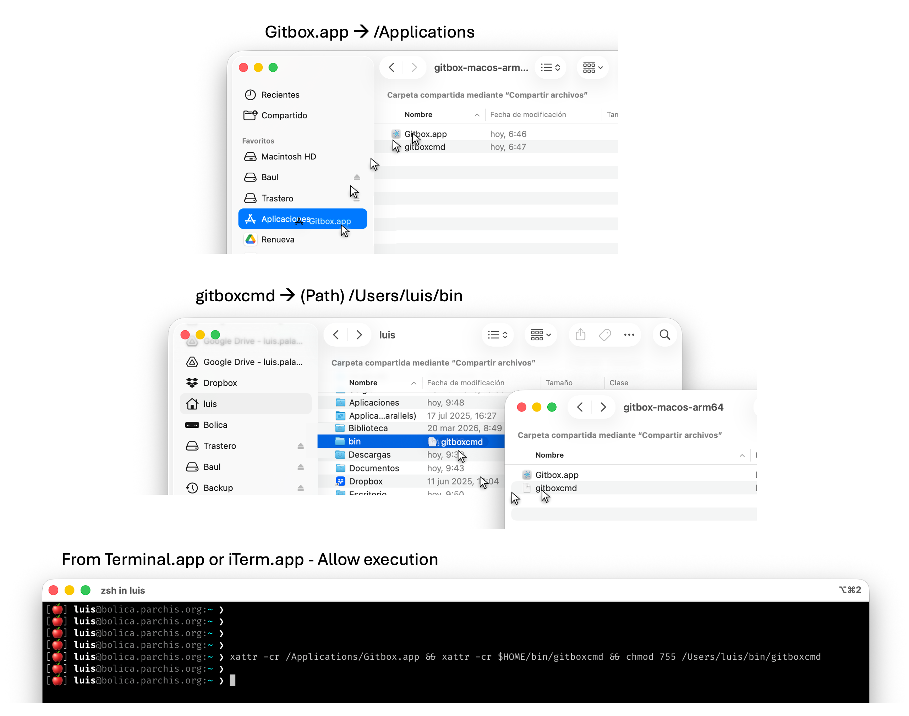

<p align="center">
  
</p>

<h1 align="center">Gitbox</h1>

<p align="center">
  <a href="https://github.com/LuisPalacios/gitbox/actions/workflows/ci.yml">
    
  </a>
</p>

<p align="center">
  <strong>Accounts & clones — nothing else.</strong><br>
  <em>gitbox never adds, commits, pushes, or modifies your working trees.</em>
</p>

[Leer en espanol](README.es.md)

> [!NOTE]
> **gitbox v2 is GUI-only.** I work almost entirely from the desktop app, so v2 drops the CLI and TUI to keep one interface well maintained. If you come from v1, read [Upgrading from v1](#upgrading-from-v1).

---

## Why gitbox?

I juggle multiple Git accounts — personal, corporate, open-source, self-hosted — across GitHub, GitLab, Gitea, Forgejo, and Bitbucket. The pain is always the same: credentials get tangled, clones end up with the wrong identity, and every new machine means starting from scratch.

I built gitbox to fix this. One desktop app to set up my accounts, discover my repos, clone them with the right credentials, and keep everything in sync. It runs on Windows, macOS, and Linux.

Gitbox does not implement any Git protocol or plumbing logic. It acts as an orchestration layer that shells out to tools already on the system: **git** for clone, fetch, pull, status, and credential-manager operations; **ssh** and **ssh-keygen** for SSH key validation and generation; and the **OS native file opener** to manage files, folders and launching local applications.

## Install with bootstrap script

For macOS, Linux, or Windows (Git Bash) — a single command that downloads the latest release, extracts it, and installs the desktop app:

```bash
bash <(curl -fsSL https://raw.githubusercontent.com/LuisPalacios/gitbox/main/scripts/bootstrap.sh)
```

This installs `GitboxApp` to `~/bin/` (macOS installs `GitboxApp.app` to `/Applications/`). On Linux it also registers the app in the Activities menu so I can search for it or pin it to the dock (skip with `--no-desktop`). Run with `--help` for options.

Headless hosts get the 1.x CLI instead: `--cli-only` installs the latest 1.x `gitbox` CLI, and the script picks it automatically on Linux without a display (`DISPLAY` and `WAYLAND_DISPLAY` unset).

> [!WARNING]
> **Gitbox is not signed or notarized.** The binaries are not code-signed, so macOS Gatekeeper, Windows SmartScreen, and similar OS protections will flag them. The bootstrap installer removes these flags automatically (`xattr -cr` on macOS, `Unblock-File` on Windows) so the binaries can run. **You are explicitly trusting unsigned code when you do this.** I recommend you audit the [source code](https://github.com/LuisPalacios/gitbox) and the [bootstrap script](scripts/bootstrap.sh) before running anything. This project is MIT-licensed open source — inspect it, build it yourself, or don't use it at all.

## What it does

- **Multi-account management** — define identities per provider with isolated credentials (GCM, SSH, or Token)
- **Automatic discovery** — find all my repos via provider APIs instead of listing them by hand
- **Smart cloning** — each repo gets cloned with the correct identity and folder structure, self-contained in its own `.git/config`
- **Sync status** — see which repos are clean, behind, dirty, diverged, or whose remote has been deleted, at a glance
- **Safe pulling** — fast-forward-only pulls; dirty or conflicted repos are never touched
- **Cross-provider mirroring** — push or pull mirrors between providers for backups (e.g., Forgejo → GitHub)
- **Move a repository** — relocate a clone from one account to another — including cross-provider (GitHub ↔ GitLab ↔ Forgejo) — with a guided preflight, credential-scope check, mirror push, origin rewire, optional source-remote delete, and optional local-clone delete. The local folder ends up pointing at the new account with no further steps
- **Credential switching** — change auth types (GCM ↔ SSH ↔ Token) with automatic cleanup
- **Self-healing host setup** — gitbox watches the pieces of your global git setup that tend to cause cryptic failures and offers a one-click fix: a lingering global `user.name` / `user.email`, a missing GCM credential helper in `~/.gitconfig`, and a missing `~/.gitignore_global` with a curated block of OS-junk patterns (`.DS_Store`, `Thumbs.db`, `*~`, …)
- **System check** — **Settings → System check** probes the host for every external tool gitbox relies on (git, Git Credential Manager, ssh, ssh-keygen, ssh-add, wsl) and shows the OS-specific install command for anything missing — so you learn about a broken dependency before it fails at auth time
- **Safe account deletion + recovery** — deleting an account cascades through every mirror and workspace that references it so nothing is left dangling; every meaningful save keeps a rolling window of 10 dated backups, and the corruption-recovery screen can restore any of them in one click
- **One-click actions** — every clone row (and every account header) has a kebab menu to open the clone in a browser, file manager, terminal, editor, or AI CLI harness (Claude Code, Codex, Antigravity, …)
- **PR & review indicators** — each clone row surfaces its open pull requests and pending review requests, pulled from the provider API
- **Read-only workspaces** — gitbox discovers existing VS Code `.code-workspace` files under the managed folders, lists them in a dedicated Workspaces tab, and opens one in my editor. It never creates or edits them — I own the files.
- **Non-standard clones & multi-repo containers** — onboard clones that live outside the standard folder tree (configurable extra scan roots), and flag a "container" repo so gitbox discovers and adopts the sibling repos cloned inside its working tree (matched to their real account, stored in place).

Five providers are supported — GitHub, GitLab, Gitea, Forgejo, and Bitbucket — and all of them work for discovery, cloning, and repo creation. Cross-provider mirroring is fully automated on Gitea, Forgejo, and GitLab; for GitHub and Bitbucket gitbox shows the manual setup steps instead of driving the UI. Read the docs for details.

## The desktop app

Gitbox ships as a single desktop app, `GitboxApp`, built with **[Wails](https://wails.io/)** + Svelte on top of a shared Go library (`pkg/`). It only needs tools that are already on the system: git, Git Credential Manager, ssh, and your terminals and editors.

| Platform | Binary          |
| -------- | --------------- |
| Windows  | `GitboxApp.exe` |
| macOS    | `GitboxApp.app` |
| Linux    | `GitboxApp`     |

`GitboxApp --version` prints the version and exits.

<p align="center">
  
</p>

## Other install methods

### Install with native installer

Notice that this installation method complains about apps not signed nor notarized. Download the installer for your platform from the [Releases](https://github.com/LuisPalacios/gitbox/releases) page:

| Platform | Installer                                           | What it does                                                                                                     |
| -------- | --------------------------------------------------- | ---------------------------------------------------------------------------------------------------------------- |
| Windows  | `gitbox-win-amd64-setup.exe`                        | Installs `GitboxApp.exe` to Program Files and creates Start Menu shortcuts                                       |
| macOS    | `gitbox-macos-arm64.dmg` / `gitbox-macos-amd64.dmg` | Open DMG, run `bash "/Volumes/gitbox/Install Gitbox.command"` from Terminal — copies the app to `/Applications/` and clears quarantine flags |
| Linux    | `gitbox-x86_64.AppImage`                            | Self-contained, runs directly — no installation needed (bundles GTK 3 and WebKitGTK)                            |

Each release also includes a `checksums.sha256` file for verifying downloads.

### Manual install (zip)

Notice that this installation method complains about apps not signed nor notarized. The [Releases](https://github.com/LuisPalacios/gitbox/releases) page also has platform zips (`gitbox-<platform>-<arch>.zip`) containing the raw app. Extract it and place it wherever you like. The app is not signed, so the OS will complain the first time.

On macOS: `xattr -cr GitboxApp.app`. On Windows: SmartScreen shows "Windows protected your PC" — click **More info** → **Run anyway**. On Linux: `chmod +x GitboxApp`.

<p align="center">
  
</p>

## Updating

Gitbox checks for updates in the background once per day. When a newer release is available, an update pill appears in the footer of the app. Click it to download the release, verify its checksum, and replace the app in place, then restart the app.

## Upgrading from v1

v2 removes the `gitbox` CLI and its TUI. `GitboxApp` is now the only interface, and it covers what I used the CLI for day to day: accounts, credentials, discovery, clone, pull, fetch, status, mirrors, workspaces, orphan adoption, branch sweeping, repo moves, and the system check.

What stays the same and what to expect:

- **Your config works unchanged.** v2 reads the same `~/.config/gitbox/gitbox.json`. The config format stays at version 3, so nothing gets migrated.
- **The v1 GUI updates itself to v2.** The in-app update banner offers v2 like any other release. It replaces only what is already installed next to it; a v1 CLI sitting beside the app stays in place and keeps updating within 1.x.
- **The Windows installer cleans up the old CLI.** Running `gitbox-win-amd64-setup.exe` over a v1 install removes the old `gitbox.exe` and its PATH entry.
- **The CLI and TUI live on in v1.** The [`release/v1`](https://github.com/LuisPalacios/gitbox/tree/release/v1) branch keeps v1 (CLI + TUI + GUI) and receives critical and security fixes as `v1.7.x` releases.
- **Headless hosts keep the CLI.** Run the bootstrap script with `--cli-only` to install the latest 1.x CLI.

## Documentation

The [documentation index](docs/README.md) has everything — user guides (GUI, credentials), developer guides (building, testing, architecture), and reference material (config format, JSON schema).

## Contributing

To build from source, run tests, and test across platforms, start with the [Developer Guide](docs/developer-guide.md). The [docs index](docs/README.md) has a suggested reading order for first-time contributors.

## Disclaimer

This software is provided **"as is"**, without warranty of any kind. I am not responsible for any damage, data loss, or security issues arising from the use of gitbox or its installer. The binaries are unsigned — the bootstrap script and manual instructions remove OS security flags so they can execute. By installing and running gitbox you accept this risk. The entire source code is available in this repository under the MIT license; audit it before use.

## License

[MIT](LICENSE)
